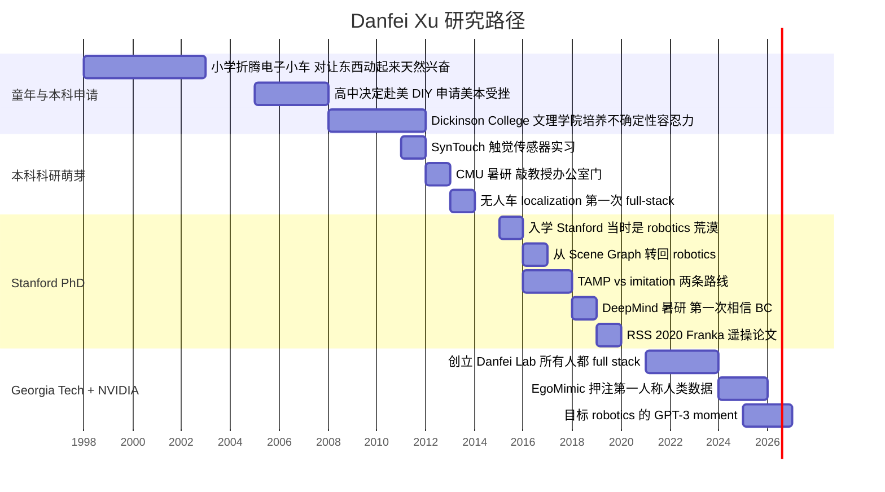
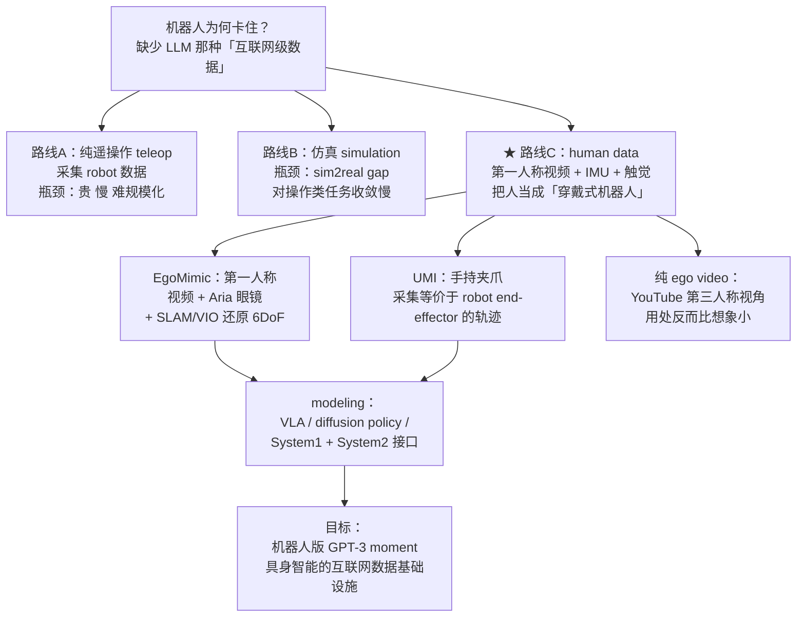

---
alias:
- Danfei Xu Podcast
- 徐丹飞 WhynotTV
- human data 机器人
- EgoMimic 访谈
- 机器人 GPT-3 moment
auto_summary: Danfei Xu（徐丹飞）是Georgia Tech助理教授兼NVIDIA Research研究员，斯坦福博士师从李飞飞和Silvio
  Savarese，他在访谈中提出核心论点：人类数据将是机器人领域的“GPT-3燃料”，正如语言数据对大语言模型的推动作用。他将人类视为“穿戴式机器人”，通过第一人称视频、IMU和触觉传感器采集数据，代表性项目EgoMimic使用Meta
  Aria眼镜配合SLAM/VIO实现6DoF定位，将人类动作映射为机器人动作；UMI则用手持夹爪模拟末端执行器。他将数据模态按重要性排序：6DoF第一人称RGB视频（5星）>
  手部姿态追踪（4星）> 触觉/力反馈（3星）> 第三人称视频（2星）> 语言标注（2星）。Danfei在2016/17年从task-and-motion planning转向行为克隆，受DeepMind暑研经历和Sutton“痛苦教训”理论影响，认为
  scaling 将超越人类设计的结构化方法。2020年RSS论文首次在Franka机械臂上展示行为克隆的“生命迹象”，但他指出行为克隆的瓶颈不在模型本身，而在于整个系统工程链。关于智能上限他认为取决于硬件本体（五指灵巧手成熟度直接决定迁移上限）和建模方法（VLA、diffusion
  policy、System 1/2接口），其中System 1/System 2接口仍是未解难题。他强调Danfei Lab的全栈文化，认为机器人学习的bug一半在硬件/系统层，只会改模型的人无法解决真问题。对于行业未来，他预测实现机器人GPT-3时刻需要数十亿小时第一人称视频数据基础设施，初期数据管线可能成为竞争优势但最终会商品化，风险在于人类行为多样性可能无法覆盖全部机器人任务空间，且硬件发展（尤其是灵巧手和触觉传感）可能滞后于算法进展。
auto_summary_indexed_at: '2026-05-12'
channel: WhynotTV
created: 2026-05-11
duration_human: 2h17m
duration_seconds: 8244
episode: 'WhynotTV Podcast #5'
episode_number: 5
guest:
- Danfei Xu (徐丹飞)
language: zh-Hans
modified: 2026-05-11
publish_date_observed: 2026-05-10
related-notes:
- '[[Podcast_张小珺Jùn｜商业访谈录_98_陈建宇_机器人基座模型]]'
- '[[Podcast_张小珺商业访谈录_106_王鹤_具身智能]]'
- '[[机器人灵巧手：深聊"不可能三角"与技术门派]]'
- '[[Podcast_张小珺Jùn｜商业访谈录_109_谢晨_仿真与合成数据]]'
- '[[SLAM_同时定位与建图]]'
- '[[Podcast_WhynotTV_Podcast_1_YangShuo]]'
- '[[强化学习之父Rich_Sutton：大语言模型的批判与AGI之路]]'
source: youtube
tags:
- CONCEPT_6DoF
- CONCEPT_6DoF_pose
- CONCEPT_end-effector
- CONCEPT_first-person_ego_video
- CONCEPT_full-stack_robotics
- CONCEPT_human_data
- CONCEPT_roboticist
- CONCEPT_teleop
- EVENT_DeepMind_暑研
- EVENT_RSS_2020
- HARDWARE_Franka
- HARDWARE_Meta_Aria
- METHOD_BC
- METHOD_EgoMimic
- METHOD_SLAM
- METHOD_TAMP
- METHOD_UMI
- METHOD_Universal_Manipulation_Interface
- METHOD_VIO
- METHOD_behavior_cloning
- METHOD_end-to-end
- METHOD_hand_pose_tracking
- METHOD_imitation_learning
- METHOD_task-and-motion_planning
- METHOD_teleop
- ORG_DeepMind
- ORG_Georgia_Tech
- ORG_Meta
- ORG_NVIDIA_Research
- ORG_Stanford
- ORG_WhynotTV
- PERSON_Danfei_Xu
- PERSON_Fei-Fei_Li
- PERSON_Silvio_Savarese
title: Danfei Xu｜人类数据、行为克隆与机器人 GPT-3 时刻
transcript: '[00:00:00] 我现在感觉 就是一辆高速前行的火车 有几个 lab（实验室）在前面疯狂搭铁轨 后面就是所有的资本开始往 往车里面加油加柴
  如果你在人身上挂足够多的 sensor（传感器）

  [00:00:14] 其实你可以把一个人变成一个机器人 I want to behavior clone a human（我想克隆人类行为） 太 exciting（令人兴奋）了
  那段时间真的就是我天天就是 一睁眼就是 let''s do this（开干吧） 所以我当时就开始给各种各样

  [00:00:26] 名字里带 robotics（机器人）的公司打电话 然后当时我们就聊了很久 然后他就说 那你来吧 我们也不给你钱 但你来吧

  [00:00:36] （博士）第二年的时候 Fei-fei 跟我说你要不继续做Scene Graph（场景图） 我说不要 我要做robotics（机器人学） 但是为什么他们（DeepMind）没有做behavior
  cloning（行为克隆） 是因为他们的

  [00:00:44] 他们的flagship product（旗舰产品） 或flagship research agenda（旗舰研究方向） 是reinforcement
  learning（强化学习） 所以他们强行地 把这个behavior cloning（行为克隆）这件事情压下去了 就是我真的不想

  [00:00:56] 在这种环境里干 如果你看遥操作数据 其实遥操作数据本身 它也不是一个完美的数据 但是人和机器人 和机器人和机器人之间的差距

  [00:01:08] 真的有那么大吗 如果说大语言模型的跃迁 来自互联网上沉淀的海量人类语言数据 那么对于机器人来说 是否也存在一种同样关键的数据 不是文字

  [00:01:19] 不是图片 而是一个人拿起杯子打开抽屉 走进房间 和另一个人互动时 在物理世界留下的痕迹 而这正是我们本期播客

  [00:01:28] 最重要的关键词 human data 人类数据 本期嘉宾 Xu Danfei Danfei 一直把自己定义为一个机器人学家 他不仅仅是坐在屏幕面前训练模型的人
  更是那个喜欢坐在机器人旁边

  [00:01:40] 看它动 看它坏 再把它修好的人 从早年折腾单片机小车 到在斯坦福从零搭建机器人系统 从不被看好的 behavior cloning（行为克隆）

  [00:01:48] 到今天思考 人类数据如何成为机器人学习的底层燃料 它的技术主线从来不是一个单点算法 而是一个完整全栈的系统问题 我们如何才能达到 机器人的
  GPT-3 moment（时刻）

  [00:02:00] 在这期播客 我们会聊 Xu Danfei 如何走上机器人这条路 人类数据会不会成为机器人学习的基石 人类数据和人形机器人 究竟是谁成就谁

  [00:02:09] 当机器人开始学习人类的操作、身体 甚至是人和人的互动 它的智能上限会是什么 这里是WhynotTV Podcast 现在请和我一起进入Xu
  Danfei的世界 之前我们聊天的时候

  [00:02:22] 你跟我说 你对自己的 self-identification（自我认同） 一直是一个 roboticist（机器人学家） 你能不能跟我讲讲
  就是比如说 你最早第一次对机器人感兴趣

  [00:02:30] 是在什么时候 我感觉应该是在初中到高中的时候 那个时候我一直对就是做一些小手工 然后做一些这种单片机 小车这种东西比较感兴趣 然后当时我记得好像并没有很多的

  [00:02:50] resources（资源），然后我就自己在这捣鼓 其实也没有做出来什么东西 但是这个念想一直在 对在初中高中的时候 对 所以你小时候是在哪儿长大的

  [00:03:02] 我在山西太原出生 然后 我六年级到初一的时候搬到上海 然后初中高中在上海念的 所以那个时候 比如说你初高中的时候

  [00:03:12] 做做什么单片机 搭搭小车这些 纯粹是自己的爱好 对，当时纯粹是自己的爱好 就是我当时记得这些东西 我就是自己从淘宝买的

  [00:03:23] 然后自己就找了一些教程 然后自己就找了一些教程 然后自己开始鼓捣这些东西 对 那你觉得你童年时期 你是那种很早就目标很明确的人

  [00:03:34] 没有没有 还是不断地试错才发现自己的兴趣 对当时 我其实是一个非常 非常 interest-driven（兴趣驱动）的人 就是只要我不

  [00:03:42] 我不想干的事情我肯定是不会干的 然后我想干的事情 我大概会投入 anywhere between（介于） 介于50%和100%的 effort（投入）来干它
  但是我如果真的不想干一件事情 我是 zero percent effort（零投入）

  [00:03:57] 有什么例子吗 当时有什么小时候你完全不想干 但是别人希望你要干的事 就是我其实是一个学习很 之前学习很差的人 就是因为我其实非常

  [00:04:07] 非常非常不喜欢 就是上课或者说考试这种形式 所以其实当时就是处在一个非常 就是 我也不知道为什么要干这件事情 然后的这个状态

  [00:04:22] 所以你 并不是那种从小在学校能够获得很多 成就感正反馈的那种状态 就是学校 学校其实对我来说完全没有什么 只是一个社交和

  [00:04:34] where I spend most of my day（我大部分时间待的地方） 这种地方 所以那当时你在学校主要做的事情是 折腾你自己的东西
  就是折腾一下自己的事情 然后上上课

  [00:04:45] 然后作业写或者不写 对哈哈哈 那这样的话 会不会小时候压力挺大的 老师和家长 对但是我觉得我父母

  [00:04:56] 就是怎么说他们也是 也不是那么确定怎么样对待这件事情 然后我也 当时我也没有特别顾及他们的感受 这种样子 所以大家就处在一个

  [00:05:12] 两边都比较模棱两可 这个状态 直到我可能就是高一高二的时候 决定可能要出国 然后这个时候我突然 我的 motivation（动力）就来了

  [00:05:23] 然后所有的事情可能就是 所有事情都朝着这个 我要去美国读书这件事情 就是往这块走 当时这个去美国留学读本科这个决定 是你的决定还是你父母的

  [00:05:38] 是我的决定 对 我记得当时的契机应该就是 我记得应该是高一的时候 去了一趟美国 然后当时觉得

  [00:05:50] 哦我觉得这件事情我还挺有兴趣的 如果要是我能换一个地方 体验这种生活 而且就是说 do something different（做一些不一样的事情）
  就是一个你来美国的一个种子 对

  [00:06:05] 就是我记得 那次以后我大概就下定决心 就是要干这件事情 there''s no way to turn back from there（没有回头路）
  所以那时候的转变是什么 就开始准备（认真）申请

  [00:06:16] 非常用功 对非常 motivated（有动力） 然后所有的事情都自己干 我不知道现在是什么情况 就是申美本（美国本科） 然后当时我记得美本

  [00:06:25] 美本有一个就是大家有一个 有一波人是自己 DIY（自己申请） 然后所有东西自己干 然后我是属于那波人 就是没有找任何中介 就所有东西都是自己干的对

  [00:06:39] 那当时你是怎么收集信息的 QQ群哈哈哈 当时还有QQ这个东西 然后还有一个论坛 叫CUUS我不知道你有没有听说过 这是一个非常非常古早的留学生论坛

  [00:06:51] 然后就是当时 应该就是美本 就是准备申美本的 很多 DIY（自己申请）的人都在上面 就是交流信息之类的 对然后考 SAT（美国大学入学考试）

  [00:07:01] 考托福这种信息应该都是在上面 就是大家交流比较多 对 所以你当时在上海是哪个中学 是一个中学 叫上南中学

  [00:07:10] 是一个 类似于区重点这么一个中学 在那儿要申美本算是有传统 没有 完全没有 我当时记得

  [00:07:19] 因为 again（还是那句话），我学习一般 所以就那个中学 其实也就是大概在中等 大概这样子 所以当时我觉得我们 我记得我们年级是去美国的

  [00:07:32] 可能就那么两三个人 对 那一届 就是一届 基本上申请美本的两三个 对

  [00:07:39] 你当时就完全的 是一个极少数的选项 对 是一个极少数的选项 这个会不会当时会比较有压力 因为

  [00:07:47] 大多数同学都在走高考的这个 track（路径） 而你 again（还是那句话）就是我是一个非常 interest-driven（兴趣驱动）的人
  如果要是这件事情跟我的 interest（兴趣）不align（相关）的话 我是完全没有想要干这件事情

  [00:08:00] 所以我也没有觉得有压力 因为我本来就不想干 对 所以你最重要的是 interest（兴趣） 至于说是不是主流 对

  [00:08:09] （主流）这些事情跟我完全没有关系 你从小就这样 大概是 哇我觉得好厉害 所以你当时完全没有那种 因为你肯定要脱产

  [00:08:18] 远离那种应试教育 甚至都不怎么去上学 当时我觉得很开心 因为我觉得 可能当时也是觉得 我有点想不起来当时这个状态是什么

  [00:08:31] 但是

  我完全没有觉得自己就是脱离主流 这件事情 是一件很有压力的事情 是我觉得脱离主流 是一件非常非常厉害的事情 让你觉得

  [00:08:41] 甚至更 exciting（更令人兴奋）一点 对exactly 那当时准备美本申请顺利吗 整个过程有没有遇到什么 说实话很不顺利 因为就是所有事情都是我自己干

  [00:08:53] 然后 然后因为我父母其实也不是 就他们对这套系统也完全没有了解 因为他们也没有上过大学 所以就是他们也不是 比方说圈内人

  [00:09:05] 或者这样子 所以他们也就是干着急 这种事情 所以就是我也是自己一个人在干 然后同时平时交流信息也是 跟网上认识的人交流

  [00:09:18] 所以到最后其实结果就一般吧 因为 我最后其实去了一个 liberal arts college（文理学院） 叫 Dickinson College（狄金森学院）
  然后当时在几个学校里面选 然后当时在几个学校里面选

  [00:09:31] 然后我当时可能有一个 有一小波人觉得 LAC（文理学院）非常好 我可能也是其中一个人 然后当时确实 后来觉得这个选择其实没有问题 就是我觉得在LAC（文理学院）里面

  [00:09:42] 有更多自己 exploration（探索）的空间 然后可能跟教授的关系也非常近 所以也促成了一些之后 比方说做科研这些事情 这个很出乎我意料
  因为我觉得一般来说

  [00:09:55] 读美本的同学都是有很多家庭的助力 甚至父母早就给他安排好了 你完全不是这样 完全没有 对 当时的状态就是我爸妈只负责

  [00:10:07] 就是我说我要考试 他说好 然后比方说我说我要去考 SAT（美国学术能力评估测试） 然后所有东西都是我自己定 然后我只需要 他们给我出钱就可以了

  [00:10:17] 所以你基本上从高一开始就不去学校 对大概高二去了一半 那你的十五六岁 十六七岁的那段时光 就是一个人在上海 背着个书包准备自己的申请

  [00:10:28] 大概是这样 那段时间也没有同学对吧 有一些就是我大概认识的 比方说我初中同学 或者有一些高中同学可能会一起 有时候会一起学习

  [00:10:40] 就是一起准备考试这样子 大概有那么几个人 好厉害我觉得我如果在那个状态下 我是会有一种不确定感 我会有一点点害怕 我觉得肯定是有不确定感

  [00:10:52] 但是怎么说 不想干 不想做没有兴趣的事情的动力更大 这个反向的推力更大 就是如果我要让你回去准备高考 你更受不了

  [00:11:06] 更受不了 对哈哈哈 你觉得你更受不了高考的这个 主要的那个点是什么 就是我不知道 做这件事情的意义是什么

  [00:11:14] 嗯对 就是没有意义的事情 我没有办法说服自己做 我很佩服一些人 就是说 他会知道

  [00:11:24] in the long run（长期来看）有些事 现在做的没有意义的事情 对以后是非常有帮助的 但是我小时候 我就不太能接受这一点 就是我当下觉得

  [00:11:35] 没有意义的事 就是对我没有意义的事情 我就不太想做对 18岁之前的一些经历 你觉得你现在回想起来 有没有什么部分

  [00:11:45] 是对你人生至今产生了比较深的影响 可能就是让我意识到了一点 就是我对于这种很高不确定性的 完全没有任何框架的事情 其实做起来非常擅长 就是我可以找到很多

  [00:12:04] 解决一个高不确定性问题的方法 哇这个我觉得非常适合做 research（研究） 对嘿嘿嘿对 所以你 当时其实18岁之前申请美本这个经历 你有一种那种自信

  [00:12:17] 就是有不确定性 我也可以 只是 in hindsight（事后看） 这个确实是 in hindsight（事后看） 当时我觉得我肯定也是很慌的
  但只是说，again（还是那句话）

  [00:12:28] 就是说另外一边的反向推力更大而已 哈哈只是后来 就是后来回想起来 可能当时就不断地 做这种事情以后 可能会让自己觉得有些事情可以

  [00:12:42] 就很多事情都是可以自己做的 然后你就远赴重洋 去美国读本科 那是你第二次去美国 那是我第二次去美国 然后刚到美国开始读本科的时候

  [00:12:53] 你有意识到自己想学什么 对什么感兴趣吗 有两个就是计算机和物理 这两个可能是我在初高中的时候 算是比较感兴趣的两件事情 就是没有那么抗拒

  [00:13:06] 可能也是少数我比较擅长的两个学科 然后就开始 类似于 major CS（主修计算机科学） 然后 minor physics（辅修物理）这样子
  那后来 你是不是本科还经历过一次转学

  [00:13:17] 去了Columbia（哥伦比亚大学） 对对对是的 因为当时就是 很多这种 liberal arts college（文理学院） 就跟一些大学会有一个
  3+2 的项目 就是在

  [00:13:27] 就是在 LAC（文理学院）读三年 然后再去那个 就是这种学校再读两年 所以我后来就是去了 Columbia（哥伦比亚大学） 然后读了 大概
  13 到 15 年的时候在 Columbia（哥伦比亚大学）

  [00:13:40] 然后我看到你 第一篇本科时候的论文 是 ICRA 2013（机器人与自动化国际会议） 那个是在哥大做的？ 没有，那个是在 LAC（文理学院）做的
  这件事情也是很有意思

  [00:13:51] 就是 因为我当时就是 我记得我大一和大二 应该是大二的时候 我有点想不起来 就是我应该是大一的时候

  [00:14:00] 我对做 research（研究）这件事情的渴望 达到了一个阈值 所以我当时就开始给各种各样 名字里带 robotics（机器人）的 公司打电话
  就真的就是打电话

  [00:14:16] 就是你 Google 一下他们的电话 对打电话 然后我说你们招不招 intern（实习生） 就是 summer intern（暑期实习生）
  我记得我打了大概20多个电话 包括了 Boston Dynamics（波士顿动力）

  [00:14:29] 包括了一些很奇怪的公司 然后最后有一个公司 它叫 SynTouch Robotics SynTouch LLC 当时可能叫 然后他们的一个产品叫
  BioTac 就是那个 tactile sensor（触觉传感器）

  [00:14:43] 你们可能在 各种各样的机器人上见过 就是一个绿色的手指 这样子 然后它是一个 bio-inspired（仿生）的 这么一个 sensor（传感器）

  [00:14:52] 可能当时应该算是 state-of-the-art（当时最先进的）吧 but anyway（不过总之） 就是说 说回来就是说 打完电话以后
  然后那个当时接电话那个人

  [00:15:00] 就是我后来的 internship mentor（实习导师） 现在就是一个 lifelong friend（一生的朋友）了 就是Jeremy
  Fishel 然后他 他当时就觉得 就觉得这个小朋友很厉害

  [00:15:12] 就是为什么会想到 给我们打电话呢 然后当时我们就聊了很久 然后他就说 那你来吧 我们也不给你钱

  [00:15:22] 那你来吧 哈哈 就是你 你来做 research（研究） 你来做吧 然后我就去了

  [00:15:27] 所以你做的都不是在学校做的research（研究） 没有 对就是 literally cold call（直接打陌生电话） 然后因为我实在太想干这件事情了
  所以 然后有人恰好

  [00:15:37] 恰好也觉得我对这件事情太有兴趣了 可能就是 what to to lose（反正也没什么可失去的） 但是当时可能就是他也是一个非常 怎么说哈哈
  也是一个性格非常好 然后也是

  [00:15:51] 也是 willing to take chances in people（愿意给人机会） 然后当时我记得我口语也非常差 所以可能当时聊了半天
  可能也半懂不懂 他也可能也是半懂不懂我想干什么的 但是他可觉得我对这件事情太有 passion（热情）了

  [00:16:03] 所以你就是 Google 到他们的电话 打电话过去说我是这儿的本科生 能不能让我来做 robotics（机器人学） 对这个公司在 LA（洛杉矶）
  当时在 USC（南加州大学）隔壁 所以你飞到西海岸来做了

  [00:16:16] 对 然后我就开始 做 research（研究） 然后就是做那个项目 然后我当时记得我们做的是一个 就是 in my paper（我的论文里）

  [00:16:27] 是一个 Bayesian approach to tactile sensing（贝叶斯方法触觉传感） 可能当时的主要的这个 idea（想法）就是
  怎么样通过 就是这个 sensor（传感器） 就是 BioTac

  [00:16:39] 这个 tactile sensor（触觉传感器）来 classify（分类） 它接触到的这个物体是一个什么物体 大概的道理就是说 我这个
  sensor（传感器）上面有三种 modality（模态） 一种是 pressure（压力）

  [00:16:51] 就是大概这个 deformation（形变）有多大 然后一个是 heat capacity（热容量） 这件事情非常神奇 就是说它这个 sensor（传感器）
  它会加热到跟人一样的体温 大概37度

  [00:17:04] 体表温度吧 大概就是跟体表温度一样 然后它会根据材料的 heat transmission（热传导）的速度 来做 classification（分类）
  这是另外一个 modality（模态）

  [00:17:14] 然后最后一个模态就是 vibration（振动） 它有一个 high-frequency（高频） 这个 vibration sampler（振动采样器）大概是
  2000 赫兹左右 如果你 手指滑动在（物体）上面的话 滑动在物体表面的话

  [00:17:25] 它会有一个 certain kind of vibration（某种振动） 哇 但当时你打电话 因为我觉得好像美本 特别是比如说 像文理学院这样的
  education（教育环境）

  [00:17:37] 很少有学生会 大一大二就说我要做 research（研究） 我要做 robotics（机器人学） 我真的就 当时实在是太想做 robotics
  research（机器人学研究）了 所以就是

  [00:17:48] 就做了一些 就是可能现在有点难以想象的这种 这种尝试 是吧 就是我觉得大多数人是按部就班的 对

  [00:17:57] 但你又一次就跟你申美本一样 你在美本的时候又在打这个电话 飞到西海岸 另外后面还做了一件离谱事情 到时候给你讲 对

  [00:18:07] 然后就是这件事情做完以后 当时可能是我第一次接触到灵巧手 可能后来大家听说过 Shadow Hands（Shadow 灵巧手）对吧 就是这个
  Shadow Robotics 大家听说过的时候 我其实已经

  [00:18:22] 搞坏了好几个了 哈哈哈 因为当时是 （SynTouch）可能是第一批拿到 Shadow Hands 的公司 然后我当时那个暑假 可能搞断了七八根手指这样子

  [00:18:35] 哇 但那个时候你本科那个时候 学 computer science（计算机科学）的学生 其实大部分应该搞的是纯算法 或者互联网公司关心的那种
  对吧

  [00:18:47] 那你当时为什么 我真的太想做 robotics（机器人）了 就是我真的想让东西动起来 我对这个纯做算法其实兴趣不太大 我真的就想让东西动起来
  对

  [00:18:59] 我对硬件 我后来想起来 就是 我觉得我对硬件有种天生的 affinity（亲和力） 就是我非常喜欢 就是

  [00:19:12] actually sit next to the robot（真的坐在机器人旁边） see it move（看着它动起来）and break
  it（把它弄坏） and fix it（再把它修好） 而且我非常非常享受这个过程 那么这是当时 你大二到大三的那个时间

  [00:19:22] 你飞到LA（洛杉矶） 在SynTouch这个公司做了intern（实习） 然后我看到你本科的时候 还有一篇一作的论文 是 IROS 2014（智能机器人与系统国际会议）
  这个是在CMU（卡内基梅隆大学）那个

  [00:19:32] summer program（暑期项目） 这个是申请的那个 RISS（CMU机器人暑期项目） RISS（CMU机器人暑期项目） 然后这件事情也非常离谱就是说
  这就是你说的那件第二件离谱的事情 对第二件离谱的事情

  [00:19:41] 就是说我当时申请嘛 就是我当时听说了（RISS）这件事 因为这是他们第一届 你是第一届RISS 对 然后听说第一届

  [00:19:51] 然后当时也非常混乱 因为他们类似于是跟 让学生跟教授配对嘛 然后可能有这个面试流程什么 当时我发了一个email（邮件）给其中一个 做driving（自动驾驶）

  [00:20:04] 就是做autonomous vehicle（自动驾驶车辆）的这么一个 类似于research professor（研究教授）吧 然后他回了（邮件）
  然后他说你这个background（背景）可能 有可能可以合适 然后我当时觉得有可能

  [00:20:18] 然后你就开车去CMU了 哈哈哈 然后就show up at the door（直接出现在门口）说 我们要不要聊一聊这件事 你觉得有可能的话
  我们要不要聊一聊

  [00:20:28] 你就去敲他的门 你就主页搜到了他的办公室 对 然后我们就聊了半小时 他说你来吧 因为当时我们那个学校

  [00:20:38] 离CMU大概4个小时 开车 哈哈

  你就开到匹兹堡 然后就去NSH no actually Smith Hall Smith Hall

  [00:20:48] 对哈哈哈 所以你当时觉得只要有可能 我就想要 I wanna make it happen（我就想把它做成） 对

  就是有一点 就这件事情

  [00:20:58] I mean, why not（为什么不呢） right（对吧） 所以当时做的是什么 那个project（项目） 当时是做无人车的localization（定位）
  然后就是

  [00:21:09] 就是也是一个非常classical（经典）的problem（问题） 就是怎么样在没有GPS（全球定位系统）的时候 做一个city-wide（全城范围）的
  localization（定位） 基于RGB 基于RGB对

  [00:21:21] 我们当时有一辆吉普 改装的吉普 然后上面挂了6个摄像头 然后我就跟另外一个researcher（研究员）一起 天天开车出去 这个收集地图信息

  [00:21:30] 你们当时都不是说有个dataset（数据集）做点 no We just drove around Pittsburgh（我们就是开车在匹兹堡到处转）
  我记得我大概一周时间 会有两天时间花在路上 一个research engineer（研究工程师）在旁边

  [00:21:41] 然后我在旁边拿电脑 就是在 就是live logging（实时记录）这个数据 对 哈哈哈 所以一周两天

  [00:21:51] 你在路上 对 然后大概持续几周吧 反正就是那个收数据 你当时做刚开始做算法的时候 可能就是大部分时间在办公室里

  [00:22:01] 然后大概在最后 deadline（截止日期）前 大概几周 就是一直在收数据 哈哈哈 那辆车后面放了6台电脑 就是

  [00:22:12] 就是在做 就是data stream（数据流） 然后就是live data collection（实时数据采集） 哈哈哈哈 那个时候我相信你是很开心的
  超开心

  [00:22:21] 哈哈哈对 我是觉得哇这个太帅了 哈哈 就天天跟Hardware（硬件）待在一起 后面6台电脑 对我天天晚上就去

  [00:22:31] 比方说

  我们当时一个很大的问题就是做NTP（Network Time Protocol） 就是这个camera sync （相机同步） time alignment（时间对齐）
  就是server（服务器）之间的time alignment（时间对齐） 我记得我那天晚上蹲在 在那个实验室蹲了一晚上

  [00:22:41] 做这个network（网络）的 time alignment（时间对齐） 对 但当时你们做的那个RGB-based（基于RGB）的 localization（定位）
  当时应该其实AlexNet已经有了

  [00:22:55] 没有 哦 actually yes 2012年时候已经有了 然后但是我们当时完全没有 就是整个CMU

  [00:23:02] 当时都没有很多人在讨论这件事情 他们所有的RI（机器人研究所） 所有人都在做非常非常classical（经典）的东西 我记得当时field
  robotics（野外机器人）是最火的 就是做driving（自动驾驶）啊 做off-road（越野）啊

  [00:23:14] 就是off-road driving（越野驾驶）啊 然后做helicopter（直升机）这种东西 我记得当时这个是最火的 所以当时你的本科是
  完全就是deep learning（深度学习） 是not part of it（完全不沾边）

  [00:23:25] 完全没有 对 一直到我PhD开始其实 所以你 actually no there is another one（还有另一个）

  [00:23:31] 但是就是说 是在本科大概大四的时候 我跟Jim Fan 就是我们是大学同学 然后他开始我们做了一个项目 I think we just implemented
  a ConvNet from scratch

  （我觉得我们当时就是从零实现了一个卷积网络）

  [00:23:48] on C++ 所以你大四的时候第一次接触到这个 但当时你已经 PhD（博士）申请过了吗还是 大概那个时候吧 大概就是前后那段时间

  [00:23:59] 对 但当时你做了很多的robotics（机器人学） 很多的hardware（硬件） 但你申请PhD（博士） 你是申到了Stanford（斯坦福）
  Feifei给了你offer（录取）啊

  [00:24:09] 对Feifei和Silvio当时是给了我offer（录取） 但其实他们之前是不符合 你说的那种hard-core robotics（硬核机器人）
  很多硬件 对这个（选择）是 That''s a great question（这是个很好的问题）

  [00:24:20] 当时我纠结了很久很久 哈哈哈 当时我拿到的offer（录取）是CMU（卡内基梅隆大学） UW（华盛顿大学） 和 Stanford（斯坦福）

  [00:24:30] 然后UW（华盛顿大学）（导师）是Dieter 我当时其实在Dieter和 Stanford（斯坦福）之间纠结了非常非常久 我记得我在4月14号才
  的时候才做的决定 就deadline（截止日期）前一天

  [00:24:40] 对哈哈哈哈哈 因为就是这个原因 因为我觉得 Stanford这边做robotics（机器人学）的人太少了 没有人当时真的一个人都没有 除了Oussama之外

  [00:24:53] 哈哈 我记得Jeannette是我来的第二年才来的 然后后来有Chelsea Dorsa、Shuran这些 Karen这些人是后来 大概在我PhD（博士）期间才到

  [00:25:06] 当时一个做robotics（机器人学）的 都没有CS（计算机系）里面 所以你当时拿到offer（录取） 比如说去了Stanford open
  day（斯坦福开放日） 你觉得这就是robotics（机器人学）的荒漠 exactly（没错）一个人都没有

  [00:25:17] not to mention robot learning（更不用说机器人学习） no, yeah, robot learning（机器人学习）这个词
  那时候都不存在这个概念 不存在这件事情 对 但你还是选择去了Stanford（斯坦福）

  [00:25:26] 最后的decision factor（决定性因素）是 我觉得可能就是隐隐感觉到 那边有一个bigger thing（更大的事情） 就是bigger（更大的）
  It''s a bigger thing（那是件更大的事） There''s something bigger that I can do there（我能在那里做更大的事情）

  [00:25:37] 有什么样的迹象给了你这样的感觉 就是UW（华盛顿大学）的确定性太高了 因为我知道我会做什么 当时可能是做3D vision（3D 计算机视觉）
  然后做一些state estimation（状态估计） 做一些planning（规划）这些东西

  [00:25:51] 但是在Stanford（斯坦福）我完全不知道会做什么 然后我觉得这件事情非常exciting（令人兴奋） 所以不单单是你在uncertainty（不确定性）下
  会做得很好 你反而会主动地去找（不确定性） seek uncertainty（追求不确定性）

  [00:26:02] 后来我会开始 就是做uncertainty seeking（追求不确定性）的一些事情 但当时你本科犹豫过要不要读PhD（博士） 这个事儿吗
  没有 就是完全没去想过

  [00:26:16] 因为你大一大二做了research（科研）之后 我实在是太想做research（科研）了 哈哈哈对 就是我完全没有考虑过full-time
  job（全职工作）这件事情 但这个也是一个 又是一个在你们美本的那个群体里面

  [00:26:29] 很少数的选项 对很少很少 大概一两个吧 哈哈哈对 你应该是2015年到了Stanford读PhD（博士） 对

  [00:26:37] 给我们讲讲那个时候的 Stanford CS department（斯坦福计算机系） 是什么样的 那个时候大多数人都在做vision（计算机视觉）
  很多人在做vision（计算机视觉） 然后我记得当时Fei-Fei

  [00:26:50] Yuke在做Scene Graph（场景图） 然后Silvio那边在做3D (Vision) 然后 但是都已经开始用deep learning（深度学习）了
  当时我记得Cewu当时做了一篇 就是做Scene Graph classification（场景图分类）的

  [00:27:03] 我们可能当时就开始考虑一些Scene Graph（场景图）东西 然后Silvio那边 是在做一些3D reconstruction（3D重建）的事情
  就是我们第一篇work（工作）是在做 End-to-end 3D reconstruction（端到端3D重建） 在我看来

  [00:27:14] 这个paper（论文）是一个 这个topic（话题） 是一个你不太会感兴趣的东西 因为这是个纯algorithm（算法）的东西 exactly
  但是这两个东西

  [00:27:22] 其实是在我rotation（轮转）期间做的 因为当时Stanford是有一个rotation program（轮转项目） 然后每个学期给你一个不同的组
  所以我第一个 第一个是跟Silvio做的3D-R2N2 然后第二个学期是跟Leo Guibas

  [00:27:37] 然后做了一些其实是egocentric（第一人称视角的） VR（虚拟现实）这种东西 然后做human data capture（人类数据采集）
  然后做modeling（建模） 其实当时是在做这个东西 没做出来什么东西

  [00:27:48] 但是 我鼓捣了一套从VR到human data capture（人类数据采集） 这整个一套系统 当时我记得

  我当时干了一件非常离谱的事情 就是我自己买了一个Oculus DK 就是developer kit（开发者套件）

  [00:28:00] 就是它刚出的那个DK 我自己买了一个 拿去办公室做自己的research（研究） 然后我记得 我记得我是在DK上面挂了一个 Leap Motion，然后做hand
  capture（手部捕捉）

  [00:28:12] 就是跟后来其实做的 就是我们去年前年（EgoMimic）做的 最开始prototype（原型）一模一样 一个VR加上camera（相机）做hand-tracking（手部追踪）
  做ego-centric hand capture（第一人称手部捕捉） 这是你第二个rotation（轮转）

  [00:28:24] 2015年冬天的时候做的事情 然后呢再往后 然后跟Fei-Fei这组 然后我跟Yuke做了这个Scene Graph（场景图） generation（生成）这个work（工作）
  当时你是处在一个尽可能想多（探索）

  [00:28:37] 对多探索 当时就是说探索一些 就是当时觉得deep learning（深度学习）这件事情太酷了 就是这个 这个为什么可以 work（奏效）
  然后后来就开始做一些

  [00:28:46] 就是比较CV（计算机视觉）的问题 （博士）第二年的时候 Fei-Fei跟我说你要不继续做Scene Graph（场景图） 我说不要 我要做robotics（机器人学）
  哈哈哈

  [00:28:54] 然后就又回去做 robotics（机器人学） 那当时Fei-Fei问你要不要继续做Scene Graph（场景图） 你说不，我要做robotics（机器人学）的时候
  你知道你面临的是什么吗 就是一个什么都得自己来 硬件都没有可能

  [00:29:05] I''m perfectly comfortable with that（我对此完全没问题） 哈哈哈 就是我实在是这件事情 我如果真的有一件事情能让我
  完全主导这件事情 我非常非常开心

  [00:29:14] I hate other people telling me what to do

  我不喜欢别人告诉我该做什么 只要她只要给你个绿灯 I just went full steam ahead（我就全速往前冲） 应该是同意了 就让你去做robotics（机器人学）
  对当时其实还有其他人一起做嘛

  [00:29:25] Yuke也开始一起做 就是我和Yuke 然后当时Ajay也来了 然后大概我们四个人 就开始成立了一个 就是

  [00:29:34] 当时可能还叫Stanford Vision Lab吧 就是 可能当时就叫Vision Lab 不是SVL (Stanford Vision
  Lab) 后来我们改了名 然后

  [00:29:43] 然后就开始 我们开始做 robotics（机器人学） 那当时你做robotics（机器人学） 我能理解 你就是个 robotics people（搞机器人的）
  这就是你的热爱

  [00:29:51] 那其他比如说Yuke，Ajay 其他人来做（机器人） 是你们看到了什么东西 有什么样的迹象 大家觉得 robotics（机器人学）是 对这是一个非常好的问题

  [00:30:00] 我也 我当时在回忆这件事情的时候 我可能要跟Yuke confirm（确认）一下 但是可能大家就是觉得 vision（计算机视觉） 这件事情可能就没那么有趣了
  当时这么个感觉

  [00:30:14] 然后大家就 我们就开始 就是16、17年的时候开始做robotics（机器人学） 那当时做robotics（机器人学）是什么样子的状态 当时我觉得可能分两种吧
  一个是比较 CV-centric（以计算机视觉为中心）

  [00:30:27] 当时可能第一篇Grasping Net GraspNet 这种work（工作）可能开始出现了 就是把 robotics（机器人学）当作 vision
  problem（视觉问题） 然后第二种就是 就是 RL（强化学习）可能已经开始work（奏效）了 因为当时那个 AlphaGo 嘛

  [00:30:43] 然后大家觉得 RL（强化学习）非常有用 像Sergey et al.（Sergey等人） 他们就开始做这些 就做 online RL（在线强化学习）
  offline RL（离线强化学习） 这些东西

  [00:30:53] 开始做了 可能大概主流就是这两派 然后真机很少 大概就是大家都是 要不然就是 vision-based（基于视觉的）

  [00:31:02] 就是那种 single-action pick-and-place（单步抓放） 要不然就是这种 motor babbling（电机乱试）加
  exploration（探索） 就大概这两类 那当时其实 17 年做 robotics（机器人学） 就是 vision（计算机视觉）

  [00:31:12] 就 deep learning（深度学习）已经开始work（起作用了） 但是没有像今天这样取得空前的成功 对当时其实大家有一个 有一个这么感觉
  就是有两种 有两种思维模式吧

  [00:31:25] 一种是 prior is a great thing（先验很重要） 就是你需要尽可能多地 把 prior（先验）放进你的系统里 这个 prior
  可以是 structure（结构） neural symbolic（神经符号） program（程序）

  [00:31:39] dynamics（动力学） 但关键是 structure（结构） 第二种就是说 就是觉得 supervised learning（监督学习）是可耻的
  你不该在机器人里做 supervised learning（监督学习） robotics（机器人）需要自己学习

  [00:31:53] 就是说他们需要自己学 大家看不上 supervised learning（监督学习） 对 对 就是要不然你需要 be smart about
  your prior（聪明地设计先验）

  [00:32:02] 要不然 要不然就得想办法让机器人自己学 那当时在这种情况下 你当时说有人把 robotics（机器人学）当作 vision problem（视觉问题）
  有人做 RL（强化学习） 你其实是很 traditional（传统机器人学背景）的

  [00:32:16] 就是其实 control（控制）、planning（规划） dynamics（动力学）那些你是知道的 对 你当时对这个事儿的定位是什么 你当时对于
  learning for robotics（机器人领域的学习） 是什么样的看法

  [00:32:25] 因为我看到你在 Scene Graph（场景图）之后 其实做了一段时间的 task and motion planning（任务与运动规划）
  对 当时其实契机应该是说我 我们当时就在想一个事情

  [00:32:35] 就是怎么样做 可能就是一个比较不切实际的想法 就是我们想做 demonstration in, action out（输入示范，输出动作）
  就是我们叫它 one-shot imitation learning（单样本模仿学习） 一条 episode（轨迹）

  [00:32:47] 对一条 episode（轨迹） 然后我记得我当时做了以后 做到一半 然后突然发现 OpenAI 做了一篇一样的 然后我们就改了 改成一个更加
  structured（结构化的）

  [00:32:58] 就是加了一些 structure prior（结构先验） 所以这个东西叫 neural task programming（神经任务编程）
  NTP 这个可能就是后来决定了我 PhD 期间的一些 taste（品味） 就是我非常喜欢 structured（结构化的）

  [00:33:10] 然后后来 structured（结构化）的极致是什么 是 task and motion planning（任务与运动规划） 对吧 现在回看
  你还坚持 你当时对 structure（结构）的这种喜好吗

  [00:33:20] 我后来想清楚了一件事情 就是 compositionality（可组合性） 可组合性是一个很好的事情 但是这个事情不一定要作为一个方法 它也可以作为一个问题
  怎么样 enable compositionality（实现可组合性）

  [00:33:35] 我理解的 task and motion planning（任务与运动规划） 我觉得它想解决的问题 是不是可以理解为它要先解决 task（任务）
  我要先干什么后干什么 dependency（依赖）我要怎么处理 第二个是对于某一个具体的 task（任务）

  [00:33:48] 我的机械臂要过去完成它 这个 motion（运动）要长什么样 还要避障 有这种需求 对 就是它的显式是这样子

  [00:33:57] 但是它的 我觉得它的本质可能就是 对一个很大的 没有办法做搜索的一个很大的空间 做 decomposition（分解） 然后把这些

  [00:34:10] local 的 problem（局部问题）在这里面做 search（搜索） 然后在空间 这几个空间怎么样 连接起来 再做一个 search
  problem（搜索问题） 我其实比较好奇的是

  [00:34:20] 因为我觉得有很多的 robotics task（机器人任务） 这种 structure（结构）是很难人为去定好的 对 然后我觉得加这种 structure（结构）
  当然我能理解的好处是 它天然地带了 generalization（泛化）

  [00:34:33] 对 但是呢 我觉得好像人的这种 structure（结构） 也会变成整个这个 我们能够解决什么问题的一个很重的天花板 对

  [00:34:42] 这会不会现在看起来 就是因为当时还没有 The Bitter Lesson（苦涩的教训） 这个文章 现在看起来 task and motion
  planning（任务与运动规划）是不是 完全不 bitter（完全背离 Bitter Lesson）

  [00:34:50] 就是实在是 the opposite of Bitter Lesson（和“苦涩的教训”相反） 对 我觉得它可能在工厂那种限定的场景下 应该还是会很有用
  但是大家做到工厂的时候

  [00:35:00] 可能会做一些更加不那么 principled（有原理依据的）的一些方法 比方说 behavior tree（行为树） 然后这些 就是有限状态机这样的方法
  后来你有一个概念

  [00:35:13] 我记得你也在很多地方都提到 就是你想做 generative task and motion planning（生成式任务与运动规划） generative
  task and motion planning（生成式任务与运动规划） 这个你当时的 insight（洞见）是什么 以及

  [00:35:23] 你觉得你现在 generative task and motion planning（生成式任务与运动规划） 够符合 Bitter Lesson（苦涩的教训）吗
  it''s getting there（正在接近） 因为我们现在已经开始做 video generative TAMP（视频生成TAMP）了

  [00:35:33] 因为这些 trajectory plans（轨迹规划）可以是 video（视频） 对吧 因为你一旦把它换成一个 deep generative
  model（深度生成模型）后 它可以生成任何空间的这个 plan（规划） 所以 we''re getting there（我们正在接近）

  [00:35:46] I think（我觉得） 我们终于快接近任务与运动规划的 Bitter Lesson 版本了 那你 PhD（博士）期间是什么时候意识到 比如说我们刚刚说的
  task and motion planning（任务与运动规划）的 这些 structure（结构）

  [00:35:58] 你肯定最开始是喜欢这些 structure（结构）的 后来你越来越了解到这个 limitation（局限） 然后我注意到后来你就没有（继续）
  你就开始做 teleoperation and behavior cloning（遥操作和行为克隆）了 就没有 work on

  [00:36:09] task and motion planning（任务与运动规划）了 这个转变是什么样的心路历程 这个契机 其实是我在 2019 年的时候去
  DeepMind 做了一个暑假的 intern（实习） 然后当时 DeepMind 就是这个

  [00:36:21] the Mecca of robot learning（机器人学习圣地）对吧 就当时可能没有其他任何的地方 可能 OpenAI 才开始 然后
  DeepMind is like the place（就是那个最重要的地方） 我当时在里面做的一个是 是说做 generative imitation（生成式模仿）

  [00:36:37] 你的那篇论文 我在准备这期 podcast（播客）的时候 我就看着很眼熟 然后我突然意识到 那个是我大一在组会上分享过的论文 哈哈哈

  [00:36:48] 我就把那个 slides（幻灯片）翻出来了 哈哈哈对 这个当时就是 good old days（好时光） 就是当时 Generative
  imitation（生成式模仿）是一个非常有趣的问题 但其实

  [00:36:59] 我想跟每一个做过 GAIL（生成式对抗模仿学习）的人都聊一下 我觉得在我看来 让我也走了很多弯路 这个 problem-solving（问题设置）上
  因为它其实听起来非常 非常的有趣

  [00:37:09] 非常 exciting（令人兴奋） 对它这个 problem setup（问题设定） 是你有一些 demonstration（示范） 然后你和
  environment（环境）还有交互 但没有reward（奖励） 恰恰相反

  [00:37:18] 我觉得 real world（现实世界）是反的 就是和 environment（环境）交互是很难很难的 对 但 demonstration（示范）是可以给很多
  的 对 但是我当时可能学到的

  [00:37:28] 不是说这件事情 这个算法多么的 scalable（可扩展） 或者 not scalable（不可扩展） 当时可能看到了 DeepMind
  的很多 infrastructure（基础设施） 就他们一些机器人上的一些东西

  [00:37:39] 真的 behavior cloning（行为克隆）有用 就是当时我亲眼看到 behavior cloning works（行为克隆确实奏效）
  但是为什么他们没有做behavior cloning（行为克隆） 是因为他们的 他们的 flagship product（旗舰产品）

  [00:37:53] 或 flagship research agenda（旗舰研究方向） 是 reinforcement learning（强化学习） 所以

  他们强行地 把这个behavior cloning（行为克隆）这件事情压下去了 做 behavior cloning（行为克隆）不政治正确 或者说不止DeepMind

  [00:38:07] 当时整个 community（学界） 没有 当时整个community（学界）都觉得 behavior cloning（行为克隆）is not
  就不是 politically correct（政治正确）的做法 我们需要

  [00:38:15] 机器人需要自己学 不能让 让人教着学 因为大家天然地觉得 supervised learning（监督学习） 不够好 不够好，不够scalable（可扩展）

  [00:38:25] 对哈哈哈 大家天然地觉得 RL（强化学习）才是 机器人的（正确）范式 对因为这个 下棋都会了 机器人怎么不会呢

  [00:38:34] 对吧哈哈哈 就是只要 scale up（扩展）就可以了 对 但是后来我看了这些以后我就觉得 BC（行为克隆）这么有效，为什么不干BC（行为克隆）呢
  然后回去我们就写了

  [00:38:46] 就是大概19年的时候 我和Ajay 然后我们两个就是大概三个月的时间 搞出来一个 就是在Franka上做behavior cloning（行为克隆）
  这么一个work（工作）

  [00:38:57] 你能不能给我们不是这个领域的观众 讲一下什么叫 fbehavior cloning（行为克隆） 什么叫机器人的行为克隆 机器人的行为克隆
  or behavior cloning（行为克隆） 是一个

  [00:39:09] 怎么说把机器人作为一个 强监督学习的一个问题 怎么样把它做成一个 强监督学习的问题 这么一个问题呢 就是你直接给它这些监督对吧

  [00:39:21] 你直接拿一个 比方说拿一个iPhone 或者拿一个VR controller（虚拟现实控制器） 你直接就是控制它 控制机器人 然后同时

  [00:39:30] 同时就是 记录它当时看到的东西 所有的camera image（相机图像） 然后你 你control（控制）它的这个 control command（控制指令）

  [00:39:39] 然后把它作为一个 x 和 y 然后喂给这个大的模型 或者小的模型 来学习一个control policy（控制策略） 我觉得当时因为 19年我刚进本科实验室

  [00:39:52] 做 imitation learning（模仿学习）的时候 所有的paper（论文）都在骂 behavior cloning（行为克隆）
  对哈哈哈 introduction（引言）的前两段 一定有一句是 behavior cloning（行为克隆） not good enough sample efficiency（样本效率不够好）

  [00:40:03] 然后又有 compounding error（误差累积） 对 但当时我觉得我听了就信了 我觉得那肯定不能做 behavior cloning（行为克隆）
  behavior cloning（行为克隆）是最弱的 baseline（基线） 对

  [00:40:13] 那你当时是因为在DeepMind看到了什么 当时就是 他们有很多很多很多的数据 就他们真的拿那个 应该是SpaceMouse吧做 做teleoperation（遥操作）

  [00:40:26] 然后用这个Sawyer（机械臂） 做得很 就是收集的非常非常好的数据 然后他们也有 错误的数据 他们也会做 reward labeling（奖励标注）

  [00:40:36] 但是如果你把所有 less than optimal（非最优）的东西都filter（过滤）掉 直接做BC（行为克隆）你就work（奏效）了
  你不需要做RL（强化学习） 对 它可以做大部分

  [00:40:45] It''s a competitive baseline for everything

  （它是一个非常有竞争力的基线） 然后当时我就想 那为什么不做这件事情（行为克隆） 我当时在DeepMind看到那个结果以后 我觉得这件事情应该可以做 但只是说我们没有很好的

  [00:40:59] 就是 在学界没有很好的 这个怎么说 对这件事情的重视 就是大家也没有做很好的 就是怎么样做teleoperation（遥操作）

  [00:41:09] 然后怎么样做 真的做好 behavior cloning（行为克隆） 在这个上面 就是大家没做过这件事情 我觉得

  [00:41:17] 所以我和Ajay就开始搞这件事情 Ajay是一个非常强的人 他是我的 就是 最好的朋友之一 他之前在17、18年的时候跟

  [00:41:31] Yuke 和 Animesh 就是我们lab（实验室）的 其他人做过大概一段时间 大概两年的时间 他们当时做一个项目叫Arm Farm（机械臂农场）
  就是我们买四五台机器人

  [00:41:44] 然后拿iPhone作为一个teleoperation interface（遥操作界面） 来做 data collection（数据采集）
  然后把这些数据收集起来 然后当时 当时他们还是 可能对这个BC shame（对行为克隆的羞耻感）这件事情比较重视

  [00:41:58] 所以他们当时一直在 Push（推进）的就是offline RL（离线强化学习） offline reinforcement learning（离线强化学习）是一个比较
  怎么说，不太容易work（奏效） 但是in theory（理论上）是可以work（奏效）的 这么一个方法对

  [00:42:09] 更好写 paper（论文）的东西 然后我记得当时就是一直不太 work（奏效） 然后我后来 Ajay可能跟我就一拍即合 说他觉得BC（行为克隆）会work（奏效）
  说他觉得BC（行为克隆）会work（奏效）

  [00:42:21] 不需要offline RL（离线强化学习） 我觉得BC（行为克隆）也会work（奏效） 不需要offline RL（离线强化学习） 我们就一拍即合
  开始搞这件事情 那给我们讲讲这篇 paper（论文）

  [00:42:30] 这篇 paper（论文）其实本质非常简单 就是我们真的 真的 show（展示）的东西非常简单 就是说BC（行为克隆）works（有效） 就是我们在
  Franka Panda（机械臂）上面

  [00:42:42] 搭了一套 做力控的teleoperation（遥操作） 就是让这个teleoperation（遥操作） 变得非常非常 丝滑 然后

  [00:42:51] 然后我们搭了一套 整个这个data collection（数据采集） 然后到 behavior cloning（行为克隆） 我们就做了非常多
  arbitrary choice（拍脑袋的决定） 比方说

  [00:42:58] 我们决定给机器上做一个wrist camera（腕部相机） why not 对吧 当时没有人做wrist camera（腕部相机） 我们就做了（Wrist
  Camera） 然后我们 决定做ResNet-18

  [00:43:09] 作为一个encoder（编码器） why not 然后当时做 做这个叫 Spatial 应该是 spatial softmax

  Spatial-softmax layer（空间 Softmax 层）

  [00:43:20] why not 然后加了一个RNN

  RNN 就是we need history（我们需要历史信息） why not 就所有东西都是 我们就是一拍脑子想出来的东西

  [00:43:29] 然后somehow（不知怎么地） 它就work（奏效）了 就是它就是一个 真的能学很多很多 我们之前没有在机器人上见过的 这些behavior（行为）

  [00:43:38] 比方说就是一个30秒 长度的一个非常真实的问题 1x（实时），不需要加速 就是把一个东西放进烤箱 把这个烤箱的 盘子拉出来

  [00:43:49] 把东西放进去 关上烤箱 然后把盘子放回去 就我们之前 没有人见过 任何人能做出来这种水平的

  [00:43:57] 这个虽然它不 generalizable（可泛化） 一点也不 generalizable（可泛化） 但是 it''s a big sign
  of life（积极的迹象） 对吧 但是呢

  [00:44:06] 我们还是在上面加了一层 比较好发 paper（论文）的这个故事就是 哈哈哈 但当时之所以要做这个事 本质上还是觉得有 BC（行为克隆）shame（羞耻感）
  做 BC（行为克隆）就担心 paper（论文）中不了

  [00:44:19] 是的是这样子 对 虽然我们两个人都非常非常坚信 BC（行为克隆） is going to work（会奏效） 但是为了发 paper（论文）
  我们还是要在上面加一层东西对

  [00:44:30] 哈哈哈 我觉得每一个博士生听到你说 为了让这个 paper（论文）能中 然后我们想一些其他的 novelty（新颖性） 都能够共情 那你觉得你现在不单单是
  PhD（博士）了

  [00:44:41] 你现在也是教授 你在学术界也在承担更多的责任 对吧 那么你觉得 how can we do better in academia（如何把学术界做得更好）
  就是让 PhD（博士）真正去做 work（有效）的东西

  [00:44:53] 而不是让 reviewer（审稿人）满意的东西 我觉得这件事没有这么简单 不是说你一定要 就是你肯定要做 work（有效）的东西 就是说肯定要做
  比如说接下来两三年会火的东西

  [00:45:05] 我觉得作为一个博士生来说 我觉得最重要的 当然是做一个非常好的 非常 solid work（扎实的研究） 第二种就是 第二个是

  [00:45:13] 你需要经历一个培养自己品味的过程 只做 work（有效）的东西 它是一种品味 但不只有这一种品味 对吧 当然了

  [00:45:23] 就是这个 从一个 community（学术共同体）角度来讲 确实我们需要 怎么说把这些条条框框的东西 我们肯定要 就要拆掉

  [00:45:36] 就是你真的能做的 work（有效）的东西 你不需要被 shame（羞辱） 对吧 这件事情我们需要改正 这个机器人学习 就是 robot learning（机器人学习）

  [00:45:44] 这件事情 如果我们把它想象成一个纯的 一个系统性问题 一个系统问题的话 我们该怎么做 对吧它不是一个单纯的算法问题

  [00:45:53] 就是整个一个 从硬件到算法这么一个系统问题的话 我们到底怎么样来啊 就是说评判一个 work（研究成果） 就是说 如果要是你把 A 加 B
  加 C 拼在一起

  [00:46:07] 做了一个非常非常强的系统 这个东西到底是不是 novel（新颖） 或者说你到底应该不应该 以 novelty（新颖性）来评价这件事 这个系统
  那现在看起来就是

  [00:46:17] 当时我觉得 整个领域可以说处在一种非常狂热的 reinforcement learning（强化学习） 强化学习 for robotics（机器人）的状态
  大多数人 像我

  [00:46:25] 当时我就是个大一大二的本科生 我就是盲从了 对吧 你们当时选择 BC（行为克隆） 一是你在 DeepMind 看到了 BC（行为克隆） actually
  works（确实有效）

  [00:46:34] 还有哪些你觉得看到了强化学习 RL（强化学习）里你当时觉得很难逾越的鸿沟 就是我很难相信这件事情 就是我很难相信这件事情就是能够做 就是能够
  scale up（扩展）这个 这个方法能让它做

  [00:46:50] 比方说我们想让他做的 比方说就是 cook a meal（做一顿饭） 然后做这种 我们就是天天在 talk（报告）里面讲的这些任务 我就
  I just can''t see a path at that point（我当时看不到一条路径）

  [00:47:00] 嗯 然后我当时就是在训练 GAIL 的时候 我花了整个 DeepMind 10% 的 compute（算力） for the record（顺便说明一下）
  GAIL（生成式对抗模仿学习）就是一个 用 RL（强化学习）去解决

  [00:47:17] imitation learning（模仿学习）的一个方法 对 那当时 你们是反其道而行之 整个 community（学术共同体）都在做
  RL（强化学习） 对 offline RL（离线强化学习）也好

  [00:47:27] generative RL（生成式强化学习）也好 对 你们做了 BC（行为克隆）之后 当时产生了什么样的影响 没有什么影响 因为 COVID（新冠疫情）了

  [00:47:37] 当时我记得唯一的影响就是 我在 Stanford 里面给了一个 talk（报告） 然后我记得当时 Chelsea Finn 非常 excited（兴奋）
  然后当时她跟我聊了聊 聊了很久 说这个东西就是怎么做的什么东西的

  [00:47:49] 然后就是我觉得我能看出她 她非常非常 excited（兴奋） 其他我觉得其实没有惊起一点 就是我们 internally（内部） 大家就觉得非常非常的
  就是这个东西 work（奏效）了

  [00:47:59] 但是因为当时大家所有的都关注在 就是 COVID（新冠疫情） shutdown（停摆） 然后没有 robot access（接触机器人的条件）
  大家可能就是一个非常 非常混乱的一个状态 就哪怕你们当时做了那个

  [00:48:09] 其实没有太多人在意 没有太多人在意 因为就是 BC（行为克隆）嘛对吧 哈哈哈 哦大家就觉得OK we all know behavior
  cloning（我们都知道行为克隆）

  [00:48:17] 斯坦福学生用一个更好的系统做了这件事 没了 对没有了 大家不觉得 这是应该发生的一个范式的转变 没有完全没有

  [00:48:26] 对 你们当时 internal（内部）觉得会 就觉得这件事情 就是我们当时已经觉得大干特干 我们要在这上面一年发四五篇 paper（论文）在上面了
  但是 COVID（新冠疫情）

  [00:48:35] 所以如果 当时反而如果没有 COVID（新冠疫情） 你们会 对 it''s gonna be a completely different
  thing（会完全不一样） 结果因为 COVID（新冠疫情）你们不能去实验室

  [00:48:44] 没有 real robot access（接触真实机器人的条件） 因为我们第二篇做的就是 DAgger（数据聚合） 就我们 immediate
  next（下一步） 就是 DAgger for BC（用于行为克隆的 DAgger）对吧 就我们要把 DAgger做work（奏效） 哈哈哈

  [00:48:55] 结果很不巧 那个时候 对我们只有这个 sim experiment（仿真实验） 我其实看了那个 RSS（机器人科学与系统会议） 2020
  和Ajay那篇 paper（论文）之后 我还有个疑问就是

  [00:49:05] 为什么没有做 bimanual（双臂） 为什么没有做双臂的 setting（设定） 因为当时我们只花了三个月 把 Franka 从头到尾的东西搭了一遍
  从C++写起 一直到 Algorithm（算法）

  [00:49:15] 就这个 learning rate tuning（调学习率） 所有都是三个月开始干的 所以 那三个月是不是天天在加班 天天凌晨三点 哈哈哈

  [00:49:23] 天天凌晨三点 对哈哈哈 就我们两个天天在 Gates （斯坦福计算机楼）下面 就是天天凌晨三点 但应该还是挺有趣的 太 exciting（令人兴奋）了

  [00:49:33] 那段时间真的就是我天天就是 一睁眼就是 let''s do this（开干吧） 当时你觉得是要给这个领域正本清源 对我当时是感觉就这个东西（BC）
  就真的绝对 work（有效） 其实今天很多人把 behavior cloning（行为克隆）讲得很简单

  [00:49:48] 就是好像是觉得有数据了我们就 train（训练） 对 但我觉得每一个真正做过 behavior cloning（行为克隆）的人 都知道最难的地方往往不是模型
  是这个系统本身 数据 distribution（分布）、evaluation（评估）怎么做

  [00:50:02] 你当时是怎么 是通过那个 project（项目） 形成了这种认识的吗 对就当时觉得 就是整个 你真要把一个 robotics system（机器人系统）搭好

  [00:50:10] 从机器人硬件本身 camera（相机）怎么摆放 然后它的 controller（控制器）的 这种 behavior（行为）是什么样子的 然后一直到它的
  control（控制）响应 camera latency（相机延迟）

  [00:50:24] 这所有东西都非常非常重要 只要你就是不注意其中一环 你肯定会有问题 但当时 你觉得整个 community（学界）已经转向了吗 有一点点了

  [00:50:34] 就是我当时记得2020年年底 2021年的时候 大家已经开始逐渐接受了 就是这个 BC（行为克隆）可以 work（有效） 然后已经开始了一些
  我觉得真正的范式转变

  [00:50:46] 可能还是就是 ALOHA 这个 line of work（研究路线） 2023年 2023 年的时候可能大家逐渐开始 就是大家觉得这 just
  works（就是奏效） 那会不会觉得很可惜

  [00:50:58] 因为你们 20 年就在做单臂的 teleoperation（遥操作） 其实你们距离 ALOHA 不是太远对吧 非常近 I would argue
  we have a better system

  （我会说我们的系统更好） 只是说就是

  [00:51:10] 当时只有我们两个人做 可能就是有一些东西没有想清楚 而且没有时间来 就是补完 就是在 2020 年 就是 COVID（新冠）期间

  [00:51:18] 没有办法做这些很多系统性的实验 这个是客观条件 当时主观上 就比如说认知是哪 你觉得现在看起来 in hindsight（事后看）有点可惜
  如果当时有更好的认知

  [00:51:29] 可能会做得更好 对这是一个很好的问题 我觉得当时我们是 我们只有自己 自己的 evidence（证据） 就是说我们这个 work（奏效）

  [00:51:39] 但是往哪个方向努力 其实我们不太清楚 到底是我们 model（模型）的问题呢 还是 action space（动作空间）的问题呢 还是 data（数据）自己本身的问题呢
  就是太多东西可以做

  [00:51:54] 但是我们就是往哪个方向走 其实不是一个 我们没有一个非常好的 hypothesis（假设） 因为这件事情本身 可能性太多了 所以你可能需要一个

  [00:52:09] 一个很大的 research agenda（研究议程） 就很多很多人一起来做 然后大家往各种各样的地方 push（推进） 才可以做 做出来比较好的效果
  所以我觉得我们两个人可能就比较困难

  [00:52:19] 所以后来我们只是做一些比较 selective（有选择性的） 就是 DAgger 和这个 Benchmark（基准测试） 这样的事情 某种程度上
  你当时因为你想 你是 15 年读的 PhD（博士） 20 年发完 RSS 你已经博五

  [00:52:31] 马上博六 马上就开始找教职 那会不会找教职 其实实际上就是这个事儿 是使你分心了 对

  [00:52:40] 当时其实那个 research direction（研究方向） 是一个很大的宝藏 对是的 哈哈哈 我主要 当时就是 in hindsight（事后看）

  [00:52:49] 真的就是事后诸葛亮的话 确实对 我就是应该继续 push（推进）这个东西 你 PhD（博士）期间还有几段 internship（实习） 我注意到
  16年在 Autodesk

  [00:52:58] 17年在Zoox 应该是做自动驾驶的 Driving（自动驾驶）对 然后19年就是你刚刚说的 在 DeepMind 看到了 BC actually
  works（行为克隆确实有效）

  [00:53:05] 你觉得 PhD（博士）期间你做的几段 internship（实习） 当时对你的认知以及 有什么样的改变 我觉得我做 internship（实习）就是一个
  就是怎么说 做完以后

  [00:53:17] 每一个 internship（实习）都对我来说 都还挺有影响 就两个internship（实习经历） 就Zoox是 让我觉得driving（自动驾驶）这件事情太无聊了
  哈哈哈哈哈

  [00:53:26] 我绝对不要再做driving（自动驾驶）了 当时因为17年的时候 大家所有人都在做driving（自动驾驶） 然后我觉得driving（自动驾驶）
  那就做driving（自动驾驶）呗 我本科时候也做过driving（自动驾驶）

  [00:53:33] 我觉得这件事情还挺有趣的 然后开始做 然后我看这个问题就真的就是 为什么做成这样了呢 就是所有人 就基本上

  [00:53:42] 居然变成了一个3D vision（3D视觉）的问题 对吧 然后我当时觉得 就很无聊 而且当时的driving（自动驾驶） 大家的 pipeline（流程）全部都是
  perception（感知）

  [00:53:51] planning（规划）control（控制） 对perception（感知） 对exactly 就是怎么样把 3D perception（3D感知）搞
  work（起作用） 所以当时你觉得无聊的点是 这个问题已经退化成一个vision（视觉）问题了

  [00:53:59] 对退化成一个vision（视觉）问题 不够system（系统性） 不够full-stack（全栈） 对 exactly 就它不是一个robotics（机器人学）问题了
  我当时这个13年为什么这么 exciting（令人兴奋）

  [00:54:07] 是因为我可以真的坐着车 然后我们就是鼓捣各种各样的摄像头 这些底层的东西 就整个这个full-stack（全栈） （自动驾驶）现在已经变成
  变成了一个非常

  [00:54:17] 非常 engineering（工程）的问题了 就是每个人 我们当时有个就是 2D vision team（二维视觉团队） 3D vision
  team（3D视觉团队） planning team（规划团队） simulation team（仿真团队）

  [00:54:26] 所有人之间都不是特别有 communication（沟通） 因为不需要communication（沟通） 只要把自己的 benchmark（基准）推上去就可以了
  对 那你会觉得随着机器人越来越成熟 未来有一天也会变成这样吗

  [00:54:38] 我觉得不会 我觉得这件事情就是 机器人你真的要做好的话 我觉得不是一个 就是分工能解决的问题 我觉得它本质来讲

  [00:54:50] 至少我觉得这条 我相信的研究路线是一个 不是分工能解决的问题 所有人都需要 know everything（什么都懂） 所以你觉得full-stack（全栈）is
  the only way out（是唯一出路） full-stack（全栈）我们可以等会再聊

  [00:55:03] 我想最后回看一下你的 PhD（博士） 这个问题你已经回答过了 有什么当时不受欢迎的vision（愿景） 现在看起来是对的 behavior
  cloning（行为克隆）对吧 但有什么你当时觉得自己对的方向

  [00:55:14] 结果是错的 我觉得整个这条 neural symbolic language for robotics

  （面向机器人的神经符号语言）这件事情 我当时挺信的 后来我觉得看过RT这些 series（系列工作）以后 我觉得

  [00:55:30] 还是太远了 就是language（语言） 就是这种 deliberate grounding of language on action

  （把语言刻意锚定在动作上） 这件事情 我觉得不是一个非常好的路线

  [00:55:39] 你说的RT是Google（谷歌）的 对对对RT就是Google（谷歌） 这个就是做high-level language model（高层语言模型）
  然后low-level policy learning（底层策略学习） 让我说得更准确一点 就是我觉得

  [00:55:49] 以 language（语言）作为 基础能力主导的 robotics（机器人学）的路线 比方说 language model（语言模型）生成
  program（程序） program（程序）来control robots（控制机器人） 或者language model（语言模型）生成language plan（语言计划）

  [00:56:02] 然后 plan（计划）以language model（语言模型）主导 做比方说我接下来一步该做什么 这件事情我觉得是不对的 就是说 就是
  symbolic layer（符号层）和 physical layer（物理层）差太远了 所以那个symbolic layer（符号层）

  [00:56:19] 都不单单是学术界之前做的 传统的那种 neural symbolic（神经符号）的语言 你觉得哪怕是LLM（大语言模型）也不够 也不够 你觉得差在哪
  它能够给我们的 prior（先验）

  [00:56:33] 也就是我们的 先验知识 和我们真正机器人需要的 what makes robots hard（机器人真正难的地方）差得太远了 就是 task
  planning（任务规划）这件事情 就是任务规划

  [00:56:45] 这件事情是非常非常简单的 比起精细操作来说 他们之间中间是离得太远了 就是我们能把精细操作这件事情做好 那其他问题其实也就是 it''s
  much easier（容易得多） 所以你觉得精细的操作

  [00:57:01] 是今天最难最重要的问题 精细操作 以及这种 physical（物理） physical common sense（物理常识）吧 物理常识
  物理常识

  [00:57:10] 机器人自己的 操作来表达出来的物理常识 就是能体现出来物理常识 这是一个非常非常难的问题 PhD（博士）最后你决定了要找教职 对

  [00:57:19] 这个是一个你觉得一直就想当教授 还是到最后你come to this decision（做出这个决定） 是怎么决定要找教职的 这是个好问题
  当时我其实在 DeepMind intern（实习）之前 我一直都不太确定

  [00:57:33] Intern（实习）之后我确定了 因为我真的不喜欢 就是当时 intern（实习） DeepMind 是一个什么样的环境呢 是从一个非常
  open（开放的） 就是非常

  [00:57:44] explorative（探索性的）这么一个研究部门 到一个 非常非常 top-down（自上而下）的这么一个方向的转变过程 大概 2019
  年夏天的时候 就是他们在做

  [00:57:54] AlphaFold 的时候 所以基本上就是 what Demis （Deepmind CEO） says goes（Demis 说了算）
  对

  what Demis（Deepmind CEO）says goes（Demis 说了算） 这件事情让我觉得 就是我真的不想

  [00:58:03] 在这种环境里干 I don''t want other people tell me what to do

  （我不想让别人告诉我该做什么） 我需要干我自己有兴趣的事情 所以怎么样 能让我自己干我自己有兴趣的事情呢 要不然创业

  [00:58:16] 要不然找教职对吧 所以你觉得你是有一个你自己 有一个很强的 对未来自己要做什么的坚持 你不希望有任何的客观因素 来影响这个事

  [00:58:28] 对是 而教职能给你最多的自由度 OK那你觉得当时是 20 年 21 年对吧 我觉得 26 年的今天 好像情况又有很大的变化了 就是某种程度上

  [00:58:40] 学术界我会说还是有那个自由 对 但是这个领域变得越来越 resource-intensive（资源紧张） 对 你觉得没有资源的自由还能叫自由吗
  这是一个非常非常好的问题

  [00:58:51] 我觉得 我不是回答这个问题最好的人选 因为我现在就是 可能也有一些（工业界）资源，也在教职里 但是绝大部分人 没有这个选择的空间

  [00:59:04] 所以 我觉得真让我 在我没有这个资源的情况下 再选的话 我觉得我可能会偏向于先在业界 有些东西

  [00:59:18] 真的不在业界 你可能真的没办法做 我们接下来 我想着重和你聊一聊 robot learning（机器人学习）和 human data（人类数据）这两个事儿
  你能不能给我们的观众简单的介绍一下

  [00:59:33] 什么是 robot learning（机器人学习） 它和传统的 robotics（机器人学）的区别和分野在哪 我觉得 robot learning（机器人学习）其实是一个
  与其说是分野 它只是说 我们想解决的问题都一样

  [00:59:47] 就是怎么样让机器人做更好的规划 更好的精细操作 更好的 就是 whole-body control（全身控制） 只是把这里面的所有方法 都换成了

  [00:59:59] data-driven（数据驱动） 就是我们需要数据 来喂这些 model（模型） 你比方说现在非常火的这些 全身控制的一些问题 它其实是一个非常好的例子

  [01:00:13] 就是之前可能大家都会 写下来一些 dynamics（动力学） 就是 whole-body dynamics（全身动力学） 然后再做一个 optimization
  problem（优化问题） 就是做一个优化问题 然后现在可能就是完全用这个

  [01:00:26] reinforcement learning（强化学习）来解决了 那传统的 whole-body control（全身控制）是大家写这个
  物理方程 写 dynamics（动力学） 解 optimization（优化） 那传统的 manipulation（操作）又是怎么做的

  [01:00:37] 今天又是怎么做的 传统的 manipulation（操作） 有一部分人也是在写 写下来这个 dynamics equation（动力学方程）
  就是你和物体之间的这些 就是

  [01:00:46] 比方说 linear（线性）和 nonlinear（非线性）的 dynamics（动力学） 比方说 你真的在开始 contact（接触）和
  contact之前 它的 dynamics（动力学）完全不一样了 然后你怎么样做这些

  [01:00:57] 就是你把它变成一个 mixed-integer programming（混合整数规划） 这种问题 对吧 然后现在大家可能就是说 完全不做这些
  modeling（建模） 我们只关心

  [01:01:07] 机器人有没有输出正确的 action（动作） 就是根据你的 训练数据 或者可能做 reinforcement learning（强化学习）
  就是你这个物体有没有达到这个目标 对吧

  [01:01:19] 所有这些中间的 这些 modeling（建模） 可能就没有了 你觉得这几年 robot learning（机器人学习）这个领域 最被高估的东西
  或者最被低估的东西会是什么

  [01:01:31] 这是个好问题 最被高估的东西 我觉得可能是大家对于 algorithm（算法）的 这个重要（重视）程度 就是 model（模型）和 algorithm（算法）
  这件事情的重要程度

  [01:01:44] 我觉得最被低估的 可能还是 system（系统）方面的 就是整个从软硬件结合的 这一块的重要程度 刚刚我们聊到 你 20 年的时候在做 teleoperation（遥操作）

  [01:01:55] 在做 behavior cloning（行为克隆） 但是其实今天 26 年 你 很重要的一个 bet（押注） 你相信的一个东西 叫 human
  data for robot learning（用人类数据来做机器人学习）

  [01:02:05] 你能不能跟我们讲一下 什么叫机器人数据 什么叫人类数据 现在大部分人说机器人数据 可能说的就是 teleoperation（遥操作）

  [01:02:13] 遥操的数据 然后人类数据 有很多很多种 现在比较主流的是第一人称视角 比方说让你想象在头上绑摄像头 然后看着你的手在做一些操作

  [01:02:28] 这种数据 当然也有第三人称视角数据 就是从旁边一个摄像头看你 或者是多视角的第三人称数据 你今天讲的这种人类数据 human data（人类数据）

  [01:02:39] 我相信你说的已经不只是说 拿人类数据 来补一点机器人数据 我觉得你可能想说的是 它要根本地改变我们训练机器人的方式 对

  [01:02:51] 今天大家做 robot learning（机器人学习）都是 data-driven（数据驱动） 有什么比较重要的 data（数据） 而为什么你最重要的
  bet（押注）是 human data（人类数据） 最主要的主流数据 可能就是遥操数据了 就是在各种各样不同机器上

  [01:03:07] 采集的遥操作数据 这可能是现在大家最主流的数据 然后第二次主流的数据 我觉得应该是在各种各样的 就是物理引擎里面 synthetic data（合成数据）

  [01:03:18] 然后我觉得第三类可能就是 就是非机器人数据吧 就是广义上来讲 大家可能会觉得 比如说从 YouTube 上来采集这些数据 会是有用的

  [01:03:33] 然后如果你真的要细分这个 非机器人的真实数据的话 那么可能就是分两类 一类就是 就是从网上下载下来 直接下载下来

  [01:03:43] 就没有任何 constraints（约束）的这些数据 比如 YouTube 的 data（数据） 然后另外一类就是我们 真的让人去采集这些
  手部操作数据的这些第一人称数据

  [01:03:52] 重点我想聊的一个 project（项目）是 EgoMimic 跟我们讲讲 EgoMimic 用的是什么样的 data（数据） 它的前世今生
  为什么会想做这个项目 对 EgoMimic 是

  [01:04:02] 是我在 可能是我开始教职以后 开始第一或者第二个 project（项目）吧 当时我和一个 是一个别的组的博士生 Simar Simar当时有一个非常非常强的这么一个想法

  [01:04:19] 就是说他想做第一人称视角数据 我问他为什么要做第一人称数据 他觉得这个东西可能是最 scalable（可扩展）的 然后我们当时讨论 我记得我们当时探讨了一周左右
  这件事情

  [01:04:35] 然后我们最后达成了（共识） let''s just do egocentric（第一人称视角）这件事情 这件事情我觉得能成 为什么我当时有一点点
  hesitation（犹豫） 是因为我知道真的搭 egocentric（第一人称）这件事情 就是做数据采集

  [01:04:47] 当时是一件非常难的事情 因为没有一个很 就是成熟的这么一个采集的这么一个 一个方案 所以我当时担心 就是这件事情会

  [01:04:59] 从头开始搭这件事情会 就是 让这个 project（项目）变得非常非常长 因为从硬件开始搭起这件事情 然后后来我们就是 他想做这件事情

  [01:05:10] 那我说那我们开始做吧 然后我们就开始搭了 这一套采集就是第一人称视角采 采集人类操作（数据） 的这么一套东西 我们当时开始的时候是用Oculus

  [01:05:22] 就是这个VR（虚拟现实）对吧 然后上面挂了一个 我记得最开始Leap Motion 就跟我2015年做的东西是一模一样的 哈哈对 只是因为Leap
  Motion变成了Orion

  [01:05:34] 就是它最新一代的 不对 我已经想不起来最新一代是什么了 反正就是最新一代 然后Oculus变成了Quest对吧 然后我们就搭了这么一套系统

  [01:05:43] 然后后来发现这个东西效果非常不好 因为 calibration（标定）非常不稳定 就是这个 这个 你可以想象就是 它有一个摄像头

  [01:05:56] 它可以采集手部数据 然后视频数据 是从另外一个摄像头来的 然后我们的VR是 这个VR（虚拟现实头戴）是用来定位 定位你的头在哪里的

  [01:06:07] 所以我把三个东西 所有东西都在同一个坐标系里面 calibrate（标定）转到同一个坐标系里面 所以这里面的这个gap（差距）非常大 所以后来我们搞了大概几周吧
  然后后来就觉得这东西太困难了

  [01:06:27] 然后正好当时我们有一个同事 他们在做Ego4D Meta的那个 Meta的那个Ego4D 然后他们有一个 有一个东西叫 Project Aria

  [01:06:39] 就他们的一个眼镜 就是Meta他们自己做的一个眼镜 正好 那个眼镜完美符合我们的所有需求 就是它可以做手部数据的状态估计 就是我可以把这10个手指的位置信息

  [01:06:53] 估计出来 它眼镜自己可以做定位 我知道我的头在哪里 它也同时可以采集第一人称视角 RGB（视频）数据 然后我们说

  [01:07:02] 那我们要不然做这个吧 然后我们就把它拿过来了 然后整个这个项目就开始 就是在数据采集这一条 就变得比较顺利 但是作为一个

  [01:07:15] 前几个 就第一个拿这个做 真的做 robot learning（机器人学习）的一个项目 其实我们踩了很多很多的坑 我们整个跟这个 我们到最后

  [01:07:28] Meta其实已经变成我们的 专职的这个（支持了） 他们整个那个 team（团队） 有一个 给我们开了一个 P0（最高优先级） 就是所有我们的
  support requests（支持请求）

  [01:07:38] 到他们那就是P0 前前后后这个数据采集 这边搞了大概有四五个月吧 才搞通这个事情 Meta这个就是用这个 Aria（眼镜）搞通 还有另外一个我想做的事情

  [01:07:51] 就是我想把机器人变得更像人 就是我需要 如果我们真的要 从人类数据里面学 学操作（技能） 学这种操作（技能）先验

  [01:08:03] 然后把它更好地转到机器人的话 机器人一定要变得更像人 就是我们需要有两个手 需要有一个像人一样的 这个 肩和躯体关节

  [01:08:15] 然后我们需要一个相机 要放在头的类似位置 当时没有任何一个机器人 符合我们这个要求 所以我们就自己搭了个机器人 然后这个机器人是我搭的

  [01:08:28] 就是我自己去那个 Vention 就是他们做那种 他们其实算是一个像集成商吧 就是卖各种各样的铝部件 然后把机器人搭成一个系统 这么一个商店

  [01:08:39] 我就买了各种各样的部件 然后我自己搭了一个双臂 加肩和这个两个棍子 这样一个东西出来 肯定对你来说有意思极了 超有趣

  [01:08:52] 我记得我那段时间 我不是教课就是在 在实验室里搭这机器人 所以那个时候你作为一个assistant professor（助理教授） 然后你其实在一线在那打螺丝
  对，exactly（没错）

  [01:09:04] 所有东西 都是我设计的 然后当时就是一作他 他在搞数据收集那方面 他非常专注于数据收集 然后我来

  [01:09:16] 我来做这个机器人本体这方面的东西 当时你们 这个project（项目）是22年中开始的还是23年中 应该是23年中 23年中 当时应该整个领域所有人都觉得teleoperation（遥操作）

  [01:09:30] 非常work（有效） 非常 work（奏效） ALOHA 刚出来 以及大家觉得最后最炫酷的 demo（演示） 还是要用遥操作 human
  data（人类数据）总是在做一些遥操作

  [01:09:41] 能够做的 subset（子集） 子集的 task（任务） 你为什么当时觉得 意识到了 human data（人类数据）的价值 然后从20年做遥操作数据
  变成了23年开始要转型做human data（人类数据）

  [01:09:55] 这是一个 这个可能就是一个逐渐的转变吧 但是我觉得做到项目做到后期 我其实有个非常强烈的想法就是说 如果你看遥操作数据 其实遥操作数据本身

  [01:10:07] 它也不是一个完美的数据 你看每一个系统的每一层 它都会带来 比方说给你举个简单的例子 就是我有一个机器人 我在这个机器上做了遥操的数据收集

  [01:10:23] 然后我把这个机器人的 底层的这个控制器稍微改了一下 比方说我把它的gain（增益）稍微改了一点点 然后它的整个（系统） 你给它发一个 控制指令

  [01:10:37] 它的反应其实完全不一样的 所以就是你在机器人 一个机器人本体本身其实都可能有很大的gap（差距） 但是人和机器人 和机器人和机器人之间的差距
  真的有那么大吗

  [01:10:52] 对吧因为我们 如果我们真的能把机器人的 就把人的动作转换成可用的action（动作） 把它的perception（感知）转换成可用的policy
  input（策略输入） 那其实我觉得这件事情不是不可能 对吧我直接把

  [01:11:10] 把人类的数据当做机器人数据来用 这件事情不是不可能的 就是我项目做到中后期 就是我 我逐渐怎么说 就是意识到这一点

  [01:11:22] 就是逐渐意识到人只是another robot（另一个机器人） 对exactly（没错） 或者说 robot 只是 another human（另一个人）
  robot（机器人）只是 another human（另一个人） 如果你在人身上挂足够多的 sensor（传感器） 其实你可以把一个人变成一个机器人

  [01:11:37] 从这个操作 从这个 control（控制）的角度来说 明白 我想深入聊一聊 比如说 EgoMimic 里面用的是 Aria（眼镜） 其实人类数据有很多的模态

  [01:11:48] 我有很多想跟你聊的 我们可以先聊聊 第一个我觉得蛮重要的 video（视频） 就是 EgoMimic 应该基本上只有 video data（视频数据）对吧
  然后里面包括手部的姿态估计

  [01:11:58] 都是从 video（视频）里面来的 对 我想知道 我们从 human ego video（人类第一人称视频）里面 给机器人能够学到的到底是什么
  就是当我们有很大量的

  [01:12:09] 人类的第一人称视角的视频数据的时候 我们学到的 是一个更好的视觉编码器 visual encoder（视觉编码器） 还是说我们真正学到的是人的
  planning prior（规划先验） 还是说我们能够学到

  [01:12:21] 人的这种 visual-motor（视觉运动） 操作的真正的技能 你觉得我们到底是在学什么 从 ego video（第一人称视频）里面 我可以先从一个比较广的角度
  来讲一下这件事情

  [01:12:35] 然后我再解释一下 EgoMimic 到底干了什么 从广的角度来讲 我觉得其实有三部分 就是你如果 就是你把一个机器人或一个人

  [01:12:45] 跟人类世界交互 这件事你可以把它分成三个子问题 就是交互的这么几个子问题 一个是你想让这个世界怎么改变 就是 how the world
  should change（世界应该如何改变） 第二个是

  [01:13:01] 一个本体怎么样让世界造成这些改变 怎么样在世界造成这些改变 比方说我想拿起来这个杯子 或者把这个杯子往前推5厘米 一个（第三个）是本体自己通过什么样的
  就是操作信号

  [01:13:19] 来让本体自己造成这些运动 比方说我 我的 motor（电机）需要多大的力 第二层和第三层区别是什么 第二个是 就是本体和世界的交互

  [01:13:32] 第三个是怎么样产生本体的这些动作 人类数据其实很（适合） 第一种就是世界应该怎么改变 其实都有了 对吧只要你把这个人 是谁造成的这些改变去除的话

  [01:13:49] 这个东西（世界如何改变）人和机器没有任何区别 只要你的机器人足够 比方说有能力做这件事情 第二层其实也可以学到 就是 比方说我有一个五指灵巧手的机器人

  [01:14:04] 然后跟人的 它的操作空间差别没有那么大 它的能施的力也差不多 那么第二种我大概也可以学到 就是一个本体到底怎么样 能让世界产生影响

  [01:14:20] 就大概是我推哪里 或者说是我拿杯子哪里 可以把它拎起来 对吧 但是第三个 我们是从人类视频里

  [01:14:30] 非常非常难学的 就是怎么样让一个本体来产生这些动作 比方说 一个极端例子就是扔球这件事情 一个机器人 到底怎么样把一个球扔出去

  [01:14:45] 是一个非常非常难的问题 因为你需要通过这个 就是你需要怎么样让 每一个关节 产生足够的力 来把这个球扔出这么一个轨迹

  [01:14:59] 其实你没有办法直接从视频数据里学出来 这个对我们来说也很难的一点是 人的驱动其实是肌肉的电信号 我们也没有办法造一个肌肉出来 是这样的 你没有办法把肌电信号和

  [01:15:16] 每个关节电机的 关系连接起来 也没有意义 但其实我一直很想问的一点就是 你刚刚也说了 Simar 和你用了一周的时间

  [01:15:26] 达成了共识 你们觉得 ego video（第一人称视频）是最 scalable（可扩展）的 对 如果我要反驳一下的话 我觉得 third-person（第三人称）是最
  scalable（可扩展）的 因为 YouTube 上有大量这种 third-person（第三人称）

  [01:15:38] 第三人称做东西的（视频） 而且我们人类从第三人称视角 比如说我经常 比如说给汽车换个空调滤芯 我就看个第三人称的视频 我一下就学会了

  [01:15:48] 对 我有这样的能力 为什么你这么强调第一人称现在 我觉得本质上两个点 一个是 就是 fidelity versus scalability（精确性和可扩展性之间的取舍）

  [01:15:59] 就是一个数据的 它到底有多么的 scalable（可扩展） 和它有多少有用的信号 其实这两个事情是很大程度上呢 是没有办法 就是一下子 optimize
  both（同时优化两者）

  [01:16:16] 你比方说 第三人称数据是非常非常 scalable（可扩展）的 你可以直接从 YouTube 上 download（下载） 但是它作为一个数据源
  是非常非常难处理的 因为

  [01:16:26] 我们现在的理解就是说你的 就是数据的 distribution（分布）需要尽可能地一样 就是人和机器人数据的 distribution（分布）尽可能一样
  你要从整个 YouTube data（YouTube 数据）里拿出 拿出那一部分

  [01:16:42] 正好跟机器人数据 align（对齐）的 这些数据非常非常难 然后真的把它做归一化 做成 normalization（归一化） 做成 distribution（分布）一样
  是一个更难的问题

  [01:16:52] 所以说你真的能用到的数据非常非常少 从 YouTube data （数据）上面 反倒来讲 如果要是我们真的让人采集第一人称视角数据的话 这件事情没有那么难
  如果我们有很好的一些设备的话

  [01:17:06] 以及很多人都想干这件事情的话 其实没有那么难 我其实比较好奇的一点 因为我在想 以前的 NLP（自然语言处理）其实有很多 sub-tasks（子任务）
  可能做 translation（翻译）的人觉得做

  [01:17:17] 做文本总结的人的数据没有用 你觉得 那是因为他们没有正确的 paradigm（范式）对不对 他们没有找到 GPT 这样的 next-token
  prediction（下一个词元预测）的范式 而今天你觉得 YouTube 的 data（可用数据）很少

  [01:17:29] 能够被用在机器人的学习上 会不会我们也在 miss（错过）一个更大、更好的 paradigm（范式） 我觉得非常有可能 只是说 我觉得很大程度来讲
  somebody（某个人）就是得有一个人把

  [01:17:45] sign of life（可行性迹象）这件事情做成 1 到 99 这件事情其实比 0 到 1 这件事情可能不确定性更低 所以大家都会选择做不确定性更低的东西
  所以 0 到 1 这件事情 如果真的有人

  [01:17:58] 能把 0 到 1 这件事情做出来 那么 1 到 99 其实 发展速度会非常快 但是如果你想做 0 到 1 的话 你就要把所有东西 you
  need to get a lot of things right（你得把很多事情都做对）

  [01:18:08] 比方说 learning all the way from YouTube data

  （比方说完全从 YouTube 数据学习） 这件事情怎么做 我觉得 我没有一个很好的方法 但是我至少知道现在 第一人称视角数据是可以做的

  [01:18:19] 我们有 sign of life（可行性迹象） 所以你会定位 EgoMimic 是某种程度上 0 到 1 的一个 project（项目）
  Exactly（没错） 我还想再在 video（视频）上深挖一下 就是你刚刚说有三层嘛

  [01:18:30] 一个是 这个世界要怎么改变 第二个是 这个机器人应该和它怎么交互 造成那种改变 第三是怎么让机器人达到那个交互的控制

  [01:18:39] 那你会想象有一天 比如说 就是也有那种第一人称乔丹打篮球 费德勒打网球的视频 我们会 get to a point（到达某个点） 到时候机器人

  [01:18:51] 看费德勒打网球的第一人称视频 就能够学到费德勒的网球技巧吗 就是这个的边界到底在哪 上限在哪 这是一个非常非常好的问题 我觉得

  [01:19:01] 边界可能就是取决于 第三层有多好 就是我们机器人本体的这个控制 能达到这个 人类所展现出来的这个状态 就是这个控制目标的这个能力有多好

  [01:19:19] 比方说我们 如果我要比方说人类做了一件事情 就是我把这个球扔出去 30 米远 然后我知道末端的速度是什么样子 那么我 如果我的

  [01:19:29] 机器人能够准确地 trace（跟踪）这个末端速度 或者末端加速度的话 我觉得这件事情是可以做的 但是 就是如果你这件事你能做出来的话 其实

  [01:19:43] it''s actually a hard problem（这其实是个难题） 但是如果能做出来的话 我觉得 第一人称视角（学）打篮球 我觉得不是很远
  就从第一人称视频学打篮球

  [01:19:53] 不是很远 当然还有很多很多其他问题 就是第一人称视角 它是一个 partially observed problem（部分可观测问题） 因为你比方说还有手的
  手部的这些信号

  [01:20:04] 就是 tactile haptics（触觉）这些东西 我们现在还没有在 capture（采集） 但是假设我们把 ego（第一人称） 就是人本体的这个数据都采集
  能采的都采了 那我觉得做打篮球这件事情

  [01:20:16] 不是不可能 那我们正好聊 我想聊下一个模态 其实 EgoMimic 我刚刚没有提到的一点是 除了 video（视频） 你们应该还有 IMU（惯性测量单元）的信息

  [01:20:25] 来做 SLAM（同步定位与建图） 来做 VIO（视觉惯性里程计） 就是基于视频和 IMU（惯性测量单元）的 odometry（里程计） 为什么
  SLAM（同步定位与建图）和 VIO（视觉惯性里程计） 对于人类数据这么重要

  [01:20:34] 它是在哪一环被用到 这是一个非常非常好的问题 因为我们现在其实出现了两种 对人类数据（的理解） 就是现在 2026 年对人类数据 有两种完全不一样的理解

  [01:20:45] 一种是 世界模型的方法 就是说我只需要知道下一帧世界长什么样就可以了 第二种是用人类当做另一种机器人 把人类当做 另外一种

  [01:20:56] 就是 BC data（行为克隆数据）来用 这两种用人类数据的方法是完全不一样的 就是 第一种是 我只需要第一人称（视觉）数据就可以了 视频数据就可以了

  [01:21:07] 第二种是说我需要把人类动作 以及比方说 tactile（触觉）这些所有的 input（输入） input（输入）output（输出） 就是人类作为一个
  一个方程的 input output（输入输出） 所有东西都要能 capture（采集）尽量 capture（采集）

  [01:21:27] 然后需要 capture（采集） 比方说 action（动作）的时候 我们就有一个问题 就是说它这个 action（动作）到底是什么 像你之前说的是
  kinematics（运动学） kinematics（运动学）是什么

  [01:21:37] 就是你手或者说末端控制器 在世界中的位置 对吧 那这个东西怎么取 那只能通过比方说 hand pose estimation（手部姿态估计）
  就是通过第一人称视角

  [01:21:48] 看你这个手的位置在哪里 那么知道你的手在相机里面的位置还不够 因为你还得 相机你也不知道在哪里 所以 IMU（惯性测量单元） 和比如说 VIO（视觉惯性里程计）

  [01:22:02] 就是 visual inertial odometry（视觉惯性里程计） it comes in right（这时候就派上用场了） you
  need to localize yourself（你需要先定位自己） 就 localize the glasses themselves（定位眼镜本身） 所以它就变得非常重要
  所以这个 SLAM（同步定位与建图）

  [01:22:12] 是对于把人当机器人的这条技术路线非常重要 对 因为我们希望从人的数据里面 尽可能多的挖掘 action label（动作标签） action
  labels（动作标签）

  [01:22:22] 我觉得我有一个疑问 就是因为我总是在类比 我是怎么学的 因为我觉得我看别人的 video（视频） 对学装家具也好 修车也好

  [01:22:31] 我不需要他的 inertia（惯性） 我也不需要他很准的 IMU（惯性测量单元）的信息 这个 gap（差距）到底在哪儿 是因为我们现在的
  video model（视频模型）不够强 所以我们必须要加这种 action label（动作标签）

  [01:22:43] SLAM（同步定位与建图）会不会只是一个过渡性的措施 在长期来看 它可能不重要 我觉得有可能 但是现在的范式 就是我们现在推的这个范式

  [01:22:53] 其实就是说 拿人类的数据 当做机器人的遥操作数据来用 对吧这件事情 如果你 你 extrapolate（外推）这个范式的话

  [01:23:05] 其实我们需要更加精细的 这个 state estimation（状态估计） 而不是说不需要 state estimation（状态估计）
  对吧 但是如果要是你说人类数据另外一个范式 比方说人类数据

  [01:23:17] 只是告诉你怎么样做这件事情 你已经知道怎么样达到每一个状态 它比方说它给你 show（展示）了一个 做了一顿饭 你每一步骤你都知道怎么做的话
  那其实是另外一种范式对吧

  [01:23:31] 那种范式可能不太需要这种精细的 state estimation（状态估计） 所以就根据你的研究 你的自己的理论 可能会你需要的数据不一样
  但你现在觉得 你最相信的一个技术路线还是

  [01:23:46] 从人里面找 action label（动作标签） 做 behavior cloning（行为克隆） 对因为我 我觉得我坚信 现在我们最缺的
  还是解决底层精细操作

  [01:23:54] 以及操作这方面 就是 manipulation（操作） 和 full-body loco-manipulation（全身移动操作） 这件事情我们还没有解决
  所以我觉得人类数据是唯一能 scale up enough to solve this problem 的数据源

  （扩展到足以解决这个问题的数据源）

  [01:24:08] 我想再聊聊 SLAM（同步定位与建图） 因为 SLAM（同步定位与建图）是一个相当 相当 traditional robotics（传统机器人学）的一个
  stack（技术栈） 可能今天做 robot learning（机器人学习）的人 大多数人是没有了解过怎么做 SLAM（同步定位与建图）的 但是 turns out（结果是）SLAM（同步定位与建图）

  [01:24:20] 变得非常非常重要 你的一个 Twitter post（推文）也聊到了这个 对 跟我们讲讲现在 SLAM（同步定位与建图） state of
  the art（最先进水平）在哪 对

  [01:24:27] 为什么这么难 它的护城河到底在哪 SLAM（同步定位与建图） state of the art（最先进水平）在 这些 VR（虚拟现实）公司
  比方说 Meta、Apple

  [01:24:38] 以及少数 driving company（自动驾驶公司） 但是对于我们有用的这些 SLAM（同步定位与建图） 比方说 sub-centimeter-level
  SLAM（亚厘米级同步定位与建图） 只有在这些 AR/VR company（增强现实/虚拟现实公司）有 这件事情是毋庸置疑的 对就是他们已经搞了十年了

  [01:24:53] 然后如果你看这个 Aria 他们自己发了一个 benchmark（基准测试） 就 city-scale SLAM（城市尺度同步定位与建图）
  就是在一个城市规模的这个 SLAM（同步定位与建图） 就是 open-source（开源）和 academia（学术界） 这些 SLAM pipeline（流程）

  [01:25:07] 和他们差得真的太远了 就等于说类似于用 VLM 跟这个 SIFT（传统计算机特征）比的这种感觉 就真的差这么远 对 我做过一个测试

  [01:25:24] 就是我当时刚买 Apple Vision Pro 我带着它在大街上走 因为我在实时地 visualize（可视化） 它那个 VIO（视觉惯性里程计）
  我走了两个 block（街区）回来还在那 对

  [01:25:33] 就是我给你举个例子 就是 Project Aria 他们能做到什么程度 SLAM（同步定位与建图）最重要的一个事情 其中一个很重要的事情就是
  它有6个摄像头 每个摄像头之间的关系

  [01:25:44] 你都需要非常稳定 但是作为一个眼镜它可没有办法稳定 因为它会变形对吧 然后它 比方说它跟你当天的气温也有关 就是它的镜头之间的关系也不一样

  [01:25:57] 他们能做到的就是 online calibration（在线标定） taking temperature into consideration（把温度考虑进去）
  就他们会有一个 就是对于镜头和热效应之间的关系 然后根据这个关系来做 calibration（标定） 哈哈

  [01:26:12] 那这个事儿对你来说 会不会某种程度上有点沮丧呢 因为你是非常希望 own full stack（掌握全栈）的 你希望我们要把 human
  data（人类数据）做好 肯定是要有这个东西的 但不幸的是

  [01:26:23] 这些东西在 VR 公司里面 我觉得 真的有很多人对这件事情感兴趣 以及就 capital investment（资本投入）的话 我觉得这个事情是可以做的
  对就是

  [01:26:37] 就是这是个工程问题 这就是一个纯纯的工程问题 没有那些什么 我需要 invent next GPT（发明下一代 GPT）去解决的问题 就这是个纯纯的工程问题
  就你觉得有钱有资源

  [01:26:48] 我们花时间去磨细节 绝对是可以做出来的 而且就是说 现在有一个非常好的一点 就是说 learning-based approach（基于学习的方法）
  它是一个 smooth ramp（平滑提升）

  [01:26:56] 你的数据量好 你的 transfer（迁移效果）就好 你数据差一点 它 transfer（迁移效果）就差一点 它不是完全没有 好我想聊第三个模态

  [01:27:04] 人类数据中的是触觉 tactile 这也是你本科的第一个 topic（研究主题） 我觉得想聊触觉的原因是 今天好像所有的 human data（人类数据）的这些项目
  触觉是缺失的一环 而对我们人类的操作来说

  [01:27:20] 触觉又是一个可以说是 我不知道它和 vision（视觉）到底谁重要 就是我闭着眼睛我也可以现在转这个笔 我闭着眼睛 我也可以把我的钱包拿出来
  对

  [01:27:30] 我们到底需要多大规模的触觉（数据） 你觉得触觉会是人类数据里面 什么地位级别的数据 我觉得会是一个 第二重要的数据 我觉得视频数据还是第一重要的

  [01:27:46] 然后接下来 有一个数据模态我其实一直 没有很好的系统 study（研究） 就是 wrist camera（腕部摄像头） 就是这个东西到底和触觉
  就是你比方说

  [01:27:56] 你想象你在你的手腕上挂了一个摄像头 然后摄像头看到 你的手和这个物体之间的交互 它解决了一大类 就是 egocentric（第一人称视角视频）很多的问题
  egocentric（第一人称视角视频）你正在拿这个东西的时候

  [01:28:09] 你可能很大程度上都被挡掉了 被你自己的手挡掉了 但是如果你腕部有摄像头的话 你是可以看到你的手在做什么的 当你有这个摄像头以后 你还有多需要触觉数据

  [01:28:22] 这件事情其实我是一直不太清楚的 触觉肯定是非常非常重要的 因为我有一个理论 就是说所有的 agent（智能体） 或者所有的 robot（机器人）、human（人类）
  其实它本质上讲就是一个

  [01:28:35] force exertion engine（施力引擎） 就是你的 你在这个世界上的目的 就是给世界产生力 你产生了这个力 力改变了世界的状态

  [01:28:48] 对吧所以 我们最重要的不是去 measure tactile（测触觉） 是 measure force（测量力） 就是你到底给这东西产生多少的力
  tactile（触觉）只是一个最直接的 一个 imperfect measurement of force（不完美的对力的测量）

  [01:29:04] 我特别好奇的是 触觉传感器到今天发展到什么地步了 有多 ready（成熟） 我觉得 最大的问题是 就是太不统一了

  [01:29:17] 所有人做的这个触觉传感器都是不一样的 有太多不同的 这种就是 GelSight 就是光学的触觉传感器 然后有压感的 有电阻的

  [01:29:29] 有这个磁场的 对吧 就太多不同的触觉传感器 它们自己都有不同的 property（性质） 就是它们的好处和坏处都不一样 但是如果要是我们真的想要达到这个摄像头

  [01:29:41] 这么一种 standardized representation（标准化表示）的话 我觉得还是有一段路的 所以触觉传感器没有像 RGB（红绿蓝）
  这样的统一表示的量纲 对而且它每一个 根据它的物理属性不一样

  [01:29:54] 它的这个属性完全不一样 对 你可以把它想成不同的传感器 那会不会 如果说触觉很重要 而触觉传感器现在又这么的

  [01:30:04] 还没有 converge（收敛） 那会不会最后 end up（变成） 我们就是用 RGB wrist camera（腕部摄像头）来 有可能
  非常有可能 就是 just riding on a beat-up car（像坐一辆破车一样）

  [01:30:15] this car is gonna take us somewhere

  （这车总会把我们带到某个地方） 我给你准备了一个 就是我觉得可能的 所有的 human data（人类数据）的模态 okay 我希望跟你

  [01:30:27] 让你从里面按照最不重要开始 慢慢往外扔 okay okay 里面有 你可以跟我们看看有什么

  [01:30:36] 有 ego video（第一人称视频） 就第一人称视频 有 hand pose（手部姿态）手的数据 whole-body pose（全身姿态）全身的动作
  force（力）和 tactile（触觉） 音频 Audio

  [01:30:45] language（语言） 以及 smell（嗅觉） 我需要开始 就是如果要是 if I give up something（如果我要放弃一个）
  对 好第一个是没有的是嗅觉

  [01:30:56] 对 我觉得这件事情 我们还 we''re not there yet（还没到那一步） 哈哈哈 对 如果要是我第二个要 give up（放弃）的话

  [01:31:06] 嗯 我觉得可能是 就是根据我们现在的范式来说 我觉得可能是 audio（音频） audio（音频） 因为 audio（音频）这件事情

  [01:31:18] 我们现在采集设备还是太粗糙了 因为最重要的可能是 定位 就是 audio（音频）从哪里来 这件事情 我觉得我们现在的 microphone（麦克风）

  [01:31:31] 还没有 我可以做 但是没有人关注到这件事情 对 第三个的话 I mean（我是说）

  [01:31:40] depending on what you believe in（取决于你相信什么） 我觉得 language（语言）和这个 whole
  body pose（全身姿态） 可能就是 其实 force/tactile（力觉和触觉） 我们现在不知道怎么用 force/tactile（力觉和触觉）其实我

  [01:31:52] 我比较好奇的是 如果我们要从里面学 它应该在 input（输入）端还是 output（输出）端 that''s a great question（这是个很好的问题）
  就是说你是一个 force exsertion machine（施力机器） 所以 in theory（理论上）

  [01:32:01] you need to measure the output（你需要测量输出） 对吧 但是你自己的受力状态也（很重要） 就是你需要根据你的受力状态
  来估计你要施加多大力 所以 input（输入）和 output（输出）两者都要

  [01:32:14] OK再来 然后就是 I guess（我猜的话） we haven''t solved manipulation（我们还没有解决操作问题）
  所以（排除） whole body pose（全身姿态） 然后就是 language（语言）、hand pose（手部姿态）、video（视频）

  [01:32:27] 所以你的第一名是 video（视频） 第二名是 hand pose（手部姿态） 第三名是 language annotation（语言标注）
  第四名是 whole body pose（全身姿态）和 tactile（触觉） 然后最不重要的是 audio（音频）和 smell（气味） 所以这个是我们聊的
  human data（人类数据）

  [01:32:41] 就是如果我们要去 collect（采集） 但是 其实我觉得 现在机器人数据和人类数据的界限 越来越模糊了 一个最好的表现方式就是 UMI
  data（通用机器接口数据）

  [01:32:52] 能不能跟我们讲讲什么是 UMI data（通用机器接口数据） 以及 UMI data（通用机器接口数据）到底是在 你会觉得在机器人（数据）那一端
  还是人类（数据）的这一端 对 UMI data（通用操作接口数据） universal manipulation interface（通用操作接口）

  [01:33:02] 是 大概就想象一下 你把你的手换成了一个机械臂的手 就是一个 gripper（夹爪） 这个 gripper（夹爪）自己本身 它有自己的状态估计

  [01:33:14] 它自己在哪里 以及它开合的状态 你是用你的人手来操作这个 gripper（夹爪） 所以 就是你大概装作自己的手是机械手 这样子

  [01:33:25] 它强行把人类的手退化成了一个夹爪 对 exactly 但是好处是什么 是它有非常好的状态估计 因为它 比方说上面会插一个摄像头

  [01:33:36] 或者一个定位（模组） 所以它知道这个 这个东西在 3D 空间里的位置在哪里 第二个就是说 这些 gripper（夹爪）会 直接被装在机器人上

  [01:33:44] 所以它没有 embodiment gap（形态差异） 就是它们的 数据采集和 deployment（部署）之间 几乎没有 gap（差异）的
  在末端执行器上 碰撞模型上（没有差异）

  [01:33:53] 碰撞模型上是没有的 但是有很大的 gap（鸿沟）是在本体 对吧因为你 你的操作空间 和机器人的操作空间是不一样的 你的手有很多

  [01:34:01] 你的手不止7个自由度 然后你机器人 可能自由度上会有一些限制 但是这个对于纯的 human video（人类视频）来说 也是存在同样的问题
  对

  [01:34:11] 这就是说 回答你的问题是 就是它到底是机器人数据 还是人的数据 我觉得它是人的数据 因为它本身来讲是

  [01:34:20] 人和环境是有直接交互的 就是你可以感受到 通过你的 gripper（夹爪）来 however indirect（虽然是间接的） 你可以感受到力
  你可以感受到它

  [01:34:30] 你对这个手部这个东西有极强的操控性 它没有一个 robot controller（机器人控制器）夹在中间 来让它变得更 indirect（间接）
  那假如说我们前面三个东西 teleop（遥操作） UMI 和 human data（人类数据）

  [01:34:43] 纯的那种 human data（人类数据） 不加 gripper（夹爪）的 他们今天各自在这个领域 有他们的重要地位 你会觉得 随着时间会怎么变化

  [01:34:52] 因为现在好像觉得 UMI 是一个 sweet spot（甜蜜点） 最 work（有效） 它能给你精细操作的能力 同时也比 teleop（遥操作）更能
  scale up（规模化） fidelity（保真度）也比纯的 video（视频）好很多 你会怎么想这个

  [01:35:05] 因为你刚刚谈到了一个是 fidelity（保真度） 一个是 scalability（可扩展性） 我其实相信 最后的 performance（表现）是这两个的乘积
  对 那么这三种

  [01:35:13] 特别是 UMI 你会怎么看 我觉得 UMI 最后和 human data（人类数据） 会变得 indistinguishable（难以区分）
  我觉得 因为现在已经有这么个趋势了

  [01:35:24] 你比方说最近看这个 Generalist 他们的这个操作 这个他们的 gripper（夹爪）其实跟人手已经很像了 他们其实就是在人手上面穿了
  两个 fingertips（指尖套） 然后上面挂了摄像头

  [01:35:37] 如果你把这个 fingertips（指尖套）拿掉 只挂一个摄像头的话 就变成了我们现在所说的 sensorized human data（传感人类数据）
  它只是说有这个 fingertips（指尖套） 所以它跟那个 robot（机器人）

  [01:35:47] gripper（夹爪）的操作区别会小很多 但是 the price is fidelity（代价是精确度）对吧 因为你没有办法做 dexterous
  manipulation（灵巧操作） 就是五指的 dexterous manipulation（灵巧操作） 所以最后 其实我觉得大部分人

  [01:36:03] 从 data（数据）往上，所有东西都会 share（共享） 所有东西都差不多 跟 human data（人类数据） 只是说在 data（数据）这个方面
  你的 transfer（迁移） 也就是这个

  [01:36:14] 从 human（人类）到 robot（机器人） 这个 transfer（迁移）到底有多少 这件事情不太确定 对 就是说 更像机器人的

  [01:36:23] human data（人类数据）就是这个 gripper（夹爪） 它会 transfer（迁移）更多 如果直接用人手的话 就会根据你的机器人的手有多像人手
  你的 capability （能力）有多像人手来决定 你就说能 transfer（迁移）多少

  [01:36:35] 你会觉得 in the long run（长期来看） 你刚刚说会越来越难以分辨 这几个数据之间 那你觉得会有什么大的趋势吗 因为现在最 work（有效）的
  UMI 还是夹爪 对吧

  [01:36:46] 你是相信五指的必要性的 我觉得其实是这样子的 就是说 真正 work（有效）的 human data（人类数据） 是需要从底层 build
  up（构建）的 就是你的机器人这边需要你的执行器

  [01:37:00] 你的 controller（控制器） 需要跟人能 execute（执行）的速度差不多 比方说我 关上我的手 这个速度 和机器人关上手的速度

  [01:37:09] 需要差不多 这件事情绝大部分人都没有 get it right（做对） 就是我现在能看到 唯一 get it right（做对）的就是 Generalist
  他们的 controller（控制器）做得非常非常好 你是说 gripper（夹爪）的那个

  [01:37:20] 就是整个手臂的这个集成器 我的 conviction（判断）是说 如果要是我们真的要做 human dexterous hand（人类灵巧手）
  就是五指到 dexterous robot hand（灵巧机器人手） 这个 transfer（迁移） 其实我们中间的 gap（差距）没有那么大

  [01:37:36] 我需要一个稍微比 Sharpa Hand（灵巧手）小一点的手 就是 Sharpa（灵巧手）是一个22自由度的手 比它稍微小一点 然后执行速度更快一点的手
  然后它的 机械臂可能我们要换一个速度（更快）

  [01:37:51] 就是说 performance（性能）更好的一个机械臂 我现在也就不 name names（点名） 然后把这东西连起来 把整个底层执行器做好
  其实我们可以做到 UMI（夹爪）级别的 transfer（迁移）

  [01:38:06] 所以你觉得现在五指的人类数据的 transfer（迁移） 是卡在了硬件上 我觉得大部分是卡在机器人硬件上面 不是数据采集硬件上 而是那个机械臂不行
  对

  [01:38:17] 就是也不是机械臂不行 只是大部分人没有把这个东西串起来 我有个问题就是 如果说 human data（人类数据）要取得巨大的成功 是不是意味着
  有双腿和五根手指的人形机器人

  [01:38:30] 也会取得巨大的成功 对 所以这两个是一荣俱荣 一损共损 我不知道双腿这件事情 但是至少上半身

  [01:38:38] 所以就是至少一个上半身 像人的双臂加五指 然后下半身就是至少 holonomic（全向移动的） 就是你可以往全向（移动） 有全向移动能力
  有一个概念就是

  [01:38:51] 就是关于整个 technology（技术）的一个概念 叫 hardware lottery（硬件彩票） 就他们说其实 是因为有了 GPU（图形处理器）
  deep learning（深度学习）才能 take off（起飞） 所以如果没有 GPU（图形处理器）的话

  [01:39:01] 可能我们永远都不知道 deep learning（深度学习）会这么 work（奏效） 我比较好奇的是 你觉得机器人的未来是 hardware
  lottery（硬件彩票） 还是 data lottery（数据彩票） 换言之到底是

  [01:39:11] human data（人类数据）成就 humanoid（人形机器人） 还是 humanoid（人形机器人）成就 human data（人类数据）
  好问题 我觉得 both（两者都是） humanoid（人形机器人）本身 其实 human-like embodiment（类人的硬件）

  [01:39:23] 其实没有任何的实质上的意义 对吧除了你可以用工具 看起来 less scary（没那么吓人） 但是有了 human data（人类数据）以后
  humanoid has its purpose（人形机器人才有了它的意义） 对吧就是 it''s the future（这就是未来）

  [01:39:34] 反过来讲 就是如果没有 humanoid（人形机器人）的话 human-to-robot transfer（人到机器人的迁移）会变得更难
  所以 这个还是互相成就 所以

  [01:39:46] human data（人类数据）现在本质就是帮机器人更像人 用以人为中心的数据 我很好奇 就是这个某种程度上会不会 也把机器人锁死在了 human-level
  performance（人类水平表现） 如果我们今天想造的

  [01:40:00] 是一个腰可以无限转 手可以无限转的一个 super humanoid（超人形机器人） 一个超人类的机器人 因为 human data（人类数据）
  我们可能造不出这样的机器人 会有这样的风险吗

  [01:40:11] 这是一个非常好的问题我觉得 两方面吧 一个是我们 其实我退一步来讲 我觉得操作就是 精细操作或者说

  [01:40:23] teaching robot how to manipulate objects

  （教机器人如何操作物体） 这件事情其实只是 human data（人类数据）的一部分 另外一部分我没有提到的 其实是机器人和人之间的交互 这个 如果要是我们把它想成是一个
  learning problem（学习问题）

  [01:40:37] 就是 data-driven problem（数据驱动问题）的话 你现在是完全没有办法通过遥操作 来采集这些数据的 只能通过人和人之间的交互
  来采集数据 所以另外一块就是 HRI（人机交互）

  [01:40:46] 就 human-robot interaction（人机交互）这一方面 其实是一个人类数据的一个巨大空白 回过来讲 就是这个到底有没有把它锁死在
  human data（人类数据） humanoid（人形机器人）这个 embodiment（具身形态）

  [01:40:58] 我觉得倒也不至于 我觉得因为其实 robotics（机器人学）大家讲 （零空间） 就是说我只要我的 degrees of freedom（自由度）够多
  我可以 dumb myself down（把自己降维） to imitate a lower degree-of-freedom system

  （去模仿一个更低自由度的系统）

  [01:41:12] 对吧如果我比方有20个自由度的手 我可以 imitate（模仿）一个只有一个夹爪的手 所以我也不一定要用一个只有人类 这么多机械自由度的这么一个（机器）人
  来 imitate human（模仿人类）

  [01:41:25] 我们可以有一个 更多自由度的机器人 然后来模拟一个更少自由度的这么一个人对吧 嗯嗯 但是这样的话 我们可能就很难激发出他真正的潜力

  [01:41:41] 对所以我的感觉就是说 当我们跨过这个 GPT-2 GPT-3 moment（时刻）以后 之后的 RL fine-tuning（强化学习微调）
  可能就是可以提上议程了对吧 我们今天还是以人为中心的这种 data（数据） 像很多的 lab（实验室）也在

  [01:41:57] 比如说 Yann LeCun 一直在 advocate（倡导） 就说我们今天连松鼠都造不出来 a squirrel-level intelligence（松鼠级智能）我们都没有
  那如果说从你的理论上来讲 如果我们要造乌鸦松鼠章鱼的智能 是不是也得给它们戴上 sensor（传感器）

  [01:42:12] 才能造得出来 we went directly for human-level

  （我们直接奔着人类水平去了） 这个 LLM（大语言模型）是 human-level（人类水平） 我们没有从这个 松鼠和松鼠之间的交流开始做起 对吧

  [01:42:22] 这是因为我们有人类数据 所以才能造出来 LLM（大语言模型） so I make the same argument（所以我有同样的论点）
  因为我们有人类第一视角数据 或者人类的操作数据 我们才能造出来

  [01:42:32] 这个 human-level（人类水平）的这么一个机器人 I guess（我猜）我的问题是 如果说 我们想要达到一些动物的 sensorimotor
  intelligence（感觉运动智能） 是不是也只能像今天做 EgoMimic 那样 给它们戴 sensor（传感器）

  [01:42:45] 但是我觉得我们如果能达到人类的 就是 physical intelligence（物理智能）的话 其实 dumbing it down is
  easier（降维更容易） 我想跟你聊聊 你对 human data（人类数据）真正的愿景 因为我们刚刚

  [01:42:56] 其实大部分东西是在聊 manipulation（操作） 聊精细的操作 假如说数据无限 算力无限 机器人硬件也足够好 你觉得

  [01:43:06] 我们最终能从 human data（人类数据） 到底能学到什么样的级别的智能 这个的上限是什么 我觉得上限是一个 a human-like
  robot（像人一样的机器人） that''s indistinguishable from humans（和人类无法区分）

  [01:43:19] 就你无法判别它是人还是机器人 就是 human-level 的 Turing test（图灵测试） 就是我可以 talk like a human（像人一样说话）
  behave like a human（像人一样行动） interact like a human（像人一样互动） 不只是在跟物理世界交互

  [01:43:32] （也不只是）跟物体交互 而是跟其他人交互 就是所有这些 physical（物理）方面的东西 都是 indistinguishable（无法区分的）
  that''s the upper bound from human data

  （那就是 human data 的上限） 所以本质上

  [01:43:44] 你是希望能够建模所有的人类的 感官数据 I want to behavior clone a human（我想克隆人类行为） 所以你要做的是
  human-level behavior cloning（人类水平的行为克隆） exactly

  [01:43:58] 那我是不是可以说 今天的大语言模型 LLM也只是在 behavior cloning language of human（克隆人类语言行为）
  对 well it''s not just（也不只是这样）对吧

  [01:44:06] 因为我们肯定后面做了很多很多的 就是 supervised fine-tuning（监督微调） reinforcement learning（强化学习）
  才可以 成为 superhuman coder（超人类水平的程序员） 对吧

  [01:44:14] 那么我们（机器人）还没有达到第一步 那我觉得如果要达到你的那个愿景 就是 behavior clone a human（克隆人类行为） 我们拿
  language model（语言模型） 今天的发展现状来看 他们之所以能做到这一天

  [01:44:27] 你在你的 CoRL talk（CoRL 演讲）也讲了 他们是因为有 Internet（互联网） 是因为他们有鼠标键盘 触摸屏 大家打字 变成
  Internet（互联网）上面的 data（数据）

  [01:44:35] 但 Internet（互联网） 手机电脑这种东西 不是为了 train LLM（训练语言模型）专门打造的 但今天的 human data（人类数据）
  是为了 train robot model（训练机器人模型）打造的 我们怎么达到像 language model（语言模型）

  [01:44:47] 那样的 infrastructure（基础设施） 我觉得这是一个 这个就是一个决定性的问题 就是这个 research agenda（研究议程）能走多久
  因为我们现在就是有很多很多公司 大概我现在数了可能100多家公司了吧

  [01:45:07] 开始采集这些数据 为什么 是因为这件事情大家都觉得可以做 有前途所以才开始有了这个数据 如果我们能继续往前推进 就是我们的这个 trajectory（轨迹）是一个

  [01:45:24] 往上的角度 而且这个 gradient（斜率）还不错 那么就会有更多的人来贡献这些数据 反过来讲 如果我们长时间停滞 没有往前发展的话

  [01:45:35] 那么贡献这些数据的人就会更少 I''m hopeful（我很乐观） 就是我觉得 这件事情是有希望的 就是我们能在大家失去兴趣之前 把这件事情做完做成

  [01:45:43] 所以你现在对这个事儿的期待是 你做的这个事儿 human data for robot learning（用人类数据做机器人学习） 越来越
  work（奏效） 导致越来越多的人也一起来做 导致越来越多的人

  [01:45:53] 愿意为这个数据付费 导致越来越多的数据公司 再采更多的这样的数据 可能我觉得与之相比较的是 language model（语言模型） video
  model（视频模型）

  [01:46:04] 它们有 Internet（互联网）和 YouTube（视频网站）这样的东西 对他们来说 这样的数据是无心插柳柳成荫 而你今天是非要把这个柳插出来
  对 我最开始的愿景也是希望无心插柳

  [01:46:18] 就是 2024 年我给那个 talk（演讲）的时候 我当时讲的就是说 之后我们这些什么 Meta glasses（眼镜） 就是 Ray-Ban
  glasses（Ray-Ban智能眼镜） 这些 就是 AI wearables（AI 可穿戴设备）

  [01:46:29] they are going to have cameras（它们会配备摄像头） they are going to give a lot
  of this data

  （它们会提供很多这类数据） 我当时想的也就是说OK in the next five years（在未来五年） 就是5年以后 可能会有很多很多数据

  [01:46:39] 但是没有想到 就是因为这件（人类数据）事情火了 所以有很多很多人来贡献这个数据 所以整个 timeline（时间线）就提前了 这么说吧 你本来想当的是配角

  [01:46:53] 没想到 robot learning（机器人学习） human data（人类数据）变成主角了 对 你本来想吃的是可穿戴设备的红利 对 本来想等这个事儿

  [01:47:02] 没想到这一下整个 community（社区）开始 对 exactly（没错） 那你对这个事儿 你刚说要做成 然后要 behavior clone
  human（行为克隆人类） 你对这个事儿需要的数据量级

  [01:47:14] 资金投入会有什么样的估计 因为我觉得 它不会 绝对比 language model（语言模型） 需要的 data（数据）更多 只会更多

  [01:47:21] 只会更多 这个 嗯 我觉得我的估计 应该是在一亿小时数据左右 一亿小时

  [01:47:36] 对就是 a hundred million（1 亿） a hundred million（1 亿） 而今天我觉得可能大家做的 最大的 我听说过最大的数据
  大概是在10万小时到20万小时之间

  [01:47:47] 那如果有一个很有钱的公司 把所有人的数据都买一买 可能能凑个几 million（几百万）小时出来 可以凑出来大概 1 到 2 million（100
  万到 200 万）小时 高质量的数据 那我们要到那儿（一亿小时）还有一百倍

  [01:47:59] 还有一百倍 听起来一百倍也不是很多 也不是很多 对可以做成 哈哈哈对 所以后来可能就是

  [01:48:07] 就是数据传输带宽的问题了 和数据存储的问题 然后这些 management（管理）方面 就是 filter（筛选）、exploration（探索）这些技术
  infrastructure（基础设施）的问题 但这个有个问题是

  [01:48:19] language model（语言模型）也好 video model（视频模型）也好 他们是比如说有他们的 representation（表征）
  有 MP4（视频格式）这样的东西也好 human data（人类数据） 今天还没有对吧

  [01:48:28] 我们连什么模态什么传感器都没有 都没有 converge（收敛统一） 那如果我们直接 push for（推进） 要 1 亿个小时的数据 这个本质上是有可能最后变成浪费
  对是

  [01:48:39] 完全没问题 这件事情也是 我现在感觉 就是一辆高速前行的火车 然后有钱的人在搭这个（铁轨） 搭铁轨

  [01:48:51] 搭铁轨对 其实就是这本身来讲就是这个样子 就是 就是有几个 lab（实验室）在前面疯狂搭铁轨 然后后面就是所有的资本就开始 就是往那个车里面加油加柴

  [01:49:08] 其实我还注意到你经常强调的 human data（人类数据） 你一直说的是 我们希望有不经意的 human data（人类数据） 而不是说专门为你这个
  task（任务） 机器人这个 task（任务）采集的 human data（人类数据） 为什么

  [01:49:20] 因为我觉得 人类的 physical intelligence（物理智能） 很多程度上讲 是我们不会想的一件事情 就是我们做一件事情 比方说我用脚开门

  [01:49:31] 或者用 用手肘把这个抽屉关上 或者说是 怎么样把一个东西拿起来 不把另外一个东西碰到 这件事情其实没有办法 demonstrate（演示）

  [01:49:42] 就是你在正常的你的生活中 会做这些事情 但是你真的让一个比方说 找一个数据采集中心 给你这么多任务让你做 那你其实做的时候

  [01:49:54] 可能就会把这些 physical intelligence rich 的 interaction变少

  （富含物理智能）物理互动变少 因为你需要 optimize for the task completion（为任务完成做优化） 对吧 所以我觉得最后

  [01:50:05] 这个范式可能是 something in between（介于两者之间） 就是我们可能需要一些 故意采集的数据来 就是 show something
  is possible（证明有些事情是可行的） 然后大部分采集的数据 可能还是就是 daily life（日常生活）

  [01:50:16] 然后最后会变成一个像 比方说 Tesla（特斯拉） 要解决的问题就是 data filtering（数据筛选） 就是什么样的数据是重要的
  我们再把这个数据拿出来 然后再训模型

  [01:50:25] 但这个麻烦的一点是 今天的 human data（人类数据）的这种供应商 它就是为你服务的 对 你让他采不经意的数据 他还不知道怎么给你采

  [01:50:35] 对所以就是这些 就是我们 research（研究）的重要性 就是我们 我们如果今年能证明 不经意的数据有用 那就会有很多人来采集

  [01:50:43] 这些不经意的数据 对吧 我就在想其实我有很多不经意的数据 可能对你来说 robot learning（机器人学习）没有任何意义 比如说我颈椎不好
  我就喜欢这样

  [01:50:51] 对 那这个怎么办 我在拉伸 就是 filtering（筛选）的问题对吧 就是有一些 filtering（筛选）的问题 你比方说

  [01:50:58] 而且就有很多很多 modeling（建模） 就是你真的要细想这个 how do you behavior cloning a human

  （怎么行为克隆人类） 这件事情是非常非常难的 就是你比方说我 就是我在做菜

  [01:51:08] 我突然扭头看一下表 为什么要看表 对吧这个 这个东西到底要不要 clone（克隆） 因为我不知道时间 机器人是知道时间的

  [01:51:15] 我们要不要 clone 这个 action（克隆这个动作） 对吧 这个所有东西都是一件 真的 behavior clone an agent（行为克隆一个智能体）
  是一件非常非常难的事情 我觉得这个和自动驾驶还有一个区别

  [01:51:27] 就是其实自动驾驶 也不是某种程度上在人身上加 sensor（传感器） 它是在车身上加 sensor（传感器） 它是一个 constrained
  task（受约束的任务） 就是你只要 get from point A to point B（把它从 A 点开到 B 点）

  [01:51:37] 就所有大部分人都是这么干的 嗯对吧 就是大部分人做的都是有效操作 很少有人会去收集不经意开车的视频 这会很危险 exactly 对

  [01:51:47] 刚刚我们谈到有whole body pose（全身姿态） 有 Tactile（触觉）这些东西 我觉得好像有一种 我的一种感觉就是 感觉 camera（相机）会吞噬掉很多其他模态的传感器
  嗯

  [01:52:00] 一个例子比如说 hand tracking（手部追踪）这个事儿 如果没有东西遮挡的话 其实 video（视频）能给你比较不错的 hand
  tracking（手部追踪） 包括whole body pose estimation（全身姿态估计） 你摄像头的焦距够大

  [01:52:10] 你就可以estimate（估计） 会不会最后变成一个 非常video-heavy（视频主导）的model（模型） 我觉得有可能 我觉得非常非常有可能
  我觉得现在已经有这个趋势了

  [01:52:18] 就看你怎么想这些问题 对吧

  就是因为这些东西都是 partial measurement（部分测量） 什么东西能给你measurement（测量） 那就用什么东西 对吧 fidelity
  versus scalability（精确性可扩展性）

  [01:52:29] 其实相机给我们的fidelity（保真度）非常非常好 而且它是一个成熟的产业 对cost（成本） 然后这个supply（供应链） 对 像你说你本科去的那个

  [01:52:41] 那个做 Tactile（触觉）的那个startup（初创公司） 你说有温度传感 又是各种传感 我都不敢想一套要多少钱 一万（美金）一个 哈哈哈

  [01:52:50] looking forward（展望未来） 就是 现在我们处在一个火车在高速前进 大家在往前 （边开边）搭铁轨的状态 那什么样的human
  data（人类数据）

  [01:52:59] 你觉得这个火车 in the long term（长期来看） in the long term（长期来看）会最有价值 我其实不知道这个问题的答案
  但是我觉得 就是说这些data collection company（数据采集公司） 需要跟这些做研究的这些机构

  [01:53:11] 进行非常非常紧密的合作 就比方说我们GT Lab（佐治亚理工学院实验室） 我们需要数据来做 来做研究 然后他们（数据采集公司）也需要知道
  什么样的数据有用

  [01:53:21] 所以这是一个非常互利互补的关系 数据分布是什么样子的 什么样的数据是有效的 怎么样让一个人采集更有效 更有效率的数据 我觉得这个是一个

  [01:53:35] 大家需要共同研究的事情 你同时也在学术界 也在工业界 做ego human data（第一视角人类数据） 我相信你能看到很多行业的趋势 我比较好奇的是

  [01:53:45] 你觉得human data（人类数据） 整个这个采集的设备也好 这个pipeline（流程）也好 最后会变成frontier lab（前沿实验室）的护城河
  还是说 随着这个东西的竞争越来越激烈

  [01:53:56] 普及越来越好 会变成一个commodity（基础标配） 我觉得会变成 commodity（基础标配） 因为这个东西 frontier lab（前沿实验室）也不知道自己要什么数据
  所以就是大家就是怎么说

  [01:54:06] frontier lab（前沿实验室）来 在教这些数据供应商 采集什么样的数据 但是他们也不能说 你只能卖给我 他们（数据采集商）也会卖给其他人

  [01:54:14] 所以就会变成一个 就是这么是一个 数据供应商做成一个中间（层） 一个交流的这么一个平台了 所以因为有这种frontier lab（前沿实验室）
  和数据供应商的这种interaction（互动）

  [01:54:26] 所以导致 交流是不可避免的 所以你采了什么数据 你用了什么设备 最后都会流通下去 是的

  [01:54:33] 是的那会不会有一个组织 嗯 一个足够有野心的公司 他们要所有东西都in-house（内部完成） 自己来 build（搭建） 你会喜欢这样的路径

  [01:54:42] 还是说一个frontier lab（前沿实验室）是做 research（研究） 然后找 data（数据）的供应商买 我会想做像Tesla那种
  own everything（全都自己掌控） 但是 作为一个academic person（学术研究者）

  [01:54:53] 我觉得research needs to be driven by everyone

  （研究需要由所有人共同推动） 所以我觉得 可能最后可能也是会变成一个frontier lab（前沿实验室） driving（带动）几个data vendor（数据供应商）这样子
  你们最近有个project（项目）叫EgoVerse 也是你就是说

  [01:55:06] 想让human data（人类数据）变成一个 open collective efforts for academia（面向学术界的开放协作）
  对 为什么你还有这个坚持 因为听起来 比如说要一亿个小时的数据

  [01:55:16] 如果一个小时几十刀 这个对学术界来说是天文数字 对 我觉得原因就是因为这个 train track（铁轨）和train（火车）这个比喻 就是我们这个

  [01:55:28] 对数据的这个热情实在是超过这个研究 （超过）基础研究太多了 嗯 （火）车可能已经在地上跑了 它已经不在轨道上跑了 你知道吗

  [01:55:41] 已经开出去了 我觉得就是说 所以我觉得要更多的人来做 更基础的研究 是什么样的数据有用 然后怎么样更好地用这些数据

  [01:55:52] 以及用这些数据去做 不同的东西 比方说human-robot interaction（人机交互） 做一些其他更有趣的研究 我觉得就是数据作为一个平台
  是一个非常好的

  [01:56:02] 一个开展大家合作的方法 第二个就是 我希望在数据厂商这边 做一个 centralization（中心化） 就是我需要通过可能我自己 或者我的合作者的
  credibility（公信力）

  [01:56:15] 让他们相信我们 如果他们给我数据 他们做一定程度的 quality check（质量检查） 我们的研究 能让他们的数据变得更 credible（可信）
  然后就是这样一个互利互惠的关系

  [01:56:31] 但你会不会想 如果 假如说你真的做出来了 做成了 最后的 end game（终局） 最后一定会演化成今天 language model（语言模型）这样

  [01:56:40] 大家高度商业化 然后非常封闭的状态 嗯我觉得对吧 我觉得真的要一亿小时数据的话 没有办法 一个open science（开放科学）这么一个

  [01:56:53] 你像之前这些就是做什么 这些 open science （开放科学）的language model（语言模型） 后来其实也没有特别的成功对吧
  其实也就是这么回事 因为需要一个高度集团化运作 一个 capital-driven（资本驱动）的东西

  [01:57:08] 来促成这件事情 虽然可能最后结果没有那么 可能不会像我预想的那么好 但是我觉得还是需要尝试的 某种程度上 你的成功就等于你的失败

  [01:57:21] 对 哈哈哈哈对 我在 scale is all you need（规模化）上面的成功 会让 open science（开放科学）这边失败
  对 因为你说十年前大家都在做 driving（自动驾驶）

  [01:57:34] driving（自动驾驶）在一开始 大家都想探索各种各样的 data sources（数据来源） 有人想 learn from YouTube
  driving data

  （从YouTube驾驶数据中学习） 但 driving（自动驾驶）最后十年之后 收敛到了和车厂高度绑定的数据 和硬件高度绑定的数据

  [01:57:48] 你觉得机器人会走不一样的路 你不担心 机器人（数据）最后也会和机器人的主机厂高度绑定 绑定的原因 是因为他们不给别人数据啊 对吧

  [01:57:58] 因为他们就是 他们不愿意公开这些数据 这些公司的数据 会对其他人也会有帮助 你比方说你车上就装了六个摄像头 那这些摄像头如果别的车有

  [01:58:10] 大概类似的camera layout（摄像头布局） 其实是可以transfer（迁移）的 但只是因为这种 capital interest（资本利益）
  所以没有transfer（迁移） 对吧 现在人类数据其实道理是一样的

  [01:58:18] 如果有一个人 真的有人买了一亿个小时数据 他不给别人 那也会产生同样的问题 所以最终来讲 不是一个跟硬件绑定

  [01:58:27] 而是一个跟商业 商业绑定的这么一件事情 如果我告诉你一个预言 告诉你human data（人类数据） 最后没有成为 robot learning（机器人学习）的
  GPT的一个基石

  [01:58:39] 你觉得可能是你的哪一层假设错了 我觉得可能我会 比方说 我对simulation-based learning（基于仿真的学习）的这个认知
  有根本上的错误 就是它的 scalability（可扩展性）跟我的预想完全不一样

  [01:58:51] for example（例如）对吧 但是 或者说可能是 human（人类）和humanoid（人形机器人）之间的gap（差距） 比方说 第三层或者第二层的这个gap太大

  [01:59:02] 然后完全没有办法做到 是zero-shot（零样本）或few-shot（少样本）transfer（迁移） 我能想象的 还有一个就是非人形机器人百花齐放
  take off（起飞）了 这就会导致human data（人类数据）的transfer（迁移）越来越难

  [01:59:16] 嗯对 有可能我们造三指三爪的 很高的然后无限转的那些机器人 对 对

  有可能但是 就是我觉得还是这波机器人火

  [01:59:28] 是因为 data-driven（数据驱动） 如果 where data is needed（哪里需要数据） 我觉得机器人厂商会造一些跟 就是
  data（数据）绑定的 这么一些本体 最后想跟你聊一下

  [01:59:40] 就一些其他的部分 一个就叫full-stack robotics（全栈机器人学） 因为你之前强调了很多 你觉得今天大家对算法的强调过重 而对system（系统）有点低估
  对

  [01:59:52] 为什么对robotics（机器人学）来说system（系统）这么重要 system is a thing for everything（所有东西都离不开系统）
  我觉得就是你 你比方说计算机 就是CS（计算机科学）本身 是有一个 systems discipline（系统方向）对吧

  [02:00:02] PL（编程语言）、compiler（编译器）、database（数据库） distributed system（分布式系统） robotics（机器人学）或者robot
  learning（机器人学习） 还处在一个 大家对整个这个 system（系统） 没有那么好的研究

  [02:00:13] 或者说还没有 没有那么方便的一个system（系统） 这种情况下 就等于说 大家对这个东西的认知没有那么的深 所以会导致

  [02:00:25] 一些项目 或者一些方向的进步会比较慢 因为我 我觉得可能就是因为system（系统）的 不够成熟导致 所以

  [02:00:33] 我觉得大家需要认真对待这个 就是 为什么full-stack（全栈）这件事情这么重要 full-stack（全栈）等于什么都要自己造吗 不是什么都要自己造
  是你需要知道

  [02:00:44] 什么东西 对你最后的 outcome（结果）会有影响 所以要对整个东西的每一个细节 有足够深的理解 对 很多团队

  [02:00:52] 今天机器人的团队 startup（初创公司）也好 大公司也好 因为整个机器人的ecosystem（生态系统）在起来 因为整个机器人的ecosystem（生态系统）在起来
  我们可以买到很好的硬件

  [02:01:00] 我们也有足够多的数据供应商 对 你觉得对于一个足够好的 要解决 robotics（机器人学） solve physical AGI（解决物理
  AGI）的团队 buy or build （买还是造）这个 decision（决策）应该怎么做

  [02:01:12] 哪些东西应该买 哪些东西应该自己来做 我觉得 you can buy everything（什么都可以买） 但是你的 integration（整合）要足够深
  你对这件事情有足够理解以后 你会自己选择到底是买还是自己造

  [02:01:26] 所以你今天看起来 你觉得是绝对不能放弃 一定要自己 in-house（内部完成）的会有哪些部分 比方说 整个这个 evaluation training
  loop（评估训练闭环）这件事情 我们是就是

  [02:01:36] 就是肯定你一个团队肯定要自己搭 post-training（后训练）数据采集 然后就是 pre-training（预训练）这些 data（数据）的这些
  filtering（筛选） 然后自己要看 这些数据到底采得怎么样

  [02:01:48] 然后符合不符合你自己的这个 对于这个数据分布的预期 以及就是 closed loop（闭环） 比方说我们自己在学校里面做的 也就是我们学生自己采数据
  自己 train model（训练模型）

  [02:02:00] 自己 deploy（部署） 每一个研究者都要对 对这整套东西的 就是 what data makes what（什么样的数据会带来什么）
  how each pocket of data changes the behavior of the system

  （每一小块数据如何改变系统行为） 这件事情

  [02:02:11] 需要一个足够深刻的了解 如果你的 data（数据）是来自 vendor（供应商）的话 他们其实肯定会 对你来说更像一个黑箱 对吧

  他们怎么采的 他们的 synchronization（同步）做得好不好

  [02:02:22] 对 那这个会不会是一个挑战 如果你要做到一亿个小时 对 这是一个很大很大的挑战 我觉得

  [02:02:30] 就是 我觉得很多人都在 struggle with this（在为这件事挣扎） 最后我想和你聊聊 modeling（建模） 这个是我们今天其实整个
  community（社群） 聊得最多的地方 world model（世界模型）

  [02:02:42] 或者 VLA（视觉语言动作模型） 但是我想从 human data（人类数据）这个角度来聊 因为我觉得每一种 每一种 data（数据） 对于
  modeling（建模）有自己的 inductive bias（归纳偏置） 如果 human data（人类数据）如果取得巨大的成功

  [02:02:53] 它会偏好什么样的 modeling method（建模方法） 我觉得 long context（长上下文） 这是一个非常非常重要的事情 again
  like what I said（还是像我刚才说的） 就是如果你要解释 就是 behavior cloning human（行为克隆人类）

  [02:03:06] 这件事情其实是你在 用你的 context（上下文）来解释你的 action（动作）的 这么一个问题 对 所以你没有足够的 context（上下文）
  你没有办法解释这个 action（动作）

  [02:03:16] 你只是把它当作一个 very broad distribution（非常宽泛的分布） 对吧你可以干A 也可以干B 因为你没有足够的 context（上下文）来理解为什么他要干这件事情
  你刚刚说的 human model（人类模型）

  [02:03:28] human data（人类数据）对应的 foundation model（基础模型） 它是一个 system two model（系统二模型）
  还是 system one model（系统一模型） both（两者） 对 你会考虑这其中的 interface（接口）会是什么吗

  [02:03:37] we need a new language（我们需要一种新的语言） 就是我现在想的一点是 你就想一个不会说话的人 他做 就是正常跟物理世界交互
  他是不会用 system two（系统二）、system one（系统一）

  [02:03:52] 或者把 language（语言）当作 system 2 / 1 这种事情 来解释他自己的行为的 对吧 他规划和操作这两件事情 可能在一个
  另外的一个空间里面做的

  [02:04:04] 但是这个空间是什么 我现在完全没有 clue（头绪） 也许那个空间就是得用 human data（人类数据）学出来 exactly（没错）
  我们需要就是 learn from scratch the space（从零学出这个空间） 就是我觉得 system one（系统一）

  [02:04:16] system two（系统二）现在 we''re taking this quite literally（我们现在把这件事理解得很字面）
  因为我们有一个 LLM（语言模型） 但是我觉得 again（再说一次） 就是我觉得 LLM（大语言模型） grounding（落地）到 action（动作）这件事情

  [02:04:25] 其实距离太远了 我觉得 我们如果有足够多的数据的话 我们可以就是从头推倒 你的一个 slide（幻灯片）里面 你介绍到了一个叫 Betty
  the crow 的

  [02:04:36] 一个乌鸦的 behavior（行为） 你觉得今天的机器人系统 距离它的智能差多少 很远太远了 就是 Betty the crow 是一个非常著名的实验

  [02:04:47] 就是有一个乌鸦 然后研究者发现 它可以通过用工具来（够东西） 就是它有几个长短不一的管子 然后里面有一些工具 然后它会从同一个管子里

  [02:05:02] 掏一个工具 去够另外一个管子里的工具 再够另外一个管子里的工具 直到最后把食物够出来 这个东西它是第一次看到 它之前没有见过这个

  [02:05:10] 这个任务 我觉得 现在机器人对于这种程度的规划 可能还是非常非常远 如果真的是说让它 zero-shot（零样本） 如果我们没有

  [02:05:20] 之前跟这个 system（系统）做过任何的 pre-training（预训练） 就是这种类型 任务的 pre-training（预训练）的话
  我觉得差的非常非常远 因为 我觉得这种问题还是处在一个

  [02:05:33] 就是通过你自己系统里的 component（组件） 来产生一个新的解法的 这种能力 现在看来 我见到最多的 可能就是不一样颜色的杯子

  [02:05:47] 我可以把它拿起来倒水 这样对吧 所以 就我觉得差的还蛮远 以及 Betty the crow 这种 task（任务） 我们用 RL（强化学习）去
  overfit（过拟合）一个

  [02:05:56] 肯定能 可以 overfit（过拟合）的 但是 generalization（泛化） 我觉得（还差很远） 丹飞最后 我想和你聊聊你

  [02:06:02] 作为教授在 Georgia Tech（佐治亚理工学院） 以及 对未来的一些展望 你觉得你当上教授之后 你现在是哪种 advising style（指导风格）的导师
  我觉得是

  [02:06:14] 在非常 hands-on（亲力亲为）和比较 hands-off（放手型）之间 反复横跳 有些东西我真的想自己干 有些东西我真的让学生自己做
  一些 open-ended exploration（开放式探索） 然后（我）也只做了

  [02:06:28] 就是大概不到四年吧 满打满算不到四年的教授 我觉得这个度 我可能还是还在探索当中 对 但是真的就是有些东西

  [02:06:37] 我真的想 push forward（推进） 我真的会 就是我想自己干 比如说 EgoMimic 里面 EgoMimic 真的就是自己干了
  你当时干了那个

  [02:06:45] 造了那个机器人 对然后我还自己给自己 自己做了一个 gripper（夹爪） 我自己在暑假 自己在家里弄了个 3D printer（3D打印机）
  自己 design（设计）了一个 gripper（夹爪）

  [02:06:53] 因为之前它那个 夹爪坏太多次了 所以我自己做了一个 自己造了一个 对 然后有一天我直接给学生

  [02:07:01] 拿这个用 用这个吧 但你对一线的 engineering（工程）是 还是有很浓厚的兴趣的 certain part of it（其中一部分）
  就是我觉得跟硬件

  [02:07:10] 越跟硬件相关我越感兴趣 哈哈哈对 就是我会 就是两个极端吧 就是完全是 算法这方面我也感兴趣

  [02:07:21] 就是有些非常顶层的设计 真的我非常感兴趣 然后跟硬件非常相关的东西 就是 就是做 control（控制） 选硬件这种

  [02:07:30] 我也非常感兴趣 中间的东西 我可能会比较让学生自己做 你是更享受哪一种 就是 IC（个体贡献者）的自己写代码实践呢 还是 manager（管理者）的
  faculty（教职）

  [02:07:40] 这样的工作 我觉得可能会比较享受 嗯 the freedom（自由度）就是这个 我可以选择自己做什么 这根据项目不一样

  [02:07:52] 但是我还是比较喜欢 就是可以让自己的一个 vision（愿景） 有一些人能帮我来做这件事情 某种程度上 那你应该一直都挺享受的 感觉你从本科到
  PhD 到现在

  [02:08:06] 是一直都在做自己想做的 对 然后现在有人帮我做想做的事情 那更好了对吧 哈哈哈 所以你是很难有一个像Danfei这样的 PhD（博士生）

  [02:08:13] 在你的 lab（实验室）里的 对 这件事情 就是 我跟我老婆讨论好几次 就说 I will be a terrible student（我会是个很糟糕的学生）

  [02:08:22] 就是我完全不想招自己 哈哈哈对 你现在在 lab（实验室）里面有什么 你坚持的价值观和要求 我其实有一个 lab culture doc（实验室文化文档）
  然后就是

  [02:08:35] 其中几条比较重要 就是说 我非常讨厌就是这个分工这件事情 因为我们现在 project（项目）其实很大 然后也有很多人就是

  [02:08:46] 自己只做自己的东西 我觉得 这件事情让我觉得就是 我不太喜欢 因为就是你需要 care about the whole thing（关心整体）
  然后 you need to know everything

  （你需要了解一切）

  [02:08:58] no work is beneath anyone（没有什么工作是低人一等的） 比方说有一次这个 我们机器人这个 motor（电机）坏了
  我直接进去 就是没有人知道怎么焊这个东西 我直接自己去焊了

  [02:09:09] 我想要我所有的学生都非常 full-stack（全栈） 就是 willing to be full-stack or like to be
  full-stack

  （愿意做全栈或者喜欢做全栈） 这可能是 我这个实验室 比较 unique（独特）的一个点 那你现在选学生带学生

  [02:09:24] 你最看重的特质是什么 我的一个 bias（偏好）就是 你不能讨厌硬件 哈哈哈 对 你讨厌讨厌硬件的学生

  [02:09:33] 我讨厌讨厌硬件的学生 对哈哈哈 你觉得学术界 真正现在吸引你的那个本质是什么 我一直对这个 thought leadership（思想领导）这件事情
  我很看重这件事情

  [02:09:47] 就是这是 就是可能最开始 Fei-Fei 跟我讲的就是 academia（学术界）最终要达到的 是一个 oversized impact（巨大影响力）
  你需要用你的 idea（想法）来影响别人 然后让别人

  [02:10:01] 你觉得一件事情是对的 然后你有能力让别人觉得这件事对 然后共同推进一件事情 如果你今天给一个年轻的学生 年轻的 researcher（研究者）一个建议
  在今天的工业界和学术界

  [02:10:13] 这样的状况下 怎么找到他自己的位置 就是我希望的 但是我不知道怎么做 我希望这个学生能够 尽早地培养自己的 taste（品味）

  [02:10:25] 就是自己觉得什么是对的 什么是不对的 或者是自己相信什么不相信什么 然后尽早的 把自己的一些对于整个系统的理解 做出来

  [02:10:36] 就是不要一个项目 不要只 care about one thing（只关心一件事） 然后就是最开始时候做一些 尽可能做一些比较 full-stack（全栈）的东西
  然后到第二年以后 你就开始选择

  [02:10:48] 你到底是想 就是做一些比较 就是比较 open-ended（开放式）的问题呢 还是说我就是想把一个问题做了 就是我把一个问题解决了 或者说是

  [02:10:59] 我想 比方说跟工业界一些合作 然后把这个一些工业界的东西 做得更加 rigorous（严谨）一点 对

  我觉得就是说这个基础一定要打好

  [02:11:10] 你觉得今年读 PhD 的 2026 年读 PhD（博士生）做 robotics（机器人学） 比十年前你们那一波 2016 年左右做 robotics
  research（机器人学研究）是更难了 还是更简单 更难了

  [02:11:20] 就是这个 因为 FOMO（错失恐惧）的情绪太高了 我觉得现在就是真的 你不跟主流有连接的话 可能就会真的觉得会被 left out（被落下）
  所以你就是

  [02:11:37] 培养 taste（品味） 其实是 你需要真的能够想清楚一件事情 大概为什么要做它 然后想清楚很多不同的路 大家为什么做它或者不做它

  [02:11:47] 对吧你有这个耐心 为什么有这个耐心 是因为可能没有一个 就 winner takes all（赢家通吃）这么一个状态 对吧但是现在 clearly（显然）就是在业界
  可能有一个 winner（赢家）

  [02:12:00] 就是有一个 winner（赢家） 对吧 currently there''s a winner（现在已经有赢家了） 所以大家可能会没有那么大的耐心
  来培养自己的 taste（品味） 对 我觉得可能这件事情会变得更难

  [02:12:10] 但是反过来讲 resource（资源）变多了 然后 tools（工具）变多了 有 Claude Code 这些东西可能让你研究变得更加简单一些
  所以

  [02:12:22] 就是专注变难了 然后做成一件事情 if you choose correctly（如果你选对了） it''s much easier to
  do something better

  （把事情做得更好会容易得多） 关于 taste（品味） 我觉得你是怎么判断

  [02:12:34] 随着这过去10多年的旅程 你是怎么判断 一个方向只是看起来重要 还是真的会改变领域 你自己内部的一个 internal test（内部测试）
  这种机制长什么样

  [02:12:46] 我是一个比较 evidence-based（基于证据的）的人 就是我需要看到一件事情 showing signs of life（显现生命迹象）
  我才会比较相信它 就是我不会 就是说

  [02:12:58] 当然有两种可能性吧 一种是 first principles（第一性原理） 就是这种事情肯定会发生 另外一种就是说 这件事情 我已经看到它有一些苗头了

  [02:13:08] 我才会比较相信这件事情 但是 taste（品味）这件事情 跟这个我觉得又不是特别一样 我觉得 taste（品味）可能就是对于一个 你要研究什么样的问题的
  这么一个选择

  [02:13:25] 我觉得我不是说我有很好的 taste（品味） 我只是觉得 taste（品味）这件事情非常重要 比方说我现在有一个非常 practical
  taste（务实的品味） 我这个跟我 PhD 的时候完全不一样 我也不是说我现在 taste（品味）很好 只是说

  [02:13:39] 我觉得 taste（品味）对一个人的研究 实在是太重要了 对 它导致了你做什么样的 research（研究） 那你自己 personal（个人的）
  你的 career goal（职业目标）是什么

  [02:13:50] 我其实没有什么目标 我只是想有朝一日能看到 robotics（机器人学）这个领域 就是能达到 GPT-3 moment（GPT-3 时刻）
  这不是我自己的目标 而是说我想

  [02:14:01] 我能尽我自己微薄的力量 把这件事情 促成这件事情发展 我当然很开心了 但是 again（再说回来）就是我 其实我感觉我对研究这件事情

  [02:14:12] 没有那么强的 ego（自我） 就是谁做这件事情都可以 你刚刚说 robotics（机器人学）的 GPT-3 moment（时刻） 你怎么定义这样的
  moment（时刻） 在任何场景下 任何人能做的事情

  [02:14:24] 大概百分之四五十的成功率能做成 如果现在 因为我想让你给年轻人一些建议 现在很多的青年的学生进入机器人 进入AI对吧 你会对十年前刚入行的自己说什么

  [02:14:36] 你会提醒他些什么东西 我觉得多看一些好的人的 研究轨迹 就是他为什么 你理解一下一些比较好的 你喜欢的一些研究者

  [02:14:49] 他为什么做他们的事情 而不是说他们做了什么 我觉得这件事情是最重要的 因为其实你是在学习他的 gradient（导数） 不是在学习他的 trajectory（轨迹）
  然后如果你能真的想清楚

  [02:15:03] 他为什么做这件事 你理解的版本的话 那么你也会对你自己的研究 会有一个更清晰的认知 如果要真的 就是说你真的想做robotics（机器人学）的话

  [02:15:15] 真的就是把 robotics（机器人学）当成 robotics（机器人学） 就是你不能把一些东西 说这个东西不是robotics（机器人学）
  就比方说 这个control（控制）不是robotics（机器人学） hardware（硬件）不是robotics（机器人学）

  [02:15:28] 或者说是 之前做的一些东西 比方说 planning（规划）不是robotics（机器人学） 然后做 object detection（目标检测）不是
  robotics（机器人学） 对吧这些东西其实都是 robotics（机器人学）

  [02:15:37] 很多人会把方法和问题混淆在一起 就是你要解决的是一个问题 然后你有很多很多不同的方法 你不一定要所有人都用一个方法 解决这个问题 不一定代表

  [02:15:50] 这个方法就是这个问题 或者这个问题就是这个方法 Danfei 感谢你的时间 就是 在这个时间节点

  [02:15:56] 我们做了这期播客 然后这个播客会一直留在这里 我希望你最后讲 留一些话在这个播客 作为一个时间胶囊 可能这个会是你5年10年

  [02:16:05] 甚至20年后会回看的 也是给观众的一段话 留在这里 你会说什么 我觉得真的能够参与 在一个能够改变世界的一个领域

  [02:16:19] 在正确的时间 在正确的地方 是一个非常幸运的事情 我觉得这个并不是说 我一直想要改变世界 或者说是想要做成一件大事

  [02:16:36] 才导致我在正确时间在正确的地点 而是我觉得大部分情况下 对于我 我可能会把自己当做一个 没有那么强天赋的人 就是一个正常普通人

  [02:16:46] 只是我觉得 在大部分人 我觉得绝大部分人 可能做自己想做的事情 还是会让你在 就是 career（职业生涯）

  [02:17:00] 或者你自己的生活变得更容易一点 然后也没那么 也没有 脱离大部队 有时候也没有那么坏的后果 所以是勇敢地做自己想做的事

  [02:17:13] 不要有那么多的包袱吧 就是what''s to lose（有什么可失去的）对吧 好谢谢你的时间 我们今天就录到这里 谢谢

  '
type: video-note
url: https://www.youtube.com/watch?v=__P5yygfRRQ
view_count: 15739
---

# Danfei Xu｜人类数据、行为克隆与机器人 GPT-3 时刻

> "如果你在人身上挂足够多的 sensor（传感器），其实你可以把一个人变成一个机器人。
> I want to behavior clone a human." —— Danfei Xu

> "我现在感觉就是一辆高速前行的火车，有几个 lab 在前面疯狂搭铁轨，后面就是所有的资本开始往车里加油加柴。" —— Danfei Xu 形容当下的具身智能

## 一句话定位

WhynotTV 主理人对话 **Danfei Xu**（Georgia Tech 助理教授 / NVIDIA Research / Stanford PhD under Fei-Fei Li & Silvio Savarese），围绕一个核心命题展开 2 小时 17 分钟的长访谈：

> **如果 LLM 的跃迁来自互联网沉淀的海量人类语言数据，机器人世界里是否也存在一种同样关键的数据 —— 不是文字、不是图片，而是一个人拿起杯子、打开抽屉、走过房间、和另一个人互动时，身体在物理世界里留下的痕迹？**

这就是本期的关键词：**human data（人类数据）**。

---

## 人物速写：一个把自己定义为 roboticist 的人

Danfei 反复强调的身份认同是 **roboticist（机器人学家）**，而不是"在屏幕上训练模型的人"：

- 是那种**愿意坐在机器人旁边，看它动、看它坏、再把它修好**的人。
- 技术主线从来不是单点算法，而是 **full-stack robotics**：硬件、感知、SLAM、规划、控制、学习——一整条。
- 人生哲学："勇敢做自己想做的事，没那么多包袱，就是 what's to lose 对吧。"

### 成长轨迹（按时间线压缩）

> 注：童年/求学阶段无公开精确年份，年份为按履历推算的近似值；Stanford 入学 2015、RSS 论文 2020 为确切节点。

---

## 核心论点：human data 为什么是机器人的新燃料

这是整期节目的"主结论树"：

### 为什么是"第一人称"，不是"第三人称"？

- YouTube 上第三人称视频（教做菜、修车）在 Danfei 看法里**不是关键**——视角错位、缺乏 6DoF pose、缺乏 hand 与 object 的物理交互信号。
- **第一人称 ego video** 才能复用：视角与机器人 head/wrist camera 接近，人手等价于 end-effector，身体本体可类比 robot base。
- 关键技术依赖是 **SLAM / VIO**：把"戴眼镜走来走去的人"还原成一个**带 6DoF pose 的移动机器人**，这一步打通后，人就成了"穿戴式数据采集机器人"。

### Human data 各模态的重要性排序（Danfei 当前判断）

| 优先级 | 模态 | 理由 |
|---|---|---|
| ★★★★★ | 第一人称 RGB 视频 + 6DoF pose（SLAM/VIO 还原） | 视角和动作都能直接 transfer |
| ★★★★☆ | 手部 pose（finger / wrist tracking） | 操作类任务的核心信号 |
| ★★★☆☆ | 触觉 / force | 重要但当前硬件不成熟，长期一定要 |
| ★★☆☆☆ | 第三人称视频 / 互联网视频 | 信号噪比低，能给 prior 但不是主菜 |
| ★★☆☆☆ | 语言/字幕 | 标注与 grounding，不是动作主信号 |

---

## 主题结构（按访谈话题分块）

### 1. 为什么从 task-and-motion planning 转向 behavior cloning

- 2016/17 robot learning 主流两条路：**结构化的 TAMP**（task & motion planning，组合搜索 + 学习模块） vs **端到端 imitation learning**。
- Danfei 自己做过 one-shot imitation learning，也碰过 TAMP，**最终判断 bitter lesson 站在 BC 这边**：靠 structure / compositionality 加进去的人为先验，长期会被 scale 平掉。
- 转折点：**DeepMind 暑研**让他第一次"相信 BC 会 work"。但他也敏锐发现一个内部政治细节：
  > "DeepMind 的 flagship product 是 reinforcement learning，所以他们强行把 behavior cloning 这件事压下去了。我真的不想在这种环境里干。"

### 2. RSS 2020 那篇 Franka BC 论文：sign of life

- 用 Franka 机械臂 + 遥操数据 + behavior cloning 做出**第一个 sign of life 系统**。
- 当时整个领域看不上 BC：觉得"模仿没新意、不够 ML"。
- 这篇为什么没在当时引发范式转变？
  > "behavior cloning 最难的不是模型，是**系统**。"
  > 一整套**遥操 → 数据采集 → 训练 → 部署**的工程链，模型是最后一公里。学术界过去只看模型，看不见系统的价值，所以这种工作很难被认可。
- 类比 self-driving 当年也是被拆成 perception → prediction → planning → control 的 pipeline；机器人领域**最终会不会也走这条路**仍是开放问题，Danfei 倾向"不会，会 end-to-end 化"。

### 3. EgoMimic 的前世今生

EgoMimic 是 Danfei 团队 push 的代表作，核心赌注：**第一人称人类数据可以作为机器人学习的 pretraining 数据**。

- 缘起：teleop 采集成本太高，而每个人每天都在产生海量第一人称交互数据——只是没有被记录下来。
- 落地依赖三件事：
  ① **硬件**：Meta Aria 眼镜（带 RGB + IMU + 多目鱼眼，原生支持 SLAM）。
  ② **算法**：SLAM/VIO 还原 6DoF，hand pose tracking 还原手部动作，把"人"映射成"穿戴式机器人"。
  ③ **机器人本体**：要有"和人形差不多"的 end-effector（理想是**五指灵巧手**），否则 transfer 上限受硬件本体卡死。
- Meta 给了 P0 级别支持（4-5 个月跑通眼镜数据采集 pipeline）。
- 关键观察：
  > "Teleop 数据本身也不是完美数据。人和机器人、机器人和机器人之间的差距，真的有那么大吗？"

### 4. UMI 到底是机器人数据还是人类数据？

- **UMI（Universal Manipulation Interface）**：手持夹爪 + 摄像头，让人**像握着一个 robot end-effector** 那样操作物体。
- 严格说既不是 teleop（人没在远程操控真机器人），也不是纯 human data（人不是用自己的手）。
- 长期看：teleop / UMI / 纯 human data 会**互补共存**，对应不同任务难度和 transfer 友好度。

### 5. Human data 与人形机器人是谁成就谁？

- 互相成就：
  - 人形机器人需要 human data 的规模，否则起不来。
  - Human data 也只有在"和人形差不多构型的机器人"上才能 transfer——你不能拿戴 Aria 眼镜的人手数据，去训一个轮式 + 三指夹爪的机器人。
- **风险**：human data 会不会把机器人**锁死在人类构型和人类水平**？
  - Danfei 的态度：短期会，长期不会。先用 human prior 把机器人推到"人类水平 baseline"，之后再用 robot 自己探索新动作（类比 AlphaGo：先学人类棋谱，再自我对弈超越）。

### 6. 数据 / 算力 / 硬件无限时，human data 的智能上限

- 上限不是 human data 本身决定的，是**机器人硬件本体**决定的。
  - 五指灵巧手的成熟度直接决定 transfer 天花板。
  - 触觉 / force sensing 的成熟度决定能否学会"用力恰到好处"这类细颗粒度技能。
- 上限第二决定因素：**modeling method**。
  - VLA、diffusion policy、autoregressive policy 都在赛跑。
  - **System 1 / System 2 interface** 还没定型——快速反应（System 1 = action policy）和慢速规划（System 2 = LLM-style planner）之间的接口是当下未解题。

### 7. Robotics 的 GPT-3 moment 还差什么？

- Danfei 估算：训练一个 human-level 的通用机器人，可能需要**互联网量级的人类数据**（数十亿小时第一人称视频 + 配套 pose / hand tracking）。
- 这个量级单一公司搞不定，必须有**机器人版的"互联网数据基础设施"**：
  - 类似 Common Crawl 之于 NLP，要有公开 / 半公开的大规模 human data pipeline。
  - 学术界的 **EgoVerse** 是这类尝试。
- **Human data pipeline 会不会成为护城河？** Danfei 倾向：短期是护城河（采集成本极高），长期会 commodity 化（类似 ImageNet → 各种公开数据集）。
- **如果 human data 没成为基石，可能错在哪？**
  - 可能错在"假设人类操作行为的多样性足以覆盖机器人需要的任务空间"——也许真实世界长尾比想象的更长。
  - 也可能错在"硬件本体能跟上"——五指灵巧手 / 触觉的成熟比预期慢很多。

### 8. Full-stack 文化与 Danfei Lab

- **Danfei Lab 文化**：所有人都要 full stack，从 CAD 设计、电路焊接、SLAM 调试到模型训练。
- 理由：robot learning 的 bug 一半在硬件 / 系统层，只会改模型的人解不了真问题。
- **Buy or build**：哪些能力机器人团队必须 in-house？
  - 必须 in-house：感知 stack、控制 stack、数据采集 pipeline、modeling。
  - 可以买：硬件本体、传感器、部分算力。

### 9. 给年轻 researcher 的建议（2026 年视角）

- 2026 年读 robotics PhD **比十年前更难也更容易**：
  - 难：竞争激烈、资本涌入、节奏快、要的 full-stack 能力比以前更全。
  - 易：基础设施完备（开源框架、公开数据、便宜硬件、LLM 辅助），起步成本远低于 2015 年。
- **如何判断一个方向是真重要 vs 只是热门？**
  - 看是否解决一个**结构性瓶颈**，而不是在已有曲线上做 incremental。
  - human data 之所以是真重要：它解决"机器人没有互联网级数据"这个**结构性瓶颈**。

### 10. 时间胶囊（给十年后的自己 + 给观众）

> "勇敢地做自己想做的事，不要有那么多的包袱。
> 大部分情况下，对于一个没那么强天赋的普通人，做自己想做的事反而会让 career 和生活变得更容易一点。
> 也没有想象的那么坏的后果。
> 就是 what's to lose 对吧。"

---

## 重点术语速查

| 术语 | 解释 |
|---|---|
| **Human data** | 人类在物理世界中身体留下的痕迹（视频、pose、力、触觉），用于训练机器人 |
| **Behavior cloning（BC）** | 监督学习方式直接拟合"观察 → 动作"映射，区别于强化学习的探索式学习 |
| **Teleoperation（遥操）** | 人远程实时操控机器人，采集到的数据是 robot trajectory |
| **EgoMimic** | Danfei 团队代表作，用第一人称人类数据预训练机器人策略 |
| **UMI（Universal Manipulation Interface）** | 手持夹爪 + 摄像头，让人像握 robot end-effector 那样操作 |
| **SLAM / VIO** | 同时定位与建图 / 视觉惯性里程计，把"戴眼镜的人"还原成 6DoF 移动机器人的关键 |
| **Ego video** | 第一人称视角视频（如 Aria 眼镜、GoPro 头戴） |
| **TAMP（Task and Motion Planning）** | 把任务符号规划与运动规划结合，2017 年前后的主流路线之一 |
| **Bitter lesson**（Sutton） | "把 structure 加进模型最终会被 scale 平掉" |
| **System 1 / System 2** | 快反应 action policy + 慢规划 LLM-style planner，机器人模型未来的接口设计 |
| **GPT-3 moment for robots** | 当机器人模型出现 LLM 级别的 emergent behavior 与跨任务泛化的那一刻 |
| **Roboticist** | 机器人学家，强调 hardware + software + 学习 + 系统全栈 |
| **Aria 眼镜** | Meta 出品的研究级智能眼镜，带 RGB + IMU + 鱼眼，是 EgoMimic 数据采集的硬件基座 |
| **Franka** | Franka Emika 机械臂，学术界遥操 + BC 实验最常用的机器人之一 |
| **Sign of life** | 系统层面"跑通了一个 end-to-end 闭环"的最小可信号——Danfei 用来形容 RSS 2020 那篇 BC 论文的意义 |

---

## 关键人物与机构

- **Fei-Fei Li**（李飞飞）：Stanford 导师，让 Danfei 在博士第二年面对"继续 Scene Graph vs 转回 robotics"的选择。
- **Silvio Savarese**：Stanford 联合导师，机器人方向的另一根支柱。
- **DeepMind**：暑研让 Danfei 相信 BC 会 work；同时也让他看清"flagship 是 RL，所以 BC 被压下去"的内部政治。
- **NVIDIA Research**：Danfei 当下另一身份，提供工业界资源。
- **Meta（Reality Labs / Aria）**：EgoMimic 数据采集的硬件 + P0 级支持方。
- **Georgia Tech**：Danfei 教职所在，自由度与资源平衡。
- **Dickinson College**：本科母校，文理学院，教会他"在不确定性里跑起来"。
- **SynTouch / CMU**：本科科研启蒙，触觉传感器与无人车 localization。

---

## 行动项 / 追踪线索

- 论文：**EgoMimic**（IROS/CoRL 系列）—— 第一人称数据 + diffusion policy。
- 论文：**RSS 2020 Franka BC** —— Danfei PhD 期间的 sign-of-life 工作。
- 系统：**UMI**（Stanford / Cheng Chi）—— 手持夹爪数据采集范式。
- 硬件：**Meta Aria 眼镜** —— 当前 ego data 采集的事实标准。
- 概念：**EgoVerse** —— 学术界开放 human data 的尝试。
- 灵感：**Sutton Bitter Lesson** + **Kahneman System 1/2** + **Karpathy 自动驾驶 pipeline 演进** —— 三个理解 robot learning 路线分歧的外部框架。

---

## 我的几条提炼

1. **"系统比模型重要"是 robot learning 的隐线**。Danfei 反复指出 BC 论文当年没引发范式转变是因为学术界看不见系统价值；今天 EgoMimic 的成败也将取决于 human data pipeline 的工程化程度，而不是 policy 模型的精巧度。
2. **第一人称视角是 leverage point**。第三人称视频虽然多但和机器人视角错位严重；ego video + SLAM 把"人 = 穿戴式机器人"这个等价关系架起来，是 human data 路线的核心 leverage。
3. **硬件本体决定智能上限**。再好的 human data 也救不了一个三指夹爪的机器人——五指灵巧手 + 触觉是必须随之到位的"配套基建"。
4. **Robotics 的 GPT-3 moment 不是模型问题，是数据基础设施问题**。Common Crawl 之于 LLM 的角色，目前在机器人领域是空缺的；EgoVerse 这类开放努力是在补这块。
5. **Roboticist 身份认同 = 抗内卷的护城河**。当全行业都在"调模型"时，那些愿意焊电路、修舵机、调 SLAM、看着机器人坏的人，会成为稀缺品种。