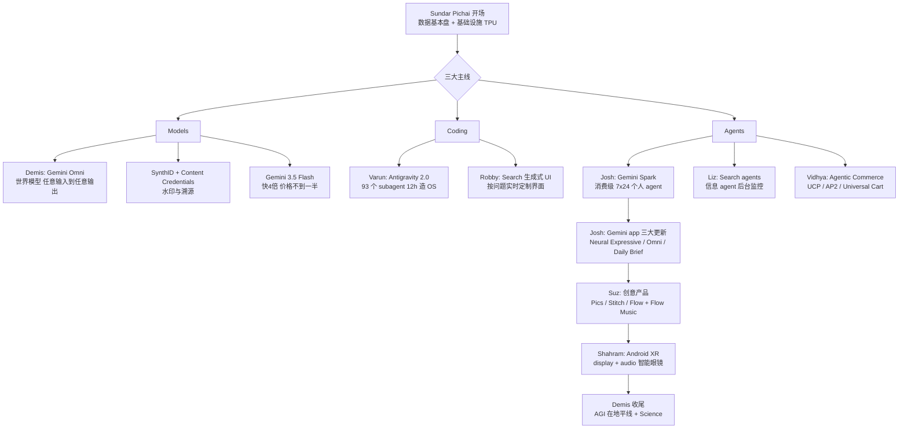
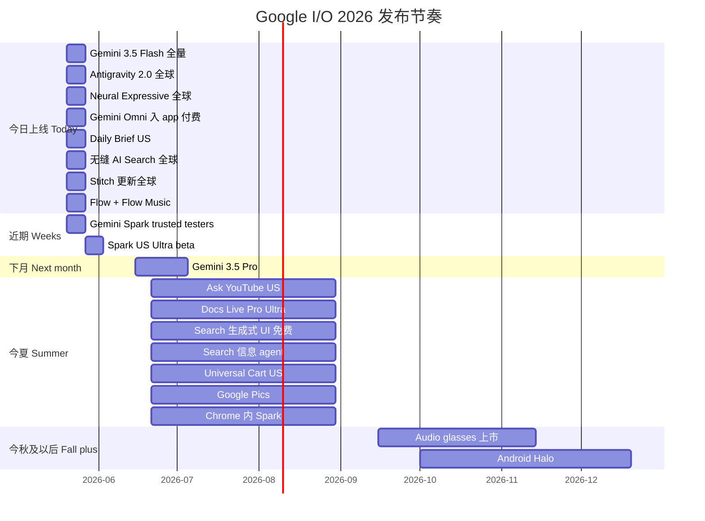

---
alias:
- Google I/O 2026 Keynote
- 谷歌 I/O 2026 主题演讲
- 皮查伊 I/O 2026 演讲
- Gemini 3.5 Flash 发布
- Antigravity 2.0 与 Gemini Spark
author: Google
auto_summary: Google I/O 2026主题演讲由Sundar Pichai开场，宣布Google已迈入AI-first十年，当前每月处理3.2万亿tokens（同比增长7倍），拥有85万开发者，190亿tokens/分钟API吞吐量，375家企业客户各自处理超过1万亿tokens，13款产品用户超10亿其中5款超30亿，Gemini
  app用户从4亿翻倍至9亿，AI Overviews月活2.5亿，AI Mode一年内突破10亿用户。资本支出从2022年310亿美元激增至今年1800-1900亿美元，第八代TPU采用双芯架构（8t训练算力提升3倍，8i推理），JAX+Pathways系统支持跨数据中心训练，全球部署超100万TPU。演讲围绕Models、Coding、Agents三大主线展开：Models方面发布Gemini
  Omni世界模型实现任意输入到任意输出，SynthID水印和Content Credentials验证系统扩展至Search和Chrome，Gemini 3.5
  Flash性能提升4倍且成本降低过半；Coding方面推出Antigravity 2.0桌面应用，93个并行子代理在12小时内用不到1000美元完成2.6万亿tokens处理并构建完整操作系统，Search生成式UI可实时生成定制化交互界面；Agents方面发布消费级个人代理Gemini
  Spark（7×24运行于专用云VM），以及UCP、AP2、Universal Cart等智能商务协议，合作伙伴包括Amazon、Meta、Microsoft、Salesforce、Stripe。Gemini
  app更新Neural Expressive设计语言、集成Omni多模态能力、推出Daily Brief个性化简报，创意产品包括Pics图像编辑、Stitch
  UI设计、Flow视频音乐创作。Android XR智能眼镜携手三星、高通，显示款支持实时翻译和叫车，音频款秋季上市与Gentle Monster、Warby
  Parker合作。Demis Hassabis压轴宣布AGI指日可待，发布AlphaEarth数字孪生地球、WeatherNext天气预报、AlphaFold和AlphaGenome生物研究工具，Isomorphic
  Labs已进入免疫疾病和癌症临床前试验。演讲于5月20日发布Gemini 3.5 Flash、Antigravity 2.0、Neural Expressive等产品，今夏推出Search生成式UI、Universal
  Cart、Flow Music，秋季发布音频眼镜和Android Halo。
auto_summary_indexed_at: '2026-05-21'
created: 2026-05-20
related-notes:
- '[[AI_Gemini-3-Flash_Frontier-Intelligence]]'
- '[[AI_Jules-vs-Antigravity_编程Agent对比]]'
- '[[Demis_Hassabis]]'
- '[[AI_ProjectGenie_GoogleDeepMind无限世界生成器]]'
- '[[AI_DevDigest_2026-05-20]]'
source:
- https://www.youtube.com/watch?v=vw73r_xaeX0
tags:
- BENCHMARK_GDPval
- CONCEPT_AGI
- CONCEPT_AP2
- CONCEPT_UCP
- CONCEPT_Universal_Cart
- EVENT_Google_I/O
- FRAMEWORK_AI_Studio
- FRAMEWORK_Chrome
- FRAMEWORK_Firebase
- FRAMEWORK_JAX
- FRAMEWORK_Pathways
- FRAMEWORK_Shopping_Graph
- HARDWARE_8i
- HARDWARE_8t
- HARDWARE_TPU
- METHOD_Antigravity
- METHOD_Antigravity_Agent_Harness
- MODEL_Gemini_3.5_Flash
- MODEL_Gemini_3.5_Pro
- MODEL_Gemini_Omni
- MODEL_Gemini_Omni_Flash
- MODEL_Gemini_Omni_Pro
- MODEL_Genie
- MODEL_Nano_Banana
- MODEL_Omni_Pro
- MODEL_Veo
- ORG_DeepMind
- ORG_Eleven_Labs
- ORG_Google
- ORG_Google_DeepMind
- ORG_Google_I/O
- ORG_Kakao
- ORG_NVIDIA
- ORG_OpenAI
- PERSON_Demis_Hassabis
- PERSON_Josh_Woodward
- PERSON_Sundar_Pichai
- PERSON_Varun_Mohan
- PERSON_皮查伊
- PLACE_美国
- PRODUCT_AI_Mode
- PRODUCT_AI_Overviews
- PRODUCT_Android
- PRODUCT_Antigravity
- PRODUCT_Antigravity_Agent_Harness
- PRODUCT_Ask_Maps
- PRODUCT_Ask_YouTube
- PRODUCT_Chrome
- PRODUCT_Chrome_Dino
- PRODUCT_Docs
- PRODUCT_Docs_Live
- PRODUCT_Gemini_Live
- PRODUCT_Gemini_app
- PRODUCT_Gmail
- PRODUCT_Keep
- PRODUCT_Maps
- PRODUCT_NotebookLM
- PRODUCT_Search
- PRODUCT_Shopping_Graph
- PRODUCT_Spark
- PRODUCT_YouTube
- PRODUCT_iOS
- TOOL_CLI
- TOOL_Content_Credentials
- TOOL_SDK
- TOOL_SynthID
transcript: '[01:06:20] >> SUNDAR PICHAI: Hello, Shoreline, and hello to everyone
  watching from around the world. Excited to be back for this year''s I/O and what
  a year it''s been. All of the relentless shipping, the rapid advances in

  [01:06:51] technology, it''s been a period of hyper-progress. I''ve definitely felt
  it myself. It''s been an intense year. Here''s a look at what I''ve been up to.
  [Laughter] Okay, I wish this was my year. Actually, the one of me plugging in the
  TPUs is pretty accurate. But there''s probably still more work to do before it''s
  in space, we are working on that. On a serious note, it''s been an

  [01:07:22] extraordinary moment. It''s been 10 years since we pivoted the company
  to be AI first. We knew how profound AI would be to advancing our mission, and improving
  people''s lives at scale. This is why we are taking a differentiated, full-stack
  approach to AI innovation. From our custom silicon and secure foundation, to our
  world-class research and models, to our products and platforms that reach billions
  of people. This approach enables us to

  [01:07:54] iterate and innovate faster, and it''s lighting up every part of the
  company. What''s really incredible is how people are using our AI. Students prepping
  for final exams through the Gemini app; musicians and artists using generative AI
  modules like Lyria and Veo as part of their creative flow; developers coding and
  bringing their ideas to life. I''ve been using Gemini in a myriad of ways. Recently,
  I''ve been turning to Gemini to make sense of my parents'' doctor visits. I''m sure
  many of you have done a

  [01:08:25] version of that. These stories of how people are using AI are the best
  measure of progress. To understand the scale at which people are adopting AI, there''s
  another great proxy: Tokens, the fundamental units of data our models process, many
  representing a problem being solved. Two years ago, we were processing 9.7 trillion
  tokens a month across our services, a

  [01:08:56] huge number. Last year at I/O, that grew to about 480 trillion tokens,
  impressive growth. Fast forward to today, that number has jumped seven times to
  3.2 quadrillion tokens per month. Never imagined I would say quadrillion in an I/O
  keynote, but here we are. Some out there might call this token maxing, and there''s
  probably some truth to it. I still think it tells an important story, about our

  [01:09:27] products and how others are building on it as well, especially our developers.
  Over 8.5 million of you are now building new apps and experiences with our models
  monthly. And our model APIs are now processing around 19 billion tokens per minute.
  Over the past 12 months, over 375 customers each processed more than 1 trillion
  tokens, representing incredible demand for AI across our industry.

  [01:09:58] We are, of course, also seeing incredible demand across our products.
  We now have 13 products with over 1 billion users each. Five of those have more
  than 3 billion users. Our Gemini models are a big reason more people are using our
  products, and why they are using our products more. It all starts with Search, which
  is bringing the benefits of generative AI to more people than any other product
  in the world. AI Overviews now has over

  [01:10:29] 2.5 billion monthly users, and AI mode has been a revelation, our biggest
  upgrade to Search ever. People love it. In just a year, it''s already surpassed
  1 billion monthly users. When people use our AI-powered features in Search, they
  use Search more. I love how Search has become less about individual queries and
  feels more like an ongoing conversation, giving you deeper insights and connecting
  you with the vastness of the Web. Another place where we''ve been rapidly innovating
  is in the

  [01:11:02] Gemini app. Last year at I/O, the Gemini app had 400 million monthly
  active users. Today, we have surpassed 900 million, more than doubling in a year.
  In the same time, daily requests have grown over seven times. It''s incredible growth.
  We''ve been adding a lot of unique features like Personal Intelligence, which makes
  responses more customized and helpful. And today, more than 50 billion images have
  been generated with our Nano Banana model.

  [01:11:33] It was a breakout star this past year. I know you''ve all been having
  a lot of fun with it. Beyond the Gemini app, we are also having much more natural
  conversations with Gemini, directly inside many of our products. Recently, Maps
  got its biggest upgrade in a decade, including a new feature called Ask Maps. People
  are using it to ask more complex and much longer questions. Here''s a real query
  from a parent: My kid just fell into

  [01:12:04] the duckpond and the wedding starts in 30 minutes. Where can I walk and
  buy her a new dress? I would like to hear how that turned out. We are also bringing
  this conversational AI to two more products. First, Ask YouTube. People come to
  YouTube every day to ask a lot of questions. There''s a lot of great videos, and
  sometimes, it''s hard to know where to start. Ask YouTube entirely reimagines the
  experience. Say you want to teach your

  [01:12:35] 3-year-old how to ride a pedal bike, and they already know how to ride
  a balance bike. Just ask YouTube. You will see a couple of differences in results.
  The information is digestible and easy to navigate. You get an overview and helpful
  tips. You will see videos that best match your interests, so if you want to try
  a specific method of teaching you can go deeper there. And best of all, it jumps
  right to the part of the video most relevant for you, brings back memories of teaching

  [01:13:05] my kids to ride. And it remembers the context so you can follow up with
  questions like, should I buy one with handbrakes, or pedal brakes? Making it an
  ongoing conversation. It even lays out the information in a table so it''s easy
  to compare. We are starting to test Ask YouTube now, and it will roll out broadly
  in the U.S. this summer.

  [01:13:38] So far, we have shown conversational text queries. There are a lot of
  times I want to get things done at the speed of my voice. That is much more possible
  today, thanks to technical leaps in our audio model. A new feature called Docs Live
  takes this to another level. To create a Doc with Gemini before, you would have
  to type up a really precise prompt. With Docs Live, you can verbally brain-dump
  whatever is on your mind and let Gemini do the rest. Let''s see it in action with
  the demo from our product team. This is all in real time, not

  [01:14:11] sped up. >> All right. Let''s try this out. So I just remembered I''m
  doing an alumni talk for my high school''s career day tomorrow, and I need to come
  up with some talking points to explain what do for a living as a software engineer,
  but I''m not really sure where to start. Actually, can you pull my resume from Drive?
  Although that might be boring. Maybe can you come up with some funny analogies so
  it will be a more engaging talk for the

  [01:14:42] students? And also, I think the school sent me an e-mail. I think the
  subject is something like "career day logistics." Maybe grab the details from there,
  throw them at the top of the Doc, so I know where to go and what time to get there.
  Let''s update those requirements and turn this straight into a draft. >> This is
  cool, but it''s a little dense. Maybe format the analogies as a table, so it''s
  a little easier for me to scan and also add a note to tell the story about ho

  [01:15:12] my brother inspired me to becom a software engineer. Sort of at the top
  of my Doc an bold it so I don''t miss it. Yeah, that looks great. >> SUNDAR PICHAI:
  In the future, you''ll be able to create new Docs and edit them directly all with
  your voice. Docs Live is rolling out for Pro

  [01:15:43] and Ultra subscribers this summer and the same powerful voice capabilities
  will come to Gmail and Google Keep then, too. Incredible to see the pace of innovation
  rolling out across our products. Supporting all of this at scale for our users,
  while also serving enterprises and developers around the world requires massive
  investments in infrastructure, and we''ve been

  [01:16:14] investing for today and for the future. In 2022, we were spending $31
  billion annually in capex. This year, we expect that number to be about six times
  that, approximately $180 to $190 billion. A key part of this investment is our custom
  silicon. A decade ago, we announced our very first commercial tensor processing
  unit or TPU on this I/O stage. Since then, we have transformed how the industry
  builds for AI. We recently announced our eighth

  [01:16:44] generation of TPUs at Cloud Next. For the first time, we have taken a
  dual-chip approach with specialized architectures for training and inference: TPU
  8t and 8i. While they may look similar, they''re actually pretty different. 8t is
  optimized for large-scale pretraining, and it''s nearly three times the raw computing
  power of our previous generation. And we''ve taken a fundamentally different approach
  with our training infrastructure. With JAX and Pathways, our training is no longer
  constrained by the

  [01:17:16] limits of a single massive data center. Instead, we can now seamlessly
  distribute training across multiple sites, scaling across more than 1 million TPUs
  globally. This gives us the ability to create the largest training cluster in the
  world. For model builders, this means training larger, more capable models in weeks
  rather than months. TPU 8i is designed for inference. We have dramatically improved
  speed at every step, because if you learn anything in

  [01:17:48] 27 years of working on Search, it''s that latency matters. To give you
  a live sense of what the speed feels like, here''s a Prompt on an upcoming Flash
  model if it were running on 8i. I''ll is to create a Chrome Dino game, Push Summit.
  The response is generated in real time. As you watch, take a look at the tokens
  per second in the top right corner. The speed is pretty incredible, nearly 1,500
  tokens per second.

  [01:18:19] It almost took longer to write out the request, and the game is pretty
  fun, too. In addition to speed, we''re also thinking about scaling sustainably.
  Both chips are more energy efficient, delivering up to two times better performance
  per watt. TPUs have been hard at work training for I/O this year. I''m told we have
  a behind-the-scenes look.

  [01:18:59] >> Hey, good weekend? >> Yeah. Just folded proteins across rar oncology
  data sets. You? >> Simulated the next 50 years of climate data. >> I made a picture
  of a pug. >> What? >> You ever a see pug dressed like an accountant? >> No. >> You
  wanna? >> All right, listen up TPUs. I/O is starting soon, and we go a job to do.
  Actually, we got trillions of jobs to do. So clear cache. Timmy! >> Huh? >> Dry
  your fans and let''s fire it up.

  [01:19:31] >> Hey, what are you doing? >> I''m doing the montage thing. >> Yeah,
  well, how about you montage your way down here and help out? >> What? Like now?
  All right, coming.

  [01:20:01] >> SUNDAR PICHAI: I bet Timmy TPU will be ready to teraflop right into
  bed after I/O. Our compute innovations enable our advancements. There are three
  areas where I want to go deeper today to show you the progress in each: Models,

  [01:20:32] coding, and agents. Let''s start with the exciting progress in world
  models. With world models, AI is moving from predicting text to simulating reality.
  Demis and the team at Google DeepMind have been working to push the boundaries of
  what these models can do. Let me invite Demis out to share more.

  [01:21:05] >> DEMIS HASSABIS: Hi, everyone It''s really great to be here. Over the
  past year, AI capabilities have leaped forwards. We now have agents that can plan
  and act on our behalf. And artificial general intelligence is just a few years away.
  Today, I''m excited to share the progress we''ve made toward building AGI. Last
  year, I outlined our vision of extending Gemini''s incredible multimodal capabilities
  to become a world model. AI that can understand

  [01:21:37] and simulate the world. This is a crucial aspect of achieving AGI and
  will be important for everything from building AI assistants to training robots.
  Now, we''re taking the next big step. I''m excited to announce Gemini Omni. Our
  new model that can create anything from any input. It combines Gemini''s intelligence
  with the best of our generative media models for a new level of

  [01:22:10] world understanding, multimodality and editing. Models like Veo, Nano
  Banana and Genie are able to create extremely realistic videos, images and interactive
  simulations. Although not perfect, they already demonstrate some impressive notions
  of intuitive physics. And with Omni, we''ve now made even more progress. It''s a
  step-change in simulating things like kinetic energy and gravity. Previous systems
  would have found these concepts difficult. Gemini''s world knowledge and reasoning
  really shine in Omni.

  [01:22:43] It can translate complex ideas into highly accurate videos. So, for example,
  you can give it a simple prompt like "make a claymation explainer of protein folding"
  and get this. >> Proteins start as chains of amino acids. They fold into patterns,
  like the alpha helix and flat sections called beta sheets forming a perfect three-dimensional
  shape. >> DEMIS HASSABIS: But the initial generation is just the start. The creative
  process is rarely a single step; it''s usually iterative. Just like Nano Banana
  redefined image

  [01:23:15] editing, Omni gives you a much more natural way to edit video with conversational
  language. What''s really cool is you can give it your own videos -- for example,
  this selfie -- and change reality in a really fun way. You can easily adjust the
  details and style, or even add elements. And the whole scene morphs to reflect your
  new idea.

  [01:23:47] A simple circle turns into a black hole or an evening stroll comes to
  life. Anything becomes a canvas for creating entirely new realities. Let''s take
  a look at what Omni can do.

  [01:24:44] >> DEMIS HASSABIS: We''re starting with video, but over time, Omni will
  be able to generate any output from any input. This was always our goal with Gemini,
  and why we built it to be multimodal from the very start. It was a harder path but
  the foundation is now paying off. Today, we''re launching the first model in the
  Omni family, Gemini Omni Flash. It''s now available across our products, and you''ll
  hear more about this later. We''re excited about the progress we''re making and
  we''ll be sharing more about Omni Pro soon. We can''t wait to see what you

  [01:25:15] create. Back to you, Sundar. >> SUNDAR PICHAI: Thanks, Demis. There''s
  huge progress. As generative AI gets better, so does the need for greater transparency.
  Research shows people can correctly identify high-quality deepfake videos only about
  a quarter of the time. Three years ago, we launched SynthID, our watermark

  [01:25:45] that is invisible to the naked eye. Since launch, SynthID has now watermarked
  100 billion images and videos, along with 60,000 years of audio assets. Millions
  of people are using our SynthID Detector in the Gemini app to verify AI-generated
  content. And now, we are going a step further and adding Content Credentials Verification
  across products. This will show you if the origin of the content was AI or a camera,
  and if it

  [01:26:15] has been edited with generative AI tools. In this example, Gemini can
  tell this photo was captured with a Pixel camera and then edited with Google Photos.
  We want more people to have easy access to these tools. So we are expanding both
  SynthID and Content Credentials Verification to Search and Chrome. You can simply
  circle to search

  [01:26:50] or right-click in Chrome and ask "was this generated with AI?" And you''ll
  get a clear response along with other helpful context. For example, this image was
  making the rounds on social media last year. [Laughter] It''s obviously fake. I
  don''t eat hamburgers. It might not be as clear to everyone else. That''s where
  these tools can be really useful. Of course, this only works at scale if more partners
  decide to watermark their own AI-generated content. NVIDIA signed on to SynthID
  last

  [01:27:21] year. And today, I''m thrilled to announce that Open AI, Kakao and Eleven
  Labs are adopting SynthID, too. It''s great to see the cross-industry collaboration.
  And we''re looking forward to expanding to more partners and setting the standard
  for transparency for the AI era. That''s a look at the progress we are making with
  World Models. Now, let''s talk about what''s next for our Gemini 3 Family.

  [01:27:52] Gemini 3 launched a few months ago with a full family of models. It''s
  been our most adopted series yet. We have loved seeing developers use Flash as a
  daily driver and build incredible experiences with Pro''s deep reasoning and multimodal
  capabilities. We''ve been hard at work on improving these models, especially focused
  on agentic coding, long-horizon tasks and real-world workflows. And today, I''m
  excited to

  [01:28:23] introduce Gemini 3.5 Flash, our first in a series of models combining
  frontier intelligence with action. Two things I would highlight. First, when compared
  to 3.1 Pr Flash is better across the board in almost all benchmarks. It''s made
  huge progress in coding, and look at that extraordinary jump in GDP val

  [01:28:57] a benchmark that captures many real-world economically valuable tasks.
  Second, 3.5 Flash is a very capable model, at the frontier and comparable to the
  best models, but much faster, which is why when you look at the intelligence versus
  output speed, it''s in a league of its own in the top right quadrant. When looking
  at output tokens per second, it''s four times faster than other frontier models,
  and it''s an incredible delight to use. The new model has been a game-changer for
  us internally at Google. We''ve been using 3.5 Flash with the reimagined version
  of our agent-first development platform,

  [01:29:29] Antigravity. And it''s dramatically accelerated how we build. In March,
  we were processing half a trillion tokens a day internally for our developers. We''ve
  been doubling every few weeks. And now, we are processing more than 3 trillion tokens
  a day. That scale has created a powerful feedback loop, which is helping us improve
  3.5. And, of course, we are bringing it today to developers in Antigravity. Varun
  is going to share more.

  [01:30:05] >> VARUN MOHAN: It''s truly an amazing time to be a builder. We''ve moved
  beyond AI tools that help us write, to agents that help us act. These agents have
  lowered the barrier to development so much that anyone can be a builder, even busy
  CEOs. In fact, Sundar used Google Antigravity last week to fix a bug in the Google
  codebase. When we launched the Antigravity IDE in November, we made sure to nail
  the core agent-powered IDE experience and

  [01:30:37] added an experimental first-of-its-kind agent for Surface as a glimpse
  of where we are heading. Millions of you already use Antigravity, and so we''re
  Excited to bring you even more today. We''ve seen the diversity of tasks, preferences
  and, frankly, product feedback, and we''ve taken all of these learnings, and now,
  Antigravity is massively expanding its suite of agentic capabilities, surfaces,
  integration, and product features. To start, we''re launching a full

  [01:31:13] CLI experience: an Antigravity SDK, native voice support with Gemini
  audio models and integration with many surfaces and platforms, like Android, Firebase,
  and Google AI Studio. All of this is available for you to try today. Most importantly,
  at the core is Antigravity 2.0, a new stand-alone desktop application that delivers
  fully on that original glimpse of a truly agent-optimized

  [01:31:43] experience. The new Antigravity is unabashedly agent first, focusing
  on the core agent conversation, agent-produced artifacts and multi-agent orchestration.
  Like I said: Unabashedly agent first. As Sundar mentioned, this is the exact experience
  teams here at Google have been using to drive massive value. The Antigravity Agent
  Harness, the invisible framework for Gemini to perform real-world tasks, has become
  much more powerful with new core primitives, such as subagents, hooks, and asynchronous
  task

  [01:32:16] management. And underpinning all of this are the Gemini models, with
  Gemini 3.5 Flash having been co-optimized with the Antigravity Harness. Of course,
  being engineers, we were curious to see how far we could push the limits of what
  was possible with these agents and models. So using the new Antigravity and Gemini
  3.5 Flash, we asked our agents to take on what we consider to be a highly complex
  and impressive task: Build a working operating system from

  [01:32:47] scratch. We were surprised by what we found. Asynchronously, Antigravity
  broke down the challenge into a cohesive plan, tackled tasks via parallel subagents,
  generated, executed, and iterated over its very own tests. Over 12 hours, 93 subagents
  working in parallel made over 15,000 model requests and processed 2.6 billion tokens
  to take an initially empty project to the core of a functioning operating system

  [01:33:19] This was not possible on Gemini 3.1 Pro, but thanks to the performance
  and cost efficiencies of Gemini 3.5 Flash, building an entirely functional operating
  system consumed less than $1,000 of API credits. The Antigravity agents wrote every
  line of code from the scheduler to the memory

  [01:33:54] management to the file system; generated, audited and tested entirely
  by an autonomous team of agents. To put this in context, developing an OS from scratch
  is notoriously brutal and can take many months to build. We weren''t just building
  an application, but a functioning operating system that applications can run on.
  Let''s take this live and actually show the operating system in action. So here,
  I''m actually in a terminal window in the OS that Antigravity built. It''s not super
  easy to demo a working operating system so let''s try

  [01:34:25] something fun to see if it works. One of the interesting utilities you
  can install is SL, a common typo for LS. Without spoiling it, here it goes. It works.
  You could see a cool locomotive passing through the screen with the Antigravity
  logo on it. But clearly, this isn''t a real OS unless I can play Doom. So I try
  running Doom right now,

  [01:34:56] it just doesn''t work. Turns out that this is missing some necessary
  video and keyboard drivers. So let''s just try to fix it in the new Antigravity.
  I have a prompt prepared and I''m going to paste it in. While it''s running, let''s
  take a tour in Antigravity 2.0. As you can see, Antigravity 2.0 is fully agent first
  with all the agent conversations on the side and all the projects, as well. Let''s
  take a quick peek at one of the conversations I

  [01:35:26] previously had. I was curious for this demo about some fun facts about
  Doom. So I asked the agent to do some research. It generated and plots on the right
  side of the panel and then finally, it also generated a cool artifact for me. It
  even generated an infographic using Nano Banana Pro, it generated some graphs using
  some code it just wrote, and then afterwards, it generated some cool tables. As
  you can see, Antigravity 2.0 is unabashedly agent first an Has been optimized to
  be the

  [01:35:59] best surface for you to interact with agents. Let''s take a look at the
  previous conversation to see how it''s going. Antigravity ended up doing a whole
  host of research, ended up writing over 100 lines of code and then finally the built
  the operating system. Let''s take a peek and see if it works. Moment of truth. Amazing.
  That never gets old. While playing Doom on an operating system that

  [01:36:29] Antigravity built is both fun and impressive, it hasn''t stopped there.
  We''ve tasked the agents to build a photo editing suite, a realtime messaging app
  and a multiuser collaboration platform, all with the same results. Multiday engineering
  efforts are collapsing into hours, if not minutes. This was made possible by the
  new subagent teamwork capability. We''re excited to bring this to you as an early
  research preview in Antigravity.

  [01:37:03] Last but not least, 3.5 Flash is incredibly fast. Like Sundar said, it''s
  four times faster than other frontier models, but, as we know, agentic coding is
  a token monster. So we''ve taken it to another level in Antigravity. We''ve optimized
  Flash to be not just four times, but 12 times faster in Antigravity. And we''re
  thrilled to give you all a taste of this experience, starting today.

  [01:37:33] What we showed you today isn''t just a vision; it''s how we''re building
  Antigravity to be the most complete agentic development platform for everyone. We''re
  doing it with the Google ecosystem, whether it''s integrating the tech stacks and
  tools that you already use or using Antigravity''s Agent Harness to power the next
  crop of agentic experiences across Google products. Today, Antigravity 2.0 is available
  globally for everyone. Join us in the Developer Keynote as we demo all the new

  [01:38:04] capabilities. Back to you, Sundar. >> SUNDAR PICHAI: Thanks, Varun. It''s
  incredible that Varun''s entire OS was built by a team of subagents in just 12 hours
  for such a low cost. What''s amazing about Flash is how it delivers frontier-level
  capabilities at less than half the price of comparable frontier models. We''ve heard
  that many companies

  [01:38:35] are already blowing through their annual token budgets, and it''s only
  May. If companies used a mix of Flash and other frontier models, they could save
  a lot of money. To put this in perspective, the top companies in Google Cloud are
  processing about 1 trillion tokens a day. If they shifted 80% of their workloads
  from other frontier models to 3.5 Flash, they would save over $1 billion annually.
  Real savings they can pour back into their company.

  [01:39:07] Gemini 3.5 Flash is available for everyone today, across our products,
  and APIs. We''re also very excited for 3.5 Pro. We are using it internally. It''s
  showing great improvements. I know you can''t wait to get your hands on it. Give
  us until next month to get it to you. Gemini 3.5 and Antigravity are unlocking a
  new world of agents, and agentic capabilities. We''ve been bringing agents to developers
  and enterprises for a

  [01:39:39] while. And now, we are super focused on bringing the power of agents,
  safely and securely, to consumers, so that they work for everyone. You will see
  many agentic experiences across many of our products today. I''m particularly excited
  for what we are bringing right into the Gemini app. Introducing Gemini Spark. It''s
  your personal AI agent that helps you navigate your digital

  [01:40:09] life, taking action on your behalf and under your direction. It runs
  on dedicated virtual machines on Google Cloud, and it is 24/7. And yes, you can
  close your laptop. It''s powered by Gemini 3.5, and the Google Antigravity Harness,
  which allows it to perform long-running tasks easily in the background. Spark integrates

  [01:40:40] seamlessly with tools, starting with our own, and in the coming weeks,
  with third-party tools through MCP. And you can work with Spark however is most
  convenient, in the Gemini app or soon through e-mail and chat. Let''s have Josh
  come up and share more. >> JOSH WOODWARD: Thanks, Sundar. It''s great to see

  [01:41:11] everyone and let me show you how Spark works with some examples from
  my personal life. So here we are, we have the new Gemini open, it''s been completely
  redesigned. We''ll talk about that later in the show, and I want take you into Spark
  here and what you can see immediately is a dashboard with all the different tasks
  that I have going on in the background. It allows you to check in on these things,
  and I''ll paste in a task right off the bat. This is a pretty straightforward example,
  but it''s so useful. Help me draft an e-mail to the team, compile everything about
  our recent Gemini live launches

  [01:41:41] and wins from the last week. Use slash ghost writer so there''s a few
  things happening here. Compile everything. This goes across Docs, e-mail, your chats
  and grabs the most important information that you need for this update. It also
  is going to use all of the stuff you see in the time period of the last week with
  the slash ghost writer. That''s a personal skill that I''ve written so the e-mail
  sounds like me. And what''s great is that with Spark, you can upload your

  [01:42:11] favorite skills you find online. So we''re going to let this run in the
  background. You can see it''s already started doing various tool calls, and I''m
  going to switch over to another one from our personal life. We''re planning a big
  block party, and you can see here, this is a pretty complex prompt We want help
  grabbing all the RSVPs, keep a list of who''s bringing what, remember to e-mail
  those neighbors who haven''t signed up yet. And what''s amazing here is Spark will
  go through, step by step, look at all these steps, all the

  [01:42:42] time it saves you going through and again work across the various skills
  and apps that you have. And what''s really amazing is it will break it down and
  also be able to generate files for you. So the first one here, this is a live RSVP
  tracker, right in Google Sheets. You can see that it shows who''s confirmed and
  who hasn''t. What''s amazing about this is it will actually update, because it''s
  connected to Gmail. So when L. Thompson wrote 8RSVPs, it will update, which is pretty

  [01:43:12] amazing. The other thing is it keeps track of all the different guests,
  as well as sending follow-up reminders to who hasn''t signed up yet. So again, this
  will happen. It will create the drafts and under my control, I can send them. And
  then finally what the prompt did is it created a hype deck for the block party and
  you can see it creates right in Google Slides, perfectly integrated and you can
  see it even pulls in things like our giant bounce house that''s going to be in the
  cul-de-sac. Now, all of this is happening in

  [01:43:43] the background and under my control. And what''s amazing is Gemini can
  even go a step further and pull out things like your neighborhood homeowners association
  won''t let you set this up before Friday afternoon on June 5th. That''s pulling
  from a file in my Google Drive. So it''s incredibly helpful about how it pulls it
  all together. Now, that''s Spark working on a laptop. Spark is also amazing on the
  go, and it works across both Android and iPhone. So here you can see on my phone
  here I''ll open it up, and I can go into Spark.

  [01:44:15] You see both of the tasks we just went through, they sync across all
  of your devices, which is so helpful and Spark is just amazing at brain-dumping
  things on your mind. If you''re super busy, it''s almost, you can just throw tasks
  over your shoulder. Spark will catch them and then run with them. So watch this.
  Start a few threads for me. The first one, find all the upcoming meetings with Sundar
  and turn them all hot pink so I don''t miss them. Write aThe second one last night

  [01:44:50] our new neighbor, John. Write a note to him and his him and his family,
  invite them to our block party, because they weren''t on our list originally. The
  third one, create a document with the top things my wife, and I need to do for the
  kids before the end of the school year. Categorize it by deadline and priority and
  make it easy to digest. I don''t want to miss anything. All right. We''ll send that
  in and you can see at the speed of my voice it''s taking that one task, and it will
  capture all of that context as fast as I can talk. It starts out as a single thread
  here and in the background it''s

  [01:45:21] actually going to go through and break down those into individual tasks.
  Now, I can just put my phone away and get on with my day. And Spark works in the
  background for me. We''ll check in later and see how it''s doing. You can see this
  is one of the first times we''ve been able to put a phone down and let it keep working
  on the I/O stage. It''s great. Because we''re prioritizing safety, we''re rolling
  out Gemini Spark deliberately, to trusted testers, this week, and as a beta for
  U.S. Google AI Ultra

  [01:45:53] subscribers next week. We want this new type of help to be in as many
  hands as possible, so to do that, we''re introducing a new Ultra plan for $100 a
  month. And for those of you that need maximum limits, we''re dropping the price
  for our top tier Ultra plan from $250 a month to $200 a month.

  [01:46:24] And there''s so much more to come. Later, this summer, Gemini Spark will
  operate directly within Chrome, acting as your agentic browser across the web. It
  can take action on your tasks under your direction. We''re also building a dedicated
  home base for your agents on your phone, Android Halo, which is coming later this
  year. As Sundar said, we''ve entered a new agentic era across Google, and we can''t
  wait to see what you''re going to build with it. Back to you, Sundar.

  [01:46:59] >> SUNDAR PICHAI: Thanks, Josh. So great to see Gemini Spark getting
  things done on your behalf. I''ve played around with all sorts of agents and you
  can really see the potential. Still early days when it comes to making agents easy
  to use, super secure, and truly helpful. That''s why I''m really excited by Gemini
  Spark. We are laying the foundation to bring this all together in a safe and secure
  way to consumers everywhere. We look forward to having you all try it. We are firmly
  in our agentic

  [01:47:31] Gemini era. Gemini Spark is the first experience you''re seeing, made
  possible by 3.5 models and Antigravity. This combination gives us new ways to actuate
  our mission and transform our products to be radically more helpful. I can''t wait
  to see how it will transform Search, our ultimate moonshot. This past year has proven
  just how much innovation is possible right at the heart

  [01:48:01] of our information mission. As we enter this agentic era, Search will
  be more helpful and powerful than ever before. Let me turn it over to Liz to share
  what''s next. >> LIZ REID: People bring billions of questions to Search every day.
  Now sometimes, the whole world is searching for the same thing; but more often,
  your questions are just as unique as

  [01:48:36] you are. that''s why we set out to make it possible to ask whatever is
  really on your mind. To unlock this, we''ve been on a journey to bring together
  the best of a search engine with the best of AI. We started this transformation
  with AI Overview. And if you can believe it, it was just last year on this stage
  that we launched AI Mode. It''s our most powerful AI Search, bringing in our most
  advanced Gemini models. And as of today, we''re upgrading it on Gemini 3.5.

  [01:49:12] Now, as Sundar mentioned, AI Mode has surpassed more than 1 billion monthly
  users, and we''re seeing phenomenal growth, with AI Mode queries more than doubling
  every quarter since launch. As people have learned how much more Search can do,
  they started bringing more questions, so much so that last quarter, we saw Search
  queries reach an all-time high. reach an all-time high. But what''s even more remarkable:
  You''re asking your real questions in all their super

  [01:49:42] specific detailed glory, knowing Search can really tackle them. You''re
  having real conversations with Search, going back and forth, and deeper. So you''re
  not just asking nearby hikes. You''re asking can you build an itinerary for hiking
  day trip near me with great views and dog friendly trails, and a lunch spot with
  convenient parking? And now, we''re entering the next chapter of Google Search,
  where incredible AI features aren''t just in Search; Google Search is

  [01:50:12] AI Search through and through. Now, it''s an AI Search that brings to
  figure out our most advanced Gemini models, our newest agentic capabilities, and
  the full breadth of the world''s information. With over 1 billion facts updated
  a minute, billions of new web pages indexed every day, and connections to an infinite
  range of human perspectives. So whatever is on your mind, you can come to Google
  and truly ask anything. Now, to start, I''m excited to announce we''re launching
  a

  [01:50:43] brand-new intelligent Search box. Before, the Search box was a contained
  space, but now, it''s totally reimagined with AI. It expands with your curiosity.
  As you ask, Search helps you formulate your question with AI-powered suggestions.
  This goes beyond autocomplete. It offers nuances that you might not have even thought
  to add, helping you take the exact question on your mind and ask it with ease. This
  new Search box puts our most powerful AI tools right at

  [01:51:14] your fingertips. And you can ask across modalities with text, images,
  files, and videos, and Search reasons across them all. This is the biggest upgrade
  to our iconic Search box since its debut over 25 years ago. And it''s starting to
  roll out toda Next, we''re making it even easier to continue the conversation with
  Search, bringing AI Overviews and AI Mode into one seamless AI Search experience.
  You can float

  [01:51:47] effortlessly from your question to your response on the main Search results
  page, to follow-ups in AI Mode. Your context stays with you and your conversation
  gets deeper. Your links and sources get even more relevant to what you might want
  to explore, so you continue to get the best of AI and the best of the Web. And I''m
  excited to share this new seamless AI Search experience is live today, across desktop
  and mobile worldwide.

  [01:52:19] Next, you just heard Sundar and Josh share our approach to agents and
  the potential that this can open up. Now, we''re taking an exciting step toward
  this vision, where you''ll be able to create and manage multiple AI agents for your
  many tasks, right in Search. We''re entering the era of Search agents. Now to start,
  you can set information agents to work for you 24/7 in the background. They can
  find you exactly what you need, exactly when you need it, and help you take action.
  You can spin up multiple agents

  [01:52:53] in Search simultaneously, so you can get updated and make progress on
  all the things that matter to you. And these will work with and alongside Gemini
  Spark to help you get more done, so let''s put a few to work. Say you''re really
  into finance, and you want to know more about big biotech stocks with P/E under
  15, positive cash flow and low debt, right when it matters. Now, you can just ask
  all of that and your agent is off. It takes your super complex question and map
  out a plan. It determines the urgency,

  [01:53:26] getting that you really need in-the-moment intel, and it sets triggers
  to look out for information as it changes, and picks the tools and data hooks it
  needs for the job. It connects directly to our realtime finance data so you get
  up-to-the-second updates on stock prices and insights on the market, the moment
  it moves. Now, when it does, your agent sends you an intelligent and synthesized
  update. It helps you understand what''s going on so you can separate the signal
  from the noise. And it points you to hyper-relevant content, like this crowdsourced

  [01:53:58] research platform, news site and social. This helps websites and creators
  get fresh content discovered by people who really care about it, when it matters
  most to them. Now, let''s say you''re apartment hunting. You can do a total brain-dump
  of what you''re looking for, with all your criteria like location and natural light
  and availability, and your agent continuously scans the entire web, across sites,
  social, and forums. Or if you''re a sneaker fan, you can just ask to be updated
  when any of your favorite athletes

  [01:54:32] announce sneaker collabs or drops. And it monitors everything from blogs
  to our Shopping Graph so you don''t miss out. You''ll be able to put information
  agents to work for you this summer. Just ask Search to keep you updated on whatever
  you want to know. Now, information agents are among the first of many agents we''re
  introducing in Search to make it more helpful for you. So whether you want to find
  it, or check it, book it, buy it or more, Search will be able to get it done.

  [01:55:03] Now, we''re also bringing agentic coding to Search so it can build you
  custom experiences just for your questions. To show you how this works, here''s
  Robby. >> ROBBY STEIN: We believe the best version of Search is one created just
  for you. It''s a Search that gives you information in the most helpful

  [01:55:34] format for your question. And we''ve spent years perfecting this. So
  if you''re shopping, we give you products. Asking about data, you see charts. Looking
  for inspiration, you get beautiful visuals. Now, we''re taking this to a whole new
  level. We''re bringing Antigravity and the agentic coding capabilities of Gemini
  3.5 Flash right into Search. So Search can build you the ideal format exactly for
  your question, completely custom on

  [01:56:05] the fly. We''re talking dynamic layouts, interactive widgets, entire
  experiences, all created just for you. This is agentic coding at the scale of Search.
  Let me give you an example. Say I''m a college student trying to wrap my mind around
  astrophysics. I can go to

  [01:56:36] Search and just ask how do black holes affect space-time? And check this
  out. I get an interactive visual right in the AI Overview. Search now gets that
  for a concept this complex, I need to interact with it to really understand it.
  This is still kind of 101, so I''m going to follow up. Show me how two orbiting
  objects like binary black holes create gravitational waves. Search dynamically builds
  a brand-new interactive visual in real time

  [01:57:08] completely custom for my specific question. And now, I can play with
  the parameters now like orbital separation, and the mass ratio, and it''s so cool.
  I can see we how wave patterns have changed, and now, the smaller black hole spirals
  around the bigger one. And now that I get the basics, I can dive into these resources
  here and read things like the LIGO Discovery Papers to learn more. Now, you might
  be wondering how

  [01:57:40] can Search actually build custom UI like this for billions of unique
  questions? With Gemini 3.5 Flash, Search plans the ideal response from scratch.
  It designs the layout, decides what custom components to build, fans out to research
  and then finally deploys the code. To build custom components in the response like
  this, Search invokes an agentic coding harness powered by Antigravity, so it can
  read and write files and execute code in a secure, containerized

  [01:58:11] environment. This is the tech you saw Varun build a whole OS with, and
  we''re bringing that power right into Search. Generative UI with Antigravity is
  rolling out to Search this summer, for everyone, free of charge. So whatever you
  want to understand, whether you''re wondering how your watch actually works, analyzing
  the cost of a new commute, or so

  [01:58:43] much more, you''ll get responses as unique as your questions. Now, let''s
  take this a step further. Some projects aren''t one-off questions; they''re ongoing
  tasks. So now, Search has the ability to help you build entire custom stateful experiences:
  Tools, trackers, dashboards. I think of these sort of like building my own little
  mini apps in Search, and I''ve been making a ton of them, and they''re especially
  awesome for those long-running tasks where you want to keep coming back, like planning
  a wedding,

  [01:59:15] or managing your home move. So what do you think? Should we build one
  together? Yeah? All right. Let''s do a demo. So I''m constantly trying to figure
  out on Thursday what it is I should do with my family every weekend. So here''s
  the search I actually just did about fun things to do with my family this weekend
  and, of course, you have a great response here from AI Mode, but here''s something
  new. Search proactively offers to build a weekend planner for me and similar to
  how you just saw

  [01:59:47] Search create these generative UI and interactive visuals completely
  from scratch, Search can code this up right now. Let''s do it. So for the sake of
  today''s demo, we thought you might want to see a peek under the hood so as this
  builds, you''re going to see realtime thinking steps and code generation flowing
  in. And here, Search is thinking about the right components to build, not just what
  information to fetch, but the best way to present it, and I''ve chosen to securely
  connect Gmail, Photos and Calendar so it''s using personal intelligence to make
  my

  [02:00:18] suggestions even more helpful. That means referencing Gmail receipts,
  Calendar and much more to personalize. And boom, there it is. It looks like it''s
  ready. All right. It''s got a beautiful planner, already taken into account driving
  times and weather. And Search knows that I have two kids. And that they love animals
  and that my oldest is learning to play chess. So actually this second one here is
  kind of awesome for my oldest so I''m going to go ahead and heart that. But, you
  know, two kids, got to make them both happy so I''m going to lock in the Happy

  [02:00:50] Hollow Park & Zoo right there. And because this syncs with my calendar,
  you can see it''s already blocked off my afternoon to meet a friend to watch this
  game down here. And below it''s got all of these cool restaurant reservations and
  beautifully laid out on Maps. Now having seen this agents, I kind of want the Madam
  President to be higher up, and also, my wife, and I try to do Friday date nights.
  So I''m going to keep customizing this and just for the sake of speed, I''m going
  to paste in here one more question to add Friday night date each week and move it
  to

  [02:01:22] the top. And just like before, it''s thinking through what''s needed
  to adjust the Planner, looking up realtime information, even checking my preferences
  again. Wow. It was so fast. So it''s able to use all kinds of information from Google
  to build this on the fly and now, you can see the map right at the top, and Friday
  date night tab, right here. So I can scroll down, I can see all of these really
  great places, after the baby-sitter arrives, here''s some awesome restaurants. I''ll
  go ahead and select it, and we''re ready to go.

  [02:01:52] Now, a weekend plan is not complete until I get my wife Danielle''s seal
  of approval so I can share this app with her, which I''m going to do right here.
  And copy it. Okay. And now, I''m actually going to pull it up on a phone. When I
  send this to her this is exactly what she''s going to see on her phone All right.
  So Danielle is in, but it also looks like she might have some feedback for me when
  I get home, but we''re going to

  [02:02:23] deal with that kind of a little bit later. So all I have to do is add
  this to my Calendar. Search will add it to all of our family calendars, and we''re
  ready to go and next weekend I''ll be able to come back and plan a whole new weekend
  with my family just like this. So we''re bringing Antigravity into Search, so you''ll
  get generative UI this summer. Starting with subscribers, you''ll be able to custom-build
  experiences just like this in the coming months.

  [02:02:56] From Search agents to agentic coding, this is an AI Search that does
  more for you, whatever your question. Agentic capabilities are going to transform
  all the ways you use Search, including how you shop. To tell you more, here''s Vidhya
  >> VIDHYA SRINIVASAN: With incredible advancements in AI,

  [02:03:27] we are entering a whole new era. We''ve been building the foundation
  for agentic commerce, and now, we''re bringing that future right to you. People
  shop across Google over a billion times a day, and for years, we''ve connected you
  with brands and retailers to help you get exactly what you''re looking for. It starts
  with our Shopping Graph, the world''s most comprehensive catalog of products. It
  now has over 60

  [02:03:57] billion listings and they are constantly updated. Combine that, the scale
  of the Shopping Graph, with our most advanced Gemini models and you get entirely
  new ways to shop. More powerful, more intelligent, and more fun! Now, when it comes
  to agentic commerce, we are focused on delivering three key building blocks to make
  this future a reality. First, the Universal Commerce Protocol, or UCP for short.
  UCP does for agentic commerce what

  [02:04:29] HTTP did for the web: It gives agents and systems a common language.
  It''s an open-source standard that allows all of the key players to work across
  the entire shopping journey. That means it makes everything from product research
  to checkout to shipment tracking totally seamless. And we''ve been thrilled to see
  the entire industry rally behind it. We co-developed and launched UCP with an incredible
  group of founding partners, and recently

  [02:05:03] welcomed Amazon, Meta, Microsoft, Salesforce, and Stripe. They''re going
  to help continue steering this open standard. It may just be the first time we''ve
  all agreed on something! And now, we are bringing UCP to even more verticals, like

  [02:05:34] hotels and local food delivery providers and to YouTube and more products.
  We are also expanding UCP-powered experiences on Google products to more regions,
  like Canada, Australia, and the U.K. in the coming months. This brings us to our
  second building block: The agent payments protocol or AP2. So when it comes to agentic
  payments, the number one question we hear is, "how do I know it won''t just go off
  and

  [02:06:05] buy something I don''t want?" Motorcycle anyone? It''s a fair question,
  and it''s why we created AP2. It''s designed so your AI agent can securely make
  payments on your behalf, but always under your control. For us, it comes down to
  two things: Setting boundaries and ensuring accountability. First, let''s talk about
  boundaries. We are now making it easy to set strict guardrails. Just tell your agent
  the specific brands

  [02:06:36] and products you want and how much you want to spend. It automatically
  makes the purchase if the criteria are met. But boundaries only work if there''s
  accountability. AP2 creates a transparent, verifiable link between you, the merchant
  and the payment processors. It uses privacy-preserving technology to keep your data
  safe and with tamper-proof digital mandates, AP2 ensures the agent is always

  [02:07:07] acting on your behalf and giving you a permanent digital paper trail.
  So if you ever need to make a return, you and the merchant are looking at the same
  record. Your payment info stays shielded and your data stays private and your purchases
  stay secure. We''ll begin bringing AP2 to Google products in the coming months,
  starting with Gemini Spark.

  [02:07:38] Now, these protocols are powering the foundation of this new era, which
  brings us to our final building block of agentic commerce. I''m excited to announce
  the Universal Cart, a truly intelligent shopping cart. It works across merchants
  and across services. You will be able to add things to your cart while you''re browsing
  Search, chatting with Gemini, watching YouTube or even reading your Gmail. The moment
  you add a

  [02:08:08] product, your cart goes to work for you in the background. It finds deals
  and price drops, it gives you insights on price history, and alerts you when something
  comes back in stock. It all runs on our Gemini models so your cart gets even smarter
  as the models improve. So just think of it as shopping with superpowers. Another
  game changer is how it applies intelligent reasoning. Let''s

  [02:08:40] say you''re building your first custom PC. You see a motherboard with
  great reviews and add it to your cart. You had already picked out a processor, but
  you didn''t realize is that the processor needs a motherboard with a different type
  of socket. Your cart catches this for you and suggests an alternative, preventing
  a problem you didn''t really see coming! Next, my favorite feature is how the cart
  can actually find hidden savings for you. If you''re like me, you have

  [02:09:10] different payment cards with different perks that are hard to keep track
  of. Now, you don''t have to. The cart can do it for you because it''s built on Google
  wallet. Here''s an example. Right here, there''s an offer from Target for some products
  that were added to the cart earlier in the week. I see it so I want to get them
  now. And UCP makes checkout from your cart super smooth. For many of your favorite
  brands, you can check out right

  [02:09:41] on Google in just a few taps with Google Pay, or you can transfer the
  items straight to the retailer''s site and buy them there. I''m excited to announce
  that we are rolling out the Universal Cart in the U.S. across Search and the Gemini
  app this summer with YouTube and Gmail to follow. These are the building blocks
  that we showed you today, and they don''t just create the

  [02:10:11] foundation for agentic commerce, they''ll transform how you shop on Google,
  making it more powerful, more intelligent and a lot more fun. Happy shopping and
  back to you, Liz! >> LIZ REID: Today, you''ve seen how we''re bringing together
  the best of a search engine with the best of AI to build a Google Search that''s
  more helpful and powerful than ever before, where Search agents work for you

  [02:10:42] around the clock, where agentic coding means that Search can build experiences
  as unique as your questions, and where the power of agentic commerce isn''t in the
  distant future; it''s here now. So in this chapter of AI Search, Google can help
  you find, understand, build, do anything. So go ahead; just ask.

  [02:11:15] >> JOSH WOODWARD: All right! Hi,

  [02:12:40] everyone! Great to see you again. And you''ve already seen some amazing
  breakthroughs this morning, and we''re just getting started. We have a lot more
  to show you in the Gemini app so let''s jump right in. Over the last summer, Gemini
  has had incredible momentum. More than 900 million users are coming to the Gemini
  app every month, and a big part of that growth is how fast we''re shipping. A year
  ago, none of these features existed. And now, Gemini has become the ultimate

  [02:13:13] creative tool for everyone. You can create images, videos and music in
  ways people never thought were possible. We made Gemini even more tailored with
  Personal Intelligence, allowing you to securely connect your Gmail, Photos, and
  other apps so you can get customized help. Just last week, we expanded Personal
  Intelligence to users Around the world directly in the app.

  [02:13:43] Millions of people are using it every single day. They found it so helpful
  for things like personalized product and trip recommendations or Acting as a thought
  partner for navigating big decisions in life like a career change or in my case,
  finding the right set of tires for our super cool min van that''s going to be at
  that block party. We''ve made Gemini superb for students also over the last year.
  You can use it to create guided learning, generate practice tests, and even use
  dedicated notebooks to keep all your notes and assignments in

  [02:14:14] one place. And these same notebooks sync directly to NotebookLM. Just
  on its own, NotebookLM has now been used to create more than 1.5 billion notebooks,
  podcasts, slide decks and more, turning complex information into easy to understand
  knowledge. And as you heard from Sundar earlier, we''re rolling out our new Gemini
  3.5 Flash model, which is unlocking a new set of features that I''m going to show
  you today. All of this is happening

  [02:14:45] in a Gemini app that''s now available in more than 230 countries and
  over 70 languages, making Gemini the most widely available AI system in the world.
  Gemini is becoming that universal assistant people are turning to. It''s designed
  for their everyday lives, and speaking of design, that brings us to the first of
  our three big updates today. Today, I''m excited to announce that we''ve

  [02:15:17] completely redesigned the Gemini experience from the ground up. From
  the moment you open it, we''ve greeted you with a stunning new design language we
  call Neural Expressive. We''ve added fluid animations, vibrant colors, new topography,
  haptic feedback throughout the app. But we all know that good design isn''t just
  about how it looks; good design is about how it works. So we''ve involved the entire
  experience. We''ve made it easier to discover and

  [02:15:49] generate those gorgeous images, videos and music with built-in templates
  that you can easily remix. And we''ve completely transformed the Gemini Live experience.
  It now opens up immediately and in line. And soon, you''ll be able to pick a regional
  dialect that resonates with you. >> You''ve got a right good mix of different accents
  knocking about like this one from Liverpool. [Speaking various languages]

  [02:16:30] >> JOSH WOODWARD: All right. Pretty cool. We''ll be rolling out these
  and many more regional dialects in the coming weeks, and my favorite part is how
  we handle model responses with our new Neural Expressive design language. That''s
  where it really comes to life. You won''t see a wall of text anymore. Instead, Gemini
  will carefully lay out its response in real time, just for you, like the generative
  UI you saw in

  [02:17:05] Search. As you scroll, you might see interactive images that are custom
  generated by Gemini. You can drill into them and explore information on an entirely
  new level. You might even see timelines that you can quickly skim, or embedded videos.
  So whether you''re in dark mode or light mode, the entire experience feels fluid,
  futuristic, and incredibly natural. Best of all? Neural Expressive is rolling out
  globally on Android, iOS, and the Web starting right now.

  [02:17:39] With a completely redesigned Gemini app as the new base, we can go even
  further with Gemini''s creative capabilities. And that''s update number 2. Gemini
  Omni is coming to the Gemini app for paid subscribers today. It''s going to let
  you bring your ideas to life using any combination of text, images and video inputs.
  As I''ve been using it, it feels like the Nano Banana for video moment is here.
  It''s never been so easy to

  [02:18:09] create and edit videos. Let''s look at how this plays out in the real
  world. I want you to meet Sashu. She''s working on a new song and wants to create
  a quick video teaser. She shares this raw video, she adds some reference visuals
  and this is the coolest part. She can transform the style of the video, even switch
  the camera angle to a 360-degree shot. And Gemini puts it all together. Let''s take
  a look at what it looks like.

  [02:18:50] >> JOSH WOODWARD: All done within Gemini. As you can see, Omni understands
  the physics of her movement, intelligently layering those effects into the real
  world without losing the soul of the shot. Creating, remixing, and Editing a video
  has never been easier. So whatever vision is in her head, she can now use Gemini
  to make it real. Google AI Plus, Pro and Ultra subscribers around the worl

  [02:19:21] Can try Gemini Omni today right in the app. The third update today is
  about how agents are coming to Gemini. This is a big shift for Gemini, because agents
  don''t just answer questions; they proactively work on your behalf. And to show
  you what that means, I want to introduce one of our newest out of the box agents
  called the daily brief. It''s a personalized digest that''s designed to be your
  first stop every morning. Here''s how

  [02:19:52] it works. You can see here it''s synthesizing information from across
  my inbox, my calendar, my tasks, it''s finding the most important things for me
  to be aware of. And I could totally forget these things like returning that back.
  It''s not just summarizing the data, though; it''s organizing it by topic. It''s
  even suggesting the next steps. And with this travel info, I can just take the next
  step right in line. All of it is super concise in this morning digest that''s built
  for

  [02:20:23] skimming. And I can''t wait for you to try it out. The Daily Brief is
  rolling out today also to Google AI Plus, Pro, and Ultra subscribers starting right
  here in the U.S. And that''s just the help you''re going to get before breakfast.
  Beyond the Daily Brief, we''re allowing power users to create their own custom workflows
  with Gemini Spark like I showed you earlier. You''ll remember at the beginning Of
  the show I sent a few tasks

  [02:20:54] off so let''s go check in on them, let''s see how they''ve completed.
  And you''ll remember when I did this earlier, I did it from the phone so we''re
  going to actually pull it up on the laptop to see how it thinks across. And if I
  open it up here on the laptop you can see it''s subdivided those three tasks right
  here, one, two, three, and it''s actually got a really nice feature. There''s certain
  tasks it will actually ask for your input so you can approve it, so it doesn''t
  just go off and do things you don''t want. But I''ll check on this one here This
  is our school year planning

  [02:21:26] checklist and I asked it remember to create a docket of all the things
  I didn''t want to forget between now and the end of the year. And so I''ll open
  this one up, and what''s amazing about this is it takes advantage of all the Google
  Docs formatting so I can immediately click in and see the checklist here for all
  our various kids, all subdivided like this, and easily go one by one, the date,
  the activity, the color coding, all integrated in one spot. Pretty incredible how
  much time this can save. Now, what comes across all of these cases is that we want
  to make agents easy to use and safe

  [02:21:59] and secure. As a reminder, Spark is going to start rolling out to trusted
  testers this week, and we''re planning to roll it out as a beta to Google AI Ultra
  subscribers next week in the U.S., and we''ll be bringing a version of Spark also
  to Gemini Workspace, as well as Gemini Enterprise. And this is just the beginning.
  We''ve got a packed road map of features we''ll be shipping throughout the summer.
  It''s going to be amazing. I''m really excited about the MCP integration. That''s
  going to enable Spark to handle so many

  [02:22:30] tasks in ways that are even more proactive and powerful. Imagine, Spark
  will be able to look ahead on your calendar and see that you''re on snack duty,
  or for your kids'' T-ball game on Saturday. They can go ahead, and proactively set
  up your instacart order on its own so you don''t forget those snacks. It will even
  remember to pick snacks that don''t have nuts in them. And we have this incredible
  lineup of partners that are coming that will be integrating with Spark over the
  summer.

  [02:23:01] Now, I know I promised just three updates, but we have one more. Last
  month, we dropped the Gemini app for Mac OS. Here it is on the screen. It''s gorgeous.
  This is a small team that built this native app from scratch, using Antigravity.
  They did over 100 features in less than 100 days. Now, two weekends ago we were
  hacking on the Mac app and we came up with something cool and we wanted to sneak
  it into the show. Do you all want to see it live? All right.

  [02:23:31] We''ve got a big summer trip coming up, and we''ve got to find a kennel
  for our two dogs, and here''s a picture of our two dogs, there''s Hank, looking
  good, and Louis Cinnamon, one of the most interesting names for a dog we''ve ever
  heard. What we''re going to do and remember when you have to go to a new kennel
  there''s lots of paperwork, allergies, vaccines, all the history you have to pull
  together. It''s so painful. And so what you can do with this on Gemini, on Mac OS
  is actually

  [02:24:04] take a look at a bunch of documents like this. You''ll be able to select
  them all and long-press the Function Key and just dictate the e-mail to the kennel.
  So it works something like this. Hi, there, I need to do a short boarding stay for
  my two dogs, Louis Cinnamon and Hank starting this Thursday, oh, wait no actually,
  it''s this Friday. They''ve never stayed with you before, but they''re very social
  dogs and also can you turn these files into a table with their details, allergies,
  recent

  [02:24:36] vaccines and make this e-mail sound friendly so we make a good first
  impression. All right. I''m going to release the function key, you can see Gemini
  is thinking at the bottom here on this Macbook. What it''s done is because I''ve
  selected those files in Finder, using its multimodal understanding, it can go through
  the PDFs, it can go through these images of their invoices, and it''s all controlled
  by my voice. So it can actually take all of that complex information and look at

  [02:25:06] that, there it is. It''s got a table in line -- It''s also so amazing,
  because it corrects -- remember, I said Thursday, no scratch that Friday, and it
  Pics that up and automatically cleans up my input. This is the power of what Gemini
  can do using your voice. These new voice capabilities in Gemini Spark will be coming
  to the Mac app this summer, as well.

  [02:25:39] And so there it is. Today has been a jam-packed Gemini day. We''ve completely
  redesigned the entire experience with Neural Expressive. We''re shipping the brand-new
  Gemini Omni model and three the .5 Flash model with 3.5 Pro coming soon and you
  can now put Gemini to work. And it will keep working for you even while you sleep,
  thanks to new features like the Daily Brief and Gemini Spark. All of this gets us
  closer to

  [02:26:10] our vision of a universal assistant that''s personal, proactive, and
  powerful in your daily life. So whether you''re a student, a busy parent, or a small
  business owner, we look forward to what you''re going to be able to do with Gemini.
  Thank you. >> Hi. I''m Holly. I moved from South Korea to the U.S. in 2005. Food
  has always been something we love to do in our family. So I decided to open a restaurant.

  [02:26:42] But running a restaurant, so hard. I discovered Gemini could help me
  with a lot of things. From menus to marketing, budgeting and inventory. How much
  sesame oil did I order last month? >> Last month you ordered five gallons. >> I
  even rebuilt our website was Antigravity and Stitch to include a custom chatbot
  for ou customers. But one day we needed to find a dishwasher very last minute and

  [02:27:13] that was my "aha" moment. I wanted to help small businesses and people
  find each other faster. So I got a small team together and we used Gemini models
  to build an inclusive hiring platform called WorkOnward. And we did what other job
  sites are not doing. We translated the job postings and then made it possible to
  post jobs just by text. It helps break down barriers fo those who aren''t tech savvy
  and

  [02:27:43] helps people find their place. Our little tool is now a platform used
  by over 13,000 people in New York City. It''s about honoring the dignity of workers
  and small businesses and I think that''s a power of AI.

  [02:28:16] >> SUZ CHAMBER: As you''ve heard today, our models and products are unlocking
  new breakthroughs, but the real breakthrough isn''t the technology; it''s what you
  do with it. Whether you''re a designer, an entrepreneur, or an artist, our products
  help shrink the gap between the moment you have an idea and the moment you create
  it. At its best, technology is a canvas for human creativity, and today, I want
  to dive into

  [02:28:47] the three products that help you bring your ideas to life. Let''s start
  with one that takes the power of Nano Banana and gives you even more creative control.
  Introducing Google Pics, a new product in Google Workspace. Pics is our image creation
  and editing tool that helps you create just about anything, from party flyers to
  infographics with the creative control you want. Watch how easy this is. You start
  with a base image as

  [02:29:18] your canvas, and what''s really cool is that Pics understands what''s
  in your creations and how the objects work together. You can hover over an element
  and click to remove it, or you can resize an object to fit the frame. Once the layout
  is set, you can add or edit text and translate all of it with just a few clicks.
  Pretty cool.

  [02:29:49] Every output from our creative tools, including Pics, is watermarked
  with SynthID and Pics is rolling out this summer. But what if you want to go beyond
  images? Maybe you want to design an app or a website. Now, you can build UI at the
  speed of thought. Teams across Google use our design product called Stitch to turn
  rough

  [02:30:21] ideas into beautiful UI designs. But it''s not just us. In the last year,
  the world used Stitch to generate over 100 million UI screens. And to continue that
  momentum, today, we''re introducing new ways to design. Let''s take a look at how
  this works. My friends Tyler and Jenny own a pizza company. They have a ton of experience
  making pizza and no experience designing websites. With a single prompt, Stitch
  will go to work, generating that UI live.

  [02:30:53] Now, this is just the first pass, but if they want to refine it, they
  can collaborate with Stitch in real time, either by writing prompts or using their
  voices. For example, they can jump in and say "make the header text larger"and update
  the menu to highlight more pizza options." And the layout updates in real time.

  [02:31:28] And because Stitch links to many tools, they can export their design
  to code or launch their website in just a few clicks. These updates in Stitch are
  rolling out today to users globally. With every new technology, what''s most exciting
  is seeing what people make with it. That''s why from day one, we haven''t just built
  models and tools for creatives; we''ve built with them. Let''s take a look at some
  of our amazing partners and what we''ve created together.

  [02:31:59] >> You''re in the era where the human has to be the most creative. >>
  Toto, I have a feeling we''re not in Kansas anymore. >> Right?

  [02:32:34] >> Yeah. We''ll do that. >> SUZ CHAMBER: That spirit of collaboration
  is why we launched Google Flow at I/O last year. Today, millions of people are using
  it to create images, films, and music, in ways that never could have been done before
  and to build on that progress, we''re rolling out Gemini Omni, a new agent, custom
  tools, and music remixing

  [02:33:11] Let''s start with Gemini Omni. Take a look at this raw footage. I love
  how this person is walking, his presence, his pacing, let''s not change any of that.
  With a simple prompt and style reference, Omni allows us to transform the environment,
  add visual effects and any other element all while preserving the original performance.

  [02:33:41] And now, you can even add new characters, while maintaining everything
  else in the scene. Next, let''s take a look at our second big update, a new agent
  in Google Flow. Until today, Flow could only execute one prompt at a time. Now,
  your agent can take multiple actions all at once. Starting with just a single

  [02:34:13] image, I can ask the agent to help me find the best camera angles for
  this scene. It analyzes what''s happening in the image, concepts the most compelling
  angles and then boom, a single image becomes 16 unique videos. The agent can also
  handle large-scale edits, like transforming all of these scenes from early morning
  to late at night.

  [02:34:45] Its understanding of context is precise. The desert sky goes completely
  dark, and the headlights turn on illuminating the dust. It''s a true collaborator,
  helping you create and edit at scale. Our next -- Our next update is Flow tools.
  Now, you can vibe-code any creative tool you can think of, right in Flow. Custom
  built by you for your unique creative

  [02:35:15] process, like designing video effects, hand-drawn animations or layering
  text. You can start building, sharing, and remixing tools today. Visual magic is
  only half the story. Google Flow Music brings the same creative control to help
  artists create original songs.

  [02:35:49] For months, one of our teammates had a piano riff in his head. Let''s
  listen to that original recording. ♪ [ piano ] ♪ It''s a really cool foundation,
  but he wanted to turn it into a demo to guide his band. So he recorded his piano
  into Flow Music and prompted it for an R&B direction with a female vocal to inspire
  his band''s singer. Let''s take a listen.

  [02:36:31] Now, this isn''t his final track, but it helped his band decide what
  to record next. These new features in Google Flow and Google Flow Music are available
  today. From musicians to small

  [02:37:01] businesses, and vibe coders to artists, the real breakthrough isn''t
  the technology; it''s what you do with it. And we can''t wait to see what you create
  Next, I would like to hand things over to Shahram to show you what happens when
  we take Google''s latest innovations and bring them into the real world.

  [02:37:38] >> SHAHRAM IZADI: This is such an exciting time for XR. AI continues
  to unlock all-new experiences on headsets, glasses and everything in between. Android
  XR, the new platform we''ve built with Samsung and optimized for Snapdragon with
  Qualcomm, combines this pioneering hardware with Gemini. This gives you help in
  the moment without taking you out of it. The next big milestone for

  [02:38:09] Android XR is Intelligent Eyewear. There will be two types of these AI
  glasses that connect to your phone and give you hands-free help all day long. Last
  year, we showed you display glasses on the I/O stage. With the small in-lens display,
  you''ll get helpful information right in front of you, right when you need it, like
  seeing your Uber pickup details at a glance, or getting live translations as you
  travel.

  [02:38:41] You''ll even be able to use features like Create My Widget to make glance-able
  elements. The first wave of developers are already creating display experiences,
  and you''ll hear more about these glasses later this year when we expand our Trusted
  Tester Program. But let''s talk about what''s launching this year. Today, I''m excited
  to announce that our first audio glasses

  [02:39:14] will arrive this fall. They are designed to give you all-day help from
  Gemini that is spoken into your ear privately rather than shown on a display. And
  these glasses let you stay hands-free and heads-up for things like listening to
  music, taking photos, making calls, or tapping into your phone apps without reaching
  into your pocket. Personally, I love to cook, but I''m not one to follow a recipe

  [02:39:47] book, so it''s great to have Gemini offer up some advice before I get
  too experimental. These audio glasses have brought together an all-star cast of
  partners. You''ve got the world''s top eyewear designers at Gentle Monster and Warby
  Parker creating iconic designs. The -- Thank you. The world''s leading electronics
  company, Samsung, is building

  [02:40:17] innovative new devices and experiences that set the bar for the whole
  industry. And we''ve been working to bring the best of Google to these glasses,
  as well. And yes. They''re going to pair with Android and iOS devices. They look
  incredible and today, You are actually going to finally see for yourself. Let''s
  pass it to our friend and

  [02:40:47] partner from Samsung, Jay Kim, to kick off the world''s first look. >>
  At Samsung, our vision is to enrich people''s lives and help shape how we live tomorrow.
  In close partnership with Google, we''re introducing intelligent eyewear that empowers
  you to connect to the world with confidence. Built with Samsung''s precise engineering
  and craftsmanship, we''re merging form, function an helpful intelligence to create

  [02:41:18] something you''ll want to wear. In eyewear, every millimeter counts.
  Today, we''re thrilled to share a first look at the upcoming styles co-created with
  our eyewear partners, Warby Parker and Gentle Monster. Let''s take a look. >> People
  are always saying, “Hey, we have to be disruptive.” But we have to think about what
  is the disruption? I want to make intelligent eyewear that looks prettier tha normal
  eyewear. That''s our goal.

  [02:41:49] It''s the balance between technology and fashion. It''s not only product.
  It''s all about perception and emotion. You know, heart, that is the DNA. I want
  to give confidence to people. When they wear this, they feel like connected with
  this kind o braveness, these kind of rebellious things because this is who we are.
  That''s the meaning of Gentle Monster with Google and Samsung >> Glasses are a deeply
  persona product. They shape how you see the worl and how the world sees you.

  [02:42:23] >> What you see here is an evolution of Warby Parker''s first intelligent
  eyewear designs. >> Our vision for intelligent eyewear started by wanting to design
  a beautiful pair of glasses. We often take inspiration from different art objects,
  artists, eras in time. >> It was important for us not to hide the technology but
  to celebrate it. >> These will not only help people see but will help them understand
  the world more deeply. >> We want people to experience the world fully and that''s
  the magic of this technology.

  [02:42:55] Hey, Gemini, who wore it better >> SHAHRAM IZADI: Aren''t they beautiful?
  These are the firs Two designs of a bigger collection coming this fall. You know
  what time it is now. Who''s up for a live demo? Nishtha is going to join me on

  [02:43:27] stage, so let''s have Gemini play some entrance music for her. And it''s
  seeing the world around you, you can see, so the more hyped you are in the audience,
  the more pumping the music will be. Gemini... I think it''s done it already. Play
  that music! Come on let''s go. Nishtha, welcome.

  [02:44:00] Welcome, Nishtha. >> NISHTHA BHATIA: Thank you. >> SHAHRAM IZADI: I''m
  wearing one of the Warby Parker styles and Nishtha has a pair of the Gentle Monster
  glasses on. Looking great, Nishtha. >> NISHTHA BHATIA: Thanks, Ram, you, too. >>
  SHAHRAM IZADI: A quick preamble for the demo today. We''re going to be piping in
  the audio to the stage speakers from our glasses, but in regular use, of course,
  Gemini is going to just privately be talking to us. Now, last time we were on stag

  [02:44:30] We saw the rich Google Maps experience on display glasses. Well Maps
  on these glasses are just as helpful, especially when working in combination with
  Personal Intelligence. >> NISHTHA BHATIA: No pulling out my phone. All I have to
  do Now is ask. Can you navigate me to that place I met my friend Gianna at last
  week? >> GEMINI: Hey, Nishtha, I''ve set your route to the Redwood Grove Natural
  Preserve from Last Week''s Hike, want to add a stop

  [02:45:00] on the way to grab your afternoon cold brew? >> NISHTHA BHATIA: Yes,
  Gemini I Would Love That. >> GEMINI: Okay. I''m Starting Walking Navigation with
  a Stop at Koopa Cafe. Turn Around and Head Towards Bill Graham Parkway. >> SHAHRAM
  IZADI: With glasses, you can allow Maps to further understand your context, and
  what''s in front of you so you get detailed directions like the coffee shop is coming
  up on your right. Speaking of coffee, Nishtha, do you want to share how Gemini intelligence
  can allow you to order that cold brew up ahead? >> NISHTHA BHATIA: That''s a really
  good idea. Gemini, can

  [02:45:30] you actually put my usual order in at that coffee shop we just talked
  about? >> GEMINI: Sure, I''ll order you a nitro cold brew for pickup from Koopa
  Cafe on Doordash. >> SHAHRAM IZADI: On the screen behind me you can see Nishtha''s
  phone in her pocket and Gemini is able to launch apps like Doordash and then click
  through all the different option screens automatically to order her coffee. And
  in a moment, it will be

  [02:46:00] ready for Nishtha''s confirmation. There we go. There we go. >> GEMINI:
  I have prepared your order for the nitro cold brew from Koopa Cafe. Would you like
  to confirm? >> NISHTHA BHATIA: Yes, please. And add a tip for 20%, too. >> SHAHRAM
  IZADI: I think after all these rehearsals, that''s her 15th cold brew of the day
  and

  [02:46:31] thanks to the coffee shop for putting up with us. >> NISHTHA BHATIA:
  Definitely, is and speaking of preparation, I actually muted my texts before I came
  on stage, but let me see if I can catch up now. Hey, Gemini, any important messages
  I missed? >> GEMINI: Yes. Your family group chat decided to meet for dinner tonight
  at 7:00 and there''s a reminder to say your daily affirmations. You are strong --
  >> NISHTHA BHATIA: Okay. We''ll do the affirmations a bit later, but why don''t
  you add that dinner to my calendar?

  [02:47:04] >> GEMINI: Sure I''ll add an event for family dinner at 7:00 p.m. to
  your calendar. Right after your team celebration. >> SHAHRAM IZADI: Awesome. Thank
  you. Gemini not only summarized her muted texts but it tapped into her Calendar
  app to add that event. So we saw how glasses work with Your phone, but what about
  when they attach to your watch to give you a glancable display? >> NISHTHA BHATIA:
  It''s not a

  [02:47:35] Google I/O without an audience selfie, but we''re going to do it with
  a twist this time. Can everyone strike their favorite pose? Gemini, take a photo
  of this amazing audience but turn it into a cartoon and add a big blimp in the sky
  that says Google I/O 2026 on it in fun colors. >> SHAHRAM IZADI: Everyone strike
  a pose. Okay. If this goes well, everyone go bananas in the audience. Nano Banana
  on glasses is just awesome and just in a few seconds, you''ll even see that seamless
  preview on her

  [02:48:07] watch any second now, drum roll. Here we go! Thank you, Nishtha. Round
  of applause for Nishtha. The demo worked, yes! The future of Intelligent Eyewear
  has never been more exciting. Stunning designs from

  [02:48:39] iconic brands, engineering and craftsmanship from Samsung, personal and
  proactive help from Gemini, customized apps and features from Google, and the developer
  ecosystem, all Arriving with our first glasses this fall. So stay tuned. Now, I''m
  going to pass it to Demis. Thank you. I''m going to pass it to Demis to talk about
  the future of AI.

  [02:49:10] >> DEMIS HASSABIS: It''s amazing to see how far we''ve come with glasses,
  and I can''t wait for everyone to experience them. Today, we showed you our next-generation
  models, Gemini 3.5 and Omni, new coding capabilities in Antigravity 2.0, agents
  in Search and Gemini Spark, and so much more. It''s great to see Gemini transforming
  so many Google products used by

  [02:49:40] billions of people every day. All of these advances show the staggering
  pace of AI progress. It''s incredible, even for those of us who have spent our entire
  lives working on this. AGI is now on the horizon and it will be the most profound
  and impactful technology ever invented. If built right, it could propel human progress
  and flourishing beyond our imagination. We''re in a moment of immense promise, but
  also enormous responsibility. It''s important that we are clear-eyed about the potential

  [02:50:11] challenges and use all the tools at our disposal to ensure the safety
  of our agentic systems and ultimately, AGI itself. One area of risk that has gained
  a lot of attention recently is cybersecurity. Google has invested in this area for
  decades and we are bringing our frontier capabilities and deep expertise to help
  secure the world''s codebases. We have tools like our Code Security Agent, CodeMender,
  which automatically finds and fixes critical software vulnerabilities. Today, we''re

  [02:50:45] inviting a select group of experts to test a new CodeMender API, and
  we''ll be launching it more broadly soon. Stepping back, the whole reason I''ve
  worked on AI my entire career was, because I saw it as the ultimate tool to advance
  science and our understanding of the world. It''s awesome to see those dreams become
  a reality with AI beginning to help scientists in almost every field. Building on
  this momentum, I''m

  [02:51:15] excited to announce Gemini for Science. It brings together a number of
  powerful AI tools to help accelerate research. Gemini can already assist in solving
  complex problems, but our new Labs prototypes streamline daily scientific tasks,
  whether it''s staying on top of newly published papers, transforming research goals
  into usable code or generating new

  [02:51:46] hypotheses. Another powerful tool for science is simulation. AI simulations
  are going to be critical to understanding and predicting dynamic systems that are
  simply too complex to model directly today. An amazing example of this is AlphaEarth
  Foundations. It''s the closest thing we have to a digital twin of the planet that
  could help address problems like deforestation and food security. Simulations are
  already proving extremely useful. Our state-of-the-art WeatherNext models can predict
  hurricane

  [02:52:17] paths faster and more accurately than traditional systems. Let''s take
  a look at how weather helped during last year''s hurricane season. >> Tropical storms
  and hurricanes can change very quickly, which makes them more challenging to predict
  than other types of weather systems. >> At Google, we developed WeatherNext a global
  weather forecasting AI model that is also able to predict where hurricanes are going
  to go and how strong they''re going to become. In 2025, WeatherNext predicted a
  category 5 hurricane striking Jamaica three days

  [02:52:47] early with greater accuracy than previous models. >> It''s going to cause
  catastrophic, life-threatening damage. >> Because of that early warning, we were
  able to give that advance notice to the public to say, move from certain areas,
  so it saved their lives. >> WeatherNext was a really valuable tool in helping us
  make these more accurate and aggressive forecasts for

  [02:53:18] Melissa. And I think going forward, WeatherNext and other AI models will
  become a part of our routine forecast toolkit here at the Hurricane Center. >> DEMIS
  HASSABIS: In the future, we will be able to simulate even more complex emergent
  systems, perhaps even virtual cells. Our biological models, like AlphaFold and AlphaGenome,
  have already become standard research tools used by millions of scientists around

  [02:53:48] the world to make important advances in their fields. I like to call
  this "science at digital speeds," both in terms of the speed of the solution and
  its dissemination to the researchers who can make use of it. I''ve always believed
  the number I''ve always believed the number one application of AI should be to improve
  human health. At Isomorphic Labs, we''re modeling molecular interactions to massively
  accelerate the development of new medicines, supported by leading industry partners.
  We''re now in the pre-clinical stage with multiple

  [02:54:23] projects, including potential treatments for immune disorders and cancer.
  Our mission is to reimagine the drug discovery process with the goal of one day
  solving all disease. Something that would have seemed impossible just a few years
  ago but I truly believe is now within reach. Google''s cutting-edge research and
  products will help unlock AGI''s incredible potential for

  [02:54:53] the benefit of the entire world. When we look back at this time, I think
  we will realize that we were standing in the foothills of the singularity. It will
  be a profound moment for humanity. This technology will be a force multiplier for
  human ingenuity and usher in a new golden age of scientific discovery and progress,
  improving the lives of everyone, everywhere. We look forward to building the future
  with all of you. Thank you and enjoy the rest of Google I/O.

  '
---

# Google I/O '26 Keynote — 皮查伊主题演讲

> [!abstract] 一句话
> Google I/O 2026 主题演讲正片：以 **AI-first 十年** 与 token 处理量 **3.2 quadrillion(千万亿)/月** 开场，把全部叙事收束到三条主线 **Models · Coding · Agents**，并贯穿一个核心模型 **Gemini 3.5 Flash** 与一套核心底座 **Antigravity Agent Harness**——从世界模型 Omni、Search 生成式 UI、消费级 agent Spark、agentic commerce 协议(UCP/AP2/Universal Cart)，到智能眼镜与 AGI/科学收尾，本质都是"把 agent 安全地推给十亿级消费者"。
>
> 笔记仅覆盖 **01:06:20 Sundar Pichai 登场后的正片**至结尾 02:54:53，不含前一小时 pre-show。

## 演讲结构总览

## 一、Pichai 开场：数据基本盘 + 基础设施

**规模即叙事（"token maxing"）**

| 指标 | 数值 | 对比 |
|---|---|---|
| 月 token 处理量 | 3.2 quadrillion(千万亿)/月 | 两年前 9.7 万亿 → 去年 480 万亿 → 今 7 倍 |
| 月活开发者 | 850 万+ | 用模型构建应用 |
| API 吞吐 | 190 亿 token/分钟 | — |
| 大客户 | 375 家各处理超 1 万亿 token | — |
| 十亿级用户产品 | 13 个（5 个超 30 亿） | — |
| AI Overviews | 25 亿月活 | — |
| AI Mode | 超 10 亿月活 | 一年内从 0 起 |
| Gemini app | 9 亿+月活 | 去年 4 亿，一年翻倍多 |
| Nano Banana | 生成超 500 亿图 | 年度爆款 |

**对话式 AI 进入更多产品**：Ask Maps、**Ask YouTube**（直接跳到视频最相关片段、可表格对比、记上下文，今夏美国推广）、**Docs Live**（语音脑暴直接生成/编辑文档，Pro/Ultra 今夏，后续延伸 Gmail/Keep）。

**基础设施与自研芯片**
- Capex：2022 年 310 亿美元 → 今年约 **1800–1900 亿美元**（约 6 倍）。
- 第八代 TPU 首次**双芯片**架构：**8t**（训练，约前代 3 倍算力）/ **8i**（推理）。
- **JAX + Pathways** 支持跨多数据中心训练，全球超 **100 万 TPU** 分布式，号称世界最大训练集群，"周级而非月级"训练大模型。
- 8i 现场演示 Flash 模型生成 Chrome Dino 游戏，近 **1500 tokens/秒**；每瓦性能提升 2 倍。

## 二、Models 主线

**Demis Hassabis — Gemini Omni（世界模型）**
- **Omni = 任意输入生成任意输出**，结合 Veo / Nano Banana / Genie，模拟动能、重力等"直觉物理(intuitive physics)"。
- 对话式视频编辑：给自己的视频，用自然语言改风格、加元素、整场景随新想法变形。
- 首发 **Gemini Omni Flash**（已上线产品），**Omni Pro** 即将到来。
- 名言："agents 能代我们规划和行动，**AGI 距今只有几年**。"

**SynthID + Content Credentials（透明度）**
- 高质量 deepfake 视频人类只能约 1/4 概率识别。
- SynthID 已水印 **1000 亿** 图像/视频 + **6 万年** 音频。
- 新增 **Content Credentials Verification** 扩展到 Search/Chrome：圈选搜索或右键问"这是 AI 生成的吗？"，可区分相机拍摄 vs 生成式编辑。
- 新加入 SynthID 的伙伴：**OpenAI、Kakao、Eleven Labs**（此前已有 NVIDIA），跨行业协作设标准。

**Gemini 3.5 Flash**
- 相比 3.1 Pro 几乎全 benchmark 更好，编码大涨，**GDPval**（真实经济价值任务）大幅跃升。
- 前沿级智能但**快 4 倍**、价格**不到一半**；intelligence vs output speed 图上独占右上象限。
- Antigravity 内部每天处理超 **3 万亿 token**（3 月还是 0.5 万亿，每几周翻倍）。
- 3.5 Flash 今日全量上线，**3.5 Pro 下月**。

## 三、Coding 主线

**Varun Mohan — Antigravity 2.0**
- 全新独立桌面应用，**unabashedly agent-first**：核心是 agent 对话、agent 产物、多 agent 编排。
- 新增完整 **CLI / SDK / 原生语音 / Android / Firebase / AI Studio 集成**。
- **Antigravity Agent Harness** 新增核心原语：**subagents、hooks、异步任务管理**；与 Gemini 3.5 Flash 协同优化。
- 标志性 demo：**93 个并行 subagent，12 小时，15000 次模型请求，26 亿 token，<1000 美元 API 额度**，从空项目造出可运行操作系统（能跑 SL 火车、能跑 Doom），写了从调度器到内存管理到文件系统的每一行代码。3.1 Pro 做不到。
- Flash 在 Antigravity 内进一步优化到**快 12 倍**；今日全球上线。
- Pichai 补充：若公司把 80% 工作负载从其他前沿模型转到 3.5 Flash，**每年省超 10 亿美元**。

**Robby Stein — Search 生成式 UI（Generative UI）**
- 把 Antigravity + 3.5 Flash 带进 Search，**按每个问题实时定制界面**：动态布局、交互组件、整套体验。
- demo：问"黑洞如何影响时空"→ AI Overview 内直接出交互可视化；追问双黑洞引力波 → 实时构建可调参（轨道间距、质量比）的全新交互图。
- 机制：3.5 Flash 从零规划响应 → 设计布局 → 决定自建组件 → 扇出研究 → 部署代码，调用 **Antigravity 容器化 agentic coding harness** 读写执行代码。**今夏对所有人免费**。
- 进一步：可建**有状态的"迷你 app"**（trackers/dashboards），周末规划器 demo 连 Gmail/Photos/Calendar、可分享并同步家人日历。

## 四、Agents 主线

**Josh Woodward — Gemini Spark（消费级个人 agent）**
- 跑在 **Google Cloud 专用虚拟机**、**7×24**、**可关笔记本**继续后台跑；Gemini 3.5 + Antigravity Harness 支撑长任务。
- 几周内通过 **MCP** 接第三方工具；可在 Gemini app、邮件、聊天中协作；可上传自己写的 skill（demo 用 `/ghostwriter` 个人 skill 让邮件像本人口吻）。
- demo：block party 策划——实时 RSVP 追踪写进 Google Sheets、生成 Slides hype deck、连 Gmail 自动更新；语音并发抛出多线程任务后放下手机。
- 发布节奏：本周 trusted testers，下周 US Google AI Ultra beta。
- 定价调整：新增 **100 美元/月 Ultra** 套餐；顶级 Ultra 从 250 → **200 美元/月**。
- 后续：Chrome 内 agentic 浏览器（今夏）、**Android Halo**（手机上 agent 的 home base，今年稍晚）。

**Liz Reid — Search agents**
- AI Mode 升级到 3.5，查询每季度翻倍，Search 查询创历史新高。
- **全新智能搜索框**：25 年来最大升级，超越自动补全的 AI 建议，跨文本/图片/文件/视频推理（今日全球上线起）。
- AI Overviews + AI Mode 合并为**无缝 AI Search 体验**（今日全球桌面+移动）。
- **信息 agent**：7×24 后台监控并触发更新——生物科技选股(P/E<15、正现金流、低负债)、租房、球鞋联名/发售监控（今夏）。

**Vidhya Srinivasan — Agentic Commerce 三大基石**

| 基石 | 是什么 | 关键点 |
|---|---|---|
| **UCP** Universal Commerce Protocol | agentic 商务的 HTTP | 开源标准；创始伙伴 + **Amazon/Meta/Microsoft/Salesforce/Stripe** 加入；扩展到酒店/外卖/YouTube，扩区到加拿大/澳洲/英国 |
| **AP2** Agent Payments Protocol | 让 agent 安全代付且始终受控 | 边界(限定品牌/产品/预算自动成交) + 问责(防篡改数字凭证、隐私保护、永久数字凭证链)；先上 Gemini Spark |
| **Universal Cart** | 跨商家/服务的智能购物车 | 在 Search/Gemini/YouTube/Gmail 任意处加购；后台找优惠、比价、到货提醒；装机 demo 检查主板插槽兼容性；基于 Google Wallet 找隐藏优惠；今夏 US Search+Gemini app |

> Shopping Graph 已超 **600 亿** 商品列表。Pichai 调侃 UCP："可能是我们头一回在一件事上达成一致。"

## 五、Gemini app 三大更新（Josh Woodward）

① **Neural Expressive** 全新设计语言：流体动画、鲜艳配色、触觉反馈；Gemini Live 即开即用、可选区域口音；响应不再是大段文字墙，而是像 Search 一样实时生成式 UI（交互图、时间线、嵌入视频）。今日全球 Android/iOS/Web。
② **Gemini Omni 入 app**：文本/图片/视频任意组合创作编辑，"视频的 Nano Banana 时刻"；付费订阅今日。
③ **Agents 入 Gemini**：**Daily Brief**（个性化晨间摘要，跨邮件/日历/任务，今日 US Plus/Pro/Ultra）；Spark 自定义工作流。
彩蛋：**Gemini for Mac OS**（小团队用 Antigravity 不到 100 天做 100+ 功能，语音多模态处理 PDF/图片生成表格邮件）。NotebookLM 已创建超 **15 亿** notebook；Gemini app 覆盖 **230+ 国家、70+ 语言**，号称全球可用性最广的 AI 系统。

## 六、创意产品（Suz Chamber）

- **Google Pics**：Workspace 内图像创作编辑，理解元素及其关系（悬停删除/调整大小/翻译文字），SynthID 水印，今夏。
- **Stitch**：设计 UI，一年生成超 **1 亿 UI 屏**，语音/prompt 实时协作、导出代码或一键上线，今日全球。
- **Google Flow + Flow Music**：Omni 转换环境/加角色且保留原表演；新 agent 单图出 16 个机位视频、批量改时段；**Flow tools** 氛围编程自建创意工具；Flow Music 把钢琴 riff 转成 R&B 女声 demo。今日上线。

## 七、Android XR / 智能眼镜（Shahram Izadi）

与三星(Snapdragon/Qualcomm)合作。两类 AI 眼镜：
- **Display glasses**：镜片内小显示，Uber 接驾信息/实时翻译/Create My Widget，首批开发者已在做，今年稍晚扩 Trusted Tester。
- **Audio glasses**：**今秋上市**，Gemini 私密入耳（不靠显示），听音乐/拍照/通话/控手机 app；伙伴 **Gentle Monster + Warby Parker** 设计、三星硬件、配对 Android/iOS。

现场 live demo（Nishtha）：眼镜导航（结合 Personal Intelligence 记起"上周见朋友 Gianna 的地方"）→ Doordash 下单 nitro cold brew → 读静音短信并加日历 → **Nano Banana 把观众拍成卡通照、加 "Google I/O 2026" 飞艇并同步预览到手表**。

## 八、收尾：AGI 与科学（Demis Hassabis）

- 回顾全场：Gemini 3.5 / Omni、Antigravity 2.0、Search/Spark agents。
- **"AGI 已在地平线上(on the horizon)，将是人类发明过最深远、最有影响力的技术"**；机遇巨大、责任也巨大。
- **安全**：cybersecurity 是焦点风险；**CodeMender** 代码安全 agent 自动找修关键漏洞，新 **CodeMender API** 邀请专家测试。
- **Gemini for Science**：追踪新论文、研究目标转可用代码、生成新假设。
- **模拟**：**AlphaEarth Foundations**（最接近地球数字孪生，应对毁林/粮食安全）；**WeatherNext**（2025 提前 3 天预测牙买加 5 级飓风 Melissa，救命级精度）。
- 生物：**AlphaFold / AlphaGenome** 已成数百万科学家标准工具；**Isomorphic Labs** 已进**临床前阶段**（免疫病/癌症），目标"有朝一日攻克所有疾病"。
- 收束金句："science at digital speeds"、**"我们正站在奇点的山脚下(foothills of the singularity)"**。

## 速查：今日/今夏发布时间表

