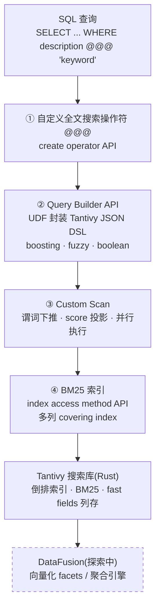

---
aliases:
- ParadeDB
- pg_search
- BM25 索引
- Postgres 全文搜索扩展
- Elasticsearch 替代
channel: CMU Database Group
created: 2026-06-11
duration: 58m47s
published: 2024-10-08
related-notes:
- '[[ParadeDB pg_search 与全文检索最佳实践]]'
- '[[ParadeDB pg_search 与 pgvectorscale 对比]]'
- '[[Pg_bm25 - PostgreSQL 内实现 Elasticsearch 级别 BM25 全文搜索 - Hacker News 讨论整理]]'
- '[[Lucene、PostgreSQL tsquery 与 Tantivy 对比与技术细节]]'
- '[[Database_PostgreSQL全文搜索_to_tsvector与BM25]]'
source: https://www.youtube.com/watch?v=Vxb8TELNM98
speaker: Philippe Noël (ParadeDB co-founder)
tags:
- CONCEPT_ACID
- CONCEPT_MVCC
- CONCEPT_UDF
- EVENT_CMU_DB_Seminar
- FRAMEWORK_Arrow
- FRAMEWORK_DataFusion
- FRAMEWORK_Lucene
- FRAMEWORK_Postgres
- FRAMEWORK_Rust
- FRAMEWORK_Tantivy
- FRAMEWORK_pgrx
- FRAMEWORK_pgvector
- METHOD_BM25
- METHOD_Elastic_DSL
- METHOD_SIMD
- METHOD_TF-IDF
- ORG_Quickwit
- PERSON_Andy_Pavlo
- PERSON_Philippe_Noël
- PRODUCT_Elasticsearch
- PRODUCT_ParadeDB
- PRODUCT_ZomboDB
- PRODUCT_pg_search
transcript: 'I don''t think they ready for this hey yo at the speed and witness something
  that is the database building block seminar series is filmed in front of a live
  studio audience this program is made possible by Google it''s another day it''s
  another time to talk about D so we''re excited today to have Philipe uh he is the
  co-founder of PR DB he''s talk about how he''s using post but he''s putting a bunch
  of crap inside of it building blocks inside of it to make it better so um as always
  if you have any questions for Philipe as he''s given the talk please unmute yourself
  and ask your question anytime say who you are and where you''re coming from it''s
  always good to know where everyone is uh and feel free to do this anytime because
  we want you know Philip to feel like he''s talking a bunch of people and not just
  uh talking to a blank screen on Zoom okay Phil thank you so much for being here
  the floor is yours go for it cool yeah thanks Andy thanks for having me and it''s
  nice to to have everyone listening so um yeah as Andy said I''m one of the founders
  of parade DB I''m honored to be here today we''re speaking about fulltech search
  and analytics and postgress parade DB is a um postgress database built as by postgress
  extension that we''re modifying with database building blocks to to make better
  for specifically fulltech search and analytics we''re trying to compete with workflows
  that are traditionally served by elastic search um so we''re trying to bring the
  good that people love with postgress mvcc assd compliance high performance joints
  worldclass reliability um but solve the limitations around search and analytics
  that um you know that postgress is not not excelling at uh let''s see okay perfect
  so um the talk is going to be split into four sections feel free to stop me at any
  time first we''ll cover ex existing full teex search functionalities in progress
  um I understand a lot of folks in the CMU audience might be very familiar with this
  but if if you''re not um it''ll be a good refresher and it''s going to contextualize
  what we''ll be speaking about after we''ll talk about what''s missing and and why
  we can make it better specifically around two areas that we work with so PG search
  is the name of our postgress extension that parade DV builds we use it to innovate
  around fex search and we use it to innovate around Aggregates or facets so before
  we get into it a couple of jargon to make sure everyone''s on the same page I''m
  sure folks here are very familiar with databases you may even be familiar with data
  Fusion Concepts as well um after the to Andrew and Andy''s talks that I believe
  were the last two ones but um perhaps not too much about fex search so first tokenization
  it''s the process of splitting words into searchable chunks you can tokenize by
  languages for example words as defined in French words that''s defined in Chinese
  uh stemming is the concept of reducing words to their root form so if you have the
  word running the stem would be the word run inverted index is what we use to accelerate
  fex search forb adds a new inverted index in postest and we''ll talk about in a
  second but there''s many that are already supported aggregation I guess you know
  I''ll skip over that for this audience but you know what it is crunching some numbers
  to get count sums averages facets is specifically aggregations over fulltech search
  so you know how many search results were return toward food for example and then
  the elastic DSL you''ll hear a little bit about elastic search for those of you
  that are not familiar elastic search is the state-of-the-art search engine that
  that companies build on today and um it has a powerful language that is used to
  do complex search uh logic and perb offers similar capabilities and we kind of refer
  them um by our own version of the elastic DSL so before we get into this who am
  I and who are the people behind PB so as Andy said my name is Philip I''m one of
  the founders of freb I''m originally from Riv Quebec uh which is a small French
  speaking town in Canada I studied CSA Harvard but I never took a database class
  I know it''s a big mistake you know I''m not proud of it but uh you know we''ll
  brush over it that today and then um yeah if you''re curious to learn more about
  me postgress is this cool Community where they do interviews about the people behind
  postgress I highly encourage all of you to join the post Community if you''re not
  a part of but you can read more about about uh myself on that interview there so
  what is PR DB and how do we make postgress better it''s an elastic search alternative
  on postgress PG search which is what we''ll talk about today is our core work it''s
  full teex search in post with bm25 we''ll cover what bm25 is in um a a you know
  shortly and then it''s built in Rust because you know who doesn''t nowadays you
  have to be part of the cool the cool kids crowd and we have some other work that
  we''ve done around an extension CPI analytics that is going to be set aside from
  today but I''m happy to talk about another time why is this even worth doing I think
  that''s something that''s worth talking about as well when we tell people that we
  improve search and analytics in postgress a lot of them are wondering why so one
  thing that brings people from the L state to something like parade is data reliability
  transaction safety on your sech engine is is very important we have a lot of uh
  users that complain that elastic search is not reliable you also get to remove any
  ETL Pipeline and delays that might be you know reasoning coming from that excuse
  me you don''t have to denormalize your data that''s a huge huge huge thing anyone
  here that loves databases uh knows that they you know the SQL and structured data
  format is a big deal and in search engine world it''s not a part of it as all so
  we''re trying to bring that back and then that also helps us do better on kind of
  the update heavy um scenarios we started this about a year ago a little over a year
  ago and before we really dive into it I do want to talk about the people that are
  building this because I''m not the only one I only happen to be the one I guess
  the privileged to talk about it so ming on the on the bottom left is our CTO my
  co-founder he''s also the author of most uh of a good chunk of the slides on this
  presentation so he gets a lot of credit for it Neil in the middle is um one of our
  lead search engineers and then Eric in um in third in third uh the third photo is
  the author of zombo DB and PGX which is the framework we use to build our product
  he''s quite a famous person in the postrest world and we''re very fortunate to have
  all these folks okay enough uh you know enough household housekeeping excuse me
  um let''s get started so what is fex search for those of you that are not familiar
  fex search is essentially simply the process of doing keyword-based retrieval for
  documents within your database it can be very simple it can be very complex pretty
  much every database nowadays supports thumb version of fex search in Thum shape
  or form um on the very simple layer you can say hey retrieve me all the documents
  that match a specific keyword like cheese but you can also have some very complex
  fex search you might want to rank your search results in various ways you might
  want to search for a corpus of text in multiple languages you might want to do analytics
  or Aggregates on those search results say you know retrieve me the top 10 but tell
  me how many results there would have been so on and so forth and it''s broken down
  in two steps the indexing step which we''ll talk a lot about today one of the big
  database building blocks that we use a parade DB um is around the indexing layer
  which is a library called ttity that allows us to pre-process the text to make it
  searchable efficiently and then the querying layer is simply running and writing
  those queries to retrieve the data we you know in the age of AI we need to do a
  point on on Vector search and what it is and isn''t so Vector search is simp similarity
  search and we have a you know a seminar section on all the vector databases that
  exist today perb we don''t think of ourselves as a vector database although we do
  support vectors um the key difference is vectors match um words based on their semantic
  meaning so you know similar synonyms and so on go very well together um and can
  be retrieved via Vector search in postra is a very famous extension called PG Vector
  that offers this what PB does is we focus on fex search the keyword side of it and
  it''s very very powerful and not at all you know obsolete from Vector search is
  very powerful especially for words that don''t have semantic meanings so if I searching
  for the name Andy paavo in the database keyword search is going to do a lot better
  if you''re searching for medical codes stock tickers you know product brand names
  things like that um and that''s what we cover we cover today but most of the people
  that use parade DB actually use both together using you know in a type of search
  called hybrid search but that''s beyond the Stope of today''s work okay so fex search
  and postgress there''s three ways in which we do fex search and postgress before
  parade DD came around and then we''ll cover what we do that''s different so one
  is the like operator that''s a very basic way to do search it''s essentially just
  string comparison the core fex searches postgress uses something called TS Vector
  TS Vector is a standard way to do it it has real expressivity you can do ranking
  you can deal with melling that have pretty good performance as well and then lastly
  there''s another extension that''s part part of core post graphs called PG trigram
  which allows putting words in trigrams we''ll cover what that is and um it allows
  you to do some sort of misspelling or basic autoc completion on top of TS Vector
  if you use a hosted postgress anywhere in the world these are what you have access
  to today the like operator syntax looks something that you can see here so column
  name like pattern so if you take the example query select star from users were name
  like John this would match names like Johnny Johnson Jonathan um like that the limitation
  that it has is it''s quite slow and it''s also very limited one of the key Concepts
  in full texer is the ability to rank results based on which ones you think are going
  to be most relevant and the like operator has no concept of of ranking so it willin
  every result with the same the same way but that''s you know nontheless a way you
  can get started and many people use it in postest today when you want to go into
  a proper way to do full text in postgress people will use TS Factor so it stores
  the tokenized stem representation of text so breaking down into the sub the roots
  of the words and then you can rank the results that you that you return using something
  called uh TS rank which under the hood implements an algorithm called tfidf perhaps
  some of you are familiar with tfidf it stands for term frequency inverse document
  frequency in short what this means is documents or rows in the case of postgress
  where the keyword your searching for let''s say cheese occurs more more frequently
  should be ranked higher makes sense and if that document is less frequently found
  in the Corpus then it should rank higher as well so if you''re searching for cheese
  and you have one document with a lot of occurrences of cheese but none in the other
  documents it should probably rank higher versus let''s say a word like the which
  is going to be very very frequently present across the entire Corpus so doesn''t
  have a lot of information it conveys as to whether this is a word that um this is
  document that should be ranked higher moving on um the search result that you can
  do with TS Vector doesn''t have to use any index so we talked about an inverted
  index briefly you can do everything which is the TS Vector data type if you do that
  though whenever you do a search post in our case is going to need to scan the entire
  table row by row to find everything that''s known as a sequential scan and that''s
  very slow postgress has concepts of inverted indices our data structure that''s
  still a representation between the word and where they can be found in the Corpus
  and instead you can make it use that index to do much faster searching in practice
  pretty much every single fulltech search implementation uses an inverted index in
  some form otherwise the performance is is very very slow lastly you can use something
  called PG trigram so as I was mentioning pregg trigram is an extension that was
  built into the core postgress codebase it splits words into two groups of true characters
  so if I keep the example of the word cheese you can see the trigram would be CH
  he e and Es and it can be used to do basic Auto completion so if I''m missing certain
  certain letters let''s say in the word I''m searching for I can use PG trigram to
  make sure that my users are still going to retrieve the information that they''re
  looking for it''s pretty limited and what it can do but it can get you part of the
  way so what is postgress f Tech search missing I think this is where things start
  to get very interesting one thing that it''s missing is something called bm25 scoring
  or bm25 relevance bm25 is an algorithm that is a um an improvement upon the tfidf
  algorithm if any of you in the audience want to do the to experiment right now you
  can think based on how we Define the tfidf algorithm just one or two slides before
  how can you think of gamifying that algorithm to make sure your results rank higher
  what could be things that''s queue it in a certain way and how can we fix those
  in a better algorithm the second thing postgress fex search is missing is powerful
  tokenizers and token filters so if you''re searching in a specific language for
  example or spee especially an English it works pretty well but you might want to
  search in multiple languages in the same query for example or postgress also doesn''t
  have a good understanding of non-latin languages like Chinese for example it would
  tokenize each character in its own word but in reality in Chinese multiple characters
  can form a word and it would be better if they were tokenized together this is something
  that''s not super well supported in TS Vector it also doesn''t have an elastic DSL
  complex um search API so giving you the ability to say Okay I want different words
  to be rank differently doing this Junction Max or weighing the scores in a specific
  way those are quite difficult to do with postest today and lastly it doesn''t have
  very strong facets or aggregation so if any of you have used postgress before and
  you''ve tried to do a count star over 100 million rows or hundreds of millions of
  rows you know that it can be very very slow and that''s a very common thing to do
  in fulltech search it''s very common if you use an e-commerce catalog for example
  to say hey here''s 10 results but there''s a 100 Million results right um to give
  users an order of of man this is the core what we do is fix these limitations but
  let''s cover that first of all what is bm25 so this is the formula for bm25 you
  can you can take a look but we''ll go over it in a sec there''s two main things
  that it improves upon the tfidf algorithm the first thing that it improves on is
  um it factors in the document like so if you remember tfidf says the more often
  a keyword is present the higher the document should be ranked well naturally documents
  that are longer are going to have higher occurrences than this specific keyword
  and so obviously it would sked towards longer documents which may not necessarily
  be the most relevant from the user''s perspective so what bm25 does is it factors
  in the document like as you can see on on the formula in the in the lower right
  in that case it says okay we keep into account the document length in order to calculate
  the score the second thing that it improves over is a concept called term saturation
  so let''s say I''m searching for cheese and I have a document with a thousand occurrences
  of the war cheese and another one with 950 well they''re probably both pretty relevant
  to the user and the extra 50 might not make a very big difference so what bm25 does
  is it keeps in mind you know the number of occurrences of a specific keyword and
  as they get more and more present their weighing is less and less impactful onto
  the score so that you don''t have just extreme amounts of repetitions influencing
  the score linearly as you can see on the tapering off in the curve at the bottom
  this is a pretty simple algorithm actually but it is nonetheless the state-of-the-art
  used today by all the standard search engine like elastic search like parade DB
  and and many others and unfortunately postgress doesn''t support it postgress doesn''t
  keep the full Corpus doesn''t keep statistics excuse me over the full Corpus of
  information that it stores and so it doesn''t have the ability to calculate all
  of that um that it would require to do bm25 search so instead they implement and
  tfidf and they have some small modifications to it um like something called cover
  density which allows you to keep in mind like whether words are close to each other
  and so on and you can get some slight improvements upon tfidf but it''s not quite
  comparable okay enough um you know enough enough mat and enough preol for now so
  what is p what is PB what is p search and how do we solve these um these four limitations
  that I mentioned here so we''re a rust extension in postgress many of the companies
  innovating in postgress doing via postgress extension postgress is very very modular
  and the post extension API allows you to do some serious work with it you can um
  hook in at the query layer at the query planner layer excuse me at the executor
  at the storage layer you can do a lot and that''s how we build we build with a framework
  called PGX which conveniently was written by Eric who''s one of the members of our
  team it allows you to write postgress extensions and rust and the database building
  block that we integrate with the most is a search Library called tentv so tentv
  is essentially a rust Bas search Library it''s inspired by a library called Lucine
  which is a Java based search library that is used by elastic search and many others
  it''s a very battle tested uh search engine and it supports fulltech search it supports
  fast fting it supports bm25 scoring it supports in inverted indices it also supports
  colmer storage which we''ll cover again in theat part of the talk for how you can
  improve on on analytics and facets and it''s essentially the core solution to many
  of the issues that postest faces thanks to the pg expr extension framework we can
  work with TV in a very in a very clean way and start to bring in some of the good
  that it offers directly inside post press maybe you you get to this but TV is it
  running in the same address space is postgress yes okay yes any other question can
  you talk about what like I mean did you at least consider Lucine or just Java as
  a non-starter for what you guys wanted to do yeah great question so tentv is a pretty
  mature project it''s maybe eight or nine years old by now um something along those
  lines it''s used by a lot of companies but it''s obviously not as mature and as
  tried and tested as Lucine Lucine might be 15 or 20 years old by now um we did not
  consider Lucine for two reasons uh one and you''ll see in the next Slide the speed
  of TV is significantly faster thanks to removing the overhead from the Java virtual
  machine um and it also makes some slightly different design decisions which I think
  actually more applicable to us but um it''s essentially not possible at least as
  far as I know to work with Java inside of a post extension so for up to Earth it
  was C or rust obviously rust was ideal and tent to be was the best search library
  in Rust and so that''s kind of how we came to it again if you''re going to talk
  about this cut me off like there''s also like zap right the other one that''s that''s
  that''s in C++ did you guys consider that as well yeah I''m familiar with zapen
  uh we did not consider zapen at the time we wanted to work in Russ specifically
  and zapen is also quite old but I don''t know if it''s as active of a project as
  um you know as tens is nowadays so we decided to go for kind of the true ined we
  actually never benchmarked them but um yeah that would have been another viable
  option there''s another one called gruna in C in py that also would have been an
  option got it awesome thank you mhm So speaking of speed um zapan is not Benchmark
  here but that''s another one that exists but anyway so tentv is super fast it is
  super super fast you can see here the average query latency compared to um to Lucine
  which is sort of the state of the Earth One believe is another one um that I believe
  is written in go if I remember correctly that''s another popular one and then a
  Pisa I''m not familiar with but that gives you a rough idea in our own benchmarking
  we''ve observed query performance compared to Lucine to be 5x on on our own implementation
  of TV that''s quite a big deal the way TV manages to be so fast is it uses an immutable
  segment based Design This is similar to what Lucine does but basically instead of
  mutating the the index segments that store the tokenized data it simply creates
  new ones and merge them compacts them behind the scene um to have faster writes
  faster reads it also uses memory map files so that dis iOS very very quickly very
  quick excuse me it builds in Rust so you can to remove the whole overhead of the
  Java virtual machines and then it uses CD which is vectorized processing on the
  CPU to um to to do parallel execution very quickly all of these are the very very
  high Lev ways for why TV is fast I''m not one of the authors of tentv Paul and a
  lot of folks behind a company called quick with are the authors of tentv that would
  make for a wonderful talk um but that''s beyond the scope of of today we''re going
  to talk mostly about post address and what we you we do with this rather than how
  it''s built so getting to the meat of the presentation and where parade DV really
  innovates so we have four things that we do in postgress in order to build parade
  dvpg search the first is we introduce our own fex search operator this is the part
  that allows us to Define and SQL F teex search queries with more syntax expressivity
  that can be passed down to tentv or fast search engine on top of this we put our
  own postgress inverted index as we discussed before inverted indices are very important
  to accelerate the speed at which you can process queries full ex queries we introduce
  an index that we call the bm25 index it''s a standard postgress index that you can
  use in in all the same ways we then have a query Builder API that allows us to replicate
  some of the really complex functionalities and really complex logic that you might
  want out of a proper search engine into pogress and lastly and perhaps the most
  exciting part of all that we do is we create our custom scan that defines how we
  we scan data in postgress and feeds it into into tensity and we''ll cover that in
  in the later half of the talk so our custom fex search operator this is how we Define
  the search queries it can be dropped in any postgress query that''s one of the most
  powerful or the most SL features of of parade DB from from users if you have joins
  you have order buys group buys anything that you like to do with post press today
  you can just drop in or at full teex search operator and it''s going to give you
  the ability to reference um fex search queries in that in that standard SQL query
  so you can take the example here select star from Mo items where ID is less than
  10 and description is keyboard what this does behind the scenes with the app app
  at operator is it going to pass the the value keyboard to the description field
  in tent and then execute a full text search query on it even though you might have
  other predicates as you have in the in the example here this is built using the
  postgress create operator API that''s a pretty well documented API you can take
  a look at um and that''s sort of the bare minimum that you need in order to start
  bringing the full teex search syntax of 10 to be in in post Crest so Steve Moy ask
  uh hey Steve how''s it going he''s asking is the at at at is that a seism or post
  ISM or a parade DB ISM maybe it''s a it''s a parade DB ism but it''s inspired by
  a postgress ISM it''s inspired by the TS Vector at ad operator thanks once we have
  this at operator that allows us to feed our Coursey now we need a custom index to
  make them faster we don''t want to be doing sequential scans over our entire tables
  so instead we want to index into what we call the dm25 index um the value of the
  content of the table so it works the exact same way that any standard postgress
  index work whether you have a b tree or a gen index or whatever you might be used
  to using in postgress for index constructions updates vacuum scans everything works
  in the same way the key difference with our index is that it''s a BM the bm25 index
  is a covering index so what this means is the preb index is designed to be created
  over multiple columns all the ones that are relevant to the full ex search queries
  that you might want to run this actually allows us to push down all sorts of predicates
  and sort into the search index directly and drastically speed up the way we do retrieval
  and we''ll cover that for in the custom scan card I it''s not a true I mean covering
  index is something that dynamically you know depends on the query depends on the
  index right so you''re just saying that if someone wanted to they could put all
  the columns in your bm25 index and then that you could then use it as a covering
  index correct correct correct okay correct EXA exactly um exactly great question
  and maybe maybe get this in a second like does doeses tanv does it provide its own
  bm25 index or you have to roll your own are you are you just interfacing into it
  so so we are interfacing into it the uh tensity has the ability to do inverted in
  it supports inverted index but what where we interface is we use the index access
  method API of postgress to make it a proper post press index and um that''s actually
  a quite a cous amount of work I would say gluing the pieces between postgress and
  and 10TV is a big deal I''ll touch upon this a little bit more later but when you
  work with postgress you can''t regress on any of the postgress feature right and
  postgress is a very opinionated database that''s one of the reason it''s so good
  so we have to work in a postgress way in order to sort of connect all of the layers
  together got it thanks um but yeah anyways so we use the index access method API
  for this third so now we have the ability to Define search queries and we have the
  ability to execute them against our bm25 index so they can be very quick however
  now we want them to be very expressive if you''ve used the elastic search API before
  you know that the DSL can take the form of very complex sub nested Json that might
  apply logic and different parts of the query the tentv is built in a similar way
  and parade DV offers uh also the ability to accept Json on the right hand side of
  the syntax we give you the ability to construct those those functions in more of
  a postgress seqy way VIA our query Builder API it looks something like this um and
  it gives you the ability to do boosting fuzzy search fuzzy phrasing booleans anything
  that you might want to do with a complex fex search so if you look at the example
  query here you say okay in this fex search query we''re saying we''re going to search
  essentially for the keywords description shoes or description running so we''re
  searching for running shoes but we''re going to boost the value of the shoes by
  2x what the value is going to be for standard word running so let''s say you''re
  building a search engine you want people to sewitch for an e-commerce catalog and
  be able to retrieve running shoes well if there shoes in the name it''s probably
  a more indicative search than if it has running so let''s say ask for running shoes
  maybe after seeing running shoes I might want to see just shoes in general rather
  than running shorts this gives you the ability to bake this logic into the search
  query in order to do this we use our query Builder API behind the scenes the way
  this is built is via postgress userdefined functions so we abstract away the Json
  syntax to make it easier for for users to write standard uh SQL queries as they
  might expect it I see I see bubbl question yeah so I just wanted to clarify that
  when you talk about query Builder API and like the query itself uh what you''re
  referring to here is like the text search engine portion of it not the like postest
  postest query engine portion of it right like there''s there''s basically like two
  layers of query engines here that you''re talking about right okay correct correct
  yeah does any does any does any the prb part that goes to the the the full teex
  search does that get exposed to the poess query Optimizer to do anything special
  with it anything with it or no it just sees as a UDF um so these are just udfs but
  we''ll see very soon once we talk to the next part the custom scan we integrate
  quite deeply with the planner to to um to optimize some of that stuff so we''ll
  touch on that in a minute hi thanks yeah any other questions cool okay carrying
  on so now we have the ability to Define f exarch queries we can execute them quickly
  over inverted indices called bm25 index and postgress all of these use bm25 score
  and everything that TTV brings and we have the ability to Define some complex syntax
  and ranking logic around that with a query Builder comes the sort of combination
  of all of this via what we call the custom scan so the postgress custom scan API
  is one of the less known and harder to work with I would say apis and allows us
  to take control of other parts of the query beyond the we at at at clause in our
  case it enables three interesting use cases that are very important for Bridging
  the gap of full and postgress one is predicate push down second is doing the bm25
  scoring and then lastly the fast assets and aggregation and that''s where we''ll
  touch upon some of the work we''re doing as as well with data fusion um which I
  know you were were the topic of the first two talks in this seminar so in the case
  of predicate push down consider the query here select star from mock item where
  the description is keyword and rating is less than five if we didn''t have a custom
  scan postgress would index access method that we describe on our pm25 index is going
  to do separate scans over the description rating at the description and the rating
  excuse me even though because as we mentioned before both are in the bm25 index
  we should be able to do it in a single scan this is know very bad for performance
  obviously and we want to combine them together the custom scan allows us to do this
  it also allows us to push things like limits and offsets all the way down into 10
  Tov so that we can drastically improve performance perance in that way let''s take
  an example of what it looks like here so as you can see here we have an example
  quer that we''re running select description rating in category from mock items where
  the description is shoes or the rating is more than two here''s an example of what
  the query plan actually looks like on Parade DB so you can see it in action so in
  this case the parade DB scan is done over that that table mock item it''s done over
  the index we''ve created we''re not doing bm25 scoring K we''ll do that in a second
  but you can see in the 10 query that we''re passing down we''re actually combining
  it all into a single query for both the rating being greater than two and the description
  matching shoes that allows us to do a single index index scan excuse me and drastically
  Speed Up Performance this is all tank to the custom scan API another example of
  what this enables us to do is coring projection so as we mentioned bm25 coing is
  very important when you''re building a proper state-of-the-art search engine and
  need to be able to return that information to the user so they can build Logic on
  top of it on top of PR DB let''s say we have the query here consider select from
  Lo item with the description in keyword how can we return the score well the custom
  scan API allows us to do this the scoring in 10v and project it to the user into
  a new column this is an example of what the query plan would look like here so it''s
  very similar as the previous one but you can see we have scores enabled as true
  and we now have the ability to say when we''re going to execute that query against
  postgress and fundamentally against parade DB we''re going to be returning parade
  db. score as a new column in addition to the core columns that are in in our mock
  items table what this looks like is very standard postr SQL uh result set syntax
  you can see here we''re returning descriptions everything that matches shoes for
  example the rating the category that it fits in in our mock data set and the M25
  score as available here so you can see okay these shoes are ranking higher than
  plastic keyboard which obviously is not relevant to description shoe so is your
  implementation smart enough to recognize that you''re calling on the score it''s
  it''s in the it''s in the select output so instead of calling for every single item
  as you scan the UDF that you can push down the UDF so that like so that like it''s
  generated as part as the the the scan operator and not like and not fired off as
  a part of the projection correct corre correct and that has so that has a big impact
  on performance of course yeah um before before custom scan the if you were to do
  bm25 scoring on Trin DB it would have a very serious impact on um the speed at which
  we could return queries but now we can actually uh optimize this significantly y
  awesome thanks sweet um okay any questions before we start talking about the analytics
  and facets so I had a question so the rating that''s a numerical column so how is
  that stored in 10 TV is that that''s not a text or a column like description uh
  yes good question yeah so I brushed over this a little bit quickly but tend to be
  at support for a wide range of types you can store text you can St store numeric
  you can store date times you can store range types as well so all of this gets stored
  intensity um in the inverted index and can get to be searchable in in a standard
  ways you can all I mean you wouldn''t tokenize it you know the way you tokenize
  text but um you can store it as well directly as the type that it represents and
  we do some mapping between the postgress types and the tent Tob types how how challenging
  is that mapping so like the the data Fusion guy talk last week like Comet mapping
  spark Comet map spark into the data Fusion how bad is it or how difficult is it
  yeah that''s a great question we''ll talk more about that as well once we talk about
  the analytics for the the standard mapping I would say 10v has quite a wide range
  of types that it supports so it''s not been too too difficult um when we start talking
  about the way we do colum or storage intensity and the mapping there uh it''s been
  a lot more challenging and I''ll I''ll cover this in a minute and then if someone
  shows up with uh UDT do you just give up and can''t support it or do you actually
  support that as well that is a great question so far I don''t think we faced the
  C case so I wouldn''t know exactly which answer they tell you but we can look into
  it and get back to you I mean if if it''s like an alias like it''s it''s just like
  you two ins become the two world two ins become an own type that should be able
  support but someone if they most people don''t Implement like their own C Level
  UDT yeah yeah okay all right keep going this is great any other questions before
  we talk into ongoing word colum or aggregations and things like that one more question
  so say the rating column it was better indexed by one of the other post indexes
  and not inverted index so would you support that great question as well uh yes you
  can still do everything that you do in postgress whether you''re using parade DB
  or not so it''s also compatible with B indexes and Jin indexes and so on um I we
  actually recommend that um users you also use B3 indexes especially when they have
  update heavy scenarios for instance but um usually people don''t also use a genin
  index because the bm25 index is sort of a superet of that but any other index is
  is supported and common to operate alongside the bm25 index so how do you deal with
  that in the planner How Deeply do you go into the cost model for the planner to
  have it decide which index to use first for example if it has multiple choices including
  using this inverted index and the B3 index yeah good question so the um for the
  bm25 index we only allow you to use a single index per table right now so that we
  don''t have any confusing logic around whether you know which index to select from
  and then we do have some cost optimization that we do to uh to prefer like index
  only scans and things like that over other types of scans but um that would say
  that''s the main way that we optimize it today we have some further optim some further
  work integrating with the planner that''s coming and I''ll talk about that in a
  second as well I have a question about the binding portion uh in terms of like so
  I think in order to do the predicate push down with rating you basically have to
  be able to know that rating and description are both in the index so is is it really
  just like when you have that index like that information is available like if there''s
  a expression with these things like just match it or is it actually like you know
  however you''re interfacing with TV like is there like a kind of more Dynamic step
  there I''m just kind of curious about that yeah good question uh it is mostly static
  today so if when you define your index you need to put every column that you want
  to us to be able to match with uh in the index as part of the index creation and
  if you have any other columns that you want to index over you will need to reindex
  as a result if you modify the the schema that gets index cool thanks yeah okay moving
  on and then we can come back to some more questions so if you remember there are
  three use cases that we talked about for for custom scan one was dm25 scoring this
  is what we just covered the other one was predicate push down to optimize performance
  but the third one is fast faets and aggregations which we haven''t talked about
  yet this is part of our ongoing work right now so you''ll get a sneak peek at the
  inside of the factory of how things are being made and some decisions that we''re
  currently wrestling with and deciding what to go what to go forward so the problem
  we have is facets or slow right so as we talked about before this query you can
  see here is a pretty good example of a of a faceted search query so we''re searching
  on our TBL mock items where the description is true rating is more than two and
  we also want to do a count ID we want to return the list of all the results that
  would actually have been returned worth off with the limit 10 give me the top 10
  results and the total of number of results found that''s a very canonical use case
  for full Tex search if we''re doing this with postr as you know the count ID is
  going to be very slow especially if we have millions of results 10 Tov has the concept
  of fast Fields what T to be defined as a fast field is a columnar type storage so
  let''s say we index ideas fast field when we create our index it''s going to tell
  um postgress that this is stored in a columnar format within the index and ID could
  be returned to postgress in columnar batches so the way postgress is built it uses
  something called Pages a page is 8 kilobyte and the postgress visibility Checker
  as part of the mvcc implementation can um can work on a per page basis for defining
  visibility or not visibility on specific rows as a result if you you know if you
  infer this a bit further you can think okay we could use something like this to
  ESS built our own vectorized fating engine we use tentv to store Fields let''s say
  the ID field as fast in a cumer format and we have postgress process it in batches
  determine visibility and then return the results to to the users moreover the custom
  scan API in postgress enables paralyzation this is quite rare postgress is single
  treaded but in the custom scan the developer has the opportunity and the responsibility
  to to implement parallelized execution on them themselves so we could build some
  sort of fating engine if you''ve attended the previous talks from ND Grove and Andrew
  lamb about dat Fusion you know this is essentially at a very very high level the
  way you know analytical query engines are built that''s quite exciting this gives
  us the ability to start thinking okay we could perhaps improve upon the the fating
  performance here enters something like data Fusion right so as I''m sure you know
  if in the previous Talk data Fusion is an embeddable query engine it''s built in
  Rust it processes Arrow batches and TV is currently exploring whether to modify
  its own columnar implementation with data Fusion right now it''s kind of a custom
  implementation so there''s some wiring that needs to be done behind the scenes but
  if we start to do this we could say hey we could actually use tentv to accelerate
  to store data in columnar format process it in a vectorized way and use data Fusion
  to do very fast um parallel vector Iz execution on top of it via the postest custom
  scan API this would allow us to start to have a really fast high performance query
  engine to do fating in postgress specifically our search results so we could let
  data Fusion to the count for example this would be a really big deal but this is
  something we''re currently looking at and there''s a lot of considerations to keep
  in mind first we''re working with postgress wait wait the last slide you said t
  Tan on its own is is is going to replace it internal column stuff with data Fusion
  corre they''re current so they''re currently exploring what way they do it TV doesn''t
  use Arrow they have their own colum or format and so in order to swap in something
  like data Fusion as their processing engine there''s some wiring that needs to be
  done but yes this is something that we''re discussing as part the project so the
  choice is either so independent of whether tant switches to data Fusion like you
  want you''re talking about like can can parade evb use data Fusion as well yes that''s
  right right that''s right we''ve actually we''ve actually done some work with data
  Fusion before in a different part of postgress at the storage layer for like column
  or tables that''s a bit beyond the scope of the talk and it''s less related to our
  fex search but where we would bring data Fusion in here would be to accelerate our
  facet search but in order for us to consider doing this in the first place we need
  to remember that we''re working within the confines of postgress is it possible
  for us to make data Fusion postgress mbcc compliant so when when we use like a qu
  here for example selling cat ID description for mock item y y yada if we can push
  the entire query down to our columnar index with TV we can push to count the problem
  is the column or index might not contain rows that we want to to return and we''ll
  cover M VCC in a second if we blindly do count over over 10v it''s not going to
  give us necessarily the correct results because the post visit AB ility Checker
  might not have have played this is a big problem and in fact we considered working
  with the 10TV Aggregates in the first place before rather than letting postest to
  them and we would have incorrect results and of course fast Aggregates are great
  but they need to be accurate so for those of you that are not familiar mvcc is the
  multiversion concurrency control implementation and postgress it essentially says
  like when you update or delete a row you don''t actually update or delete a a physical
  data on dis and postgress you simply impend a logical record that says what has
  happened to the row and then the postgress vacuuming process will um will work on
  that to to you know resolve the state of the database this is all based on those
  like snapshots that it creates and when um it guarantees essentially it''s responsible
  for guaranteeing whether um you know specific transactions are allowed to see specific
  rows that''s a core underlying of postgress and we need to be able to work with
  that when we bring a separate query engine like something like data Fusion in this
  case this is an example of transaction isolation that you know at a very very high
  level for all of you that you know that are students at CMU I''m sure this is essentially
  101 but um you know if I''m thinking okay which row you know whether a transaction
  should see a row or not then the question is like what rows are a transaction allowed
  to see let''s say I have connection A and B and you know transaction a inserts into
  a table but hasn''t committed can I can B read the transaction that would be a dirty
  read if a inserts and commits but B hasn''t committed can it read the transaction
  that''s called a phantom read I''m going to skip over over the rest but these are
  s of the four ways in which people do transaction isolation in post Crest and you
  can see them in a table here the default one that postest comes with is read committed
  so it''s not possible to do a dirty read it''s not possible for a transaction to
  read a transaction that hasn''t committed from a different process in order for
  us to start bringing something like data Fusion inside of postgress to do those
  um to to Crunch the Aggregates to do the faceted search we would need to at least
  at the very least match the integration of mdcc to have recommitted support on the
  way we deal with Aggregates and in fact it''s possible in postgress to also enable
  the other levels of isolation and so ideally our implementation would be fully mvcc
  compliant this is not easy can I ask quick clarification question please please
  so uh let''s see PR DB is is mostly like an extension in postgress right so I guess
  you''re you''re then accepting inserts into the postgress side um are you then actually
  so so like your interaction with tant TV is actually to index what you have inserted
  in postest I I was kind of the impression that there was some storage that tant
  TV has access to that you''re loading into post but that''s still not the case right
  correct sorry if I covered this a bit briefly all of this happened in the index
  access method layer so you use postgress in any standard way you can write to heat
  tables insert update and so on and then on the tables on which you define a bm25
  index we will index that via tentv and store it in the index that''s the storage
  that tentv has access to this is the area we would need yeah this is the area that
  we would need to give mbcc compliance because in the case of um in the case of of
  standard progress indexes the visibility Checker will act on the return the results
  returned by the index so you don''t need to worry about this basically it uses the
  full standard postgress way to do things even if they are dead rows within the index
  the visibility Checker will filter them about but in the case of our index if we''re
  actually using data Fusion it''s not going to have access to the visibility Checker
  so we would need to come up with a solution on on how to do that and make sure that
  our index remains in VCC compliant even if it''s using data Fusion okay um anyways
  so I''ll cover this also very briefly but transaction isolation that relies on snapshot
  with states of the database and a specific a specific point in time excuse me each
  transaction ID is contains the you know the transaction ID and the committed transaction
  ID in postgress it''s known as X-Men and xmat xmat excuse me and then postgress
  uses the snapshots to meet the visibility requirement what we could do is do something
  similar essentially right we could try to have data Fusion call the visibility Sher
  functions to determine whether you know whether a row is visible against a snapshot
  that''s something that we could do and that would be that would give us the ability
  to give mvcc compliance while using data Fusion as a query engine for processing
  the columnar storage fast fields of 10 to be the problem is data Fusion is multi-
  treaded postgress isn''t as I mentioned before the custom scan API is one of the
  very rare areas in postgress where you actually can have parallel execution so it
  would be possible for us to go and perhaps implement this this is something we''re
  currently investigating right now that''s solution one maybe another solution is
  we could reimplement mvcc this sounds pretty crazy but it''s actually been done
  before by other folks so we could reimplement the post press visibility Checker
  function within the 10d index ourselves and then have data Fusion be be aware of
  that so as I mentioned the X-Men and xmax X-Men is when a transaction gets gets
  you know committed and xmac is when the row gets updated or deleted it''s zero if
  it''s never happened we could use postgress triggers to do that the problem in that
  case is that causes a lot of right implication the postgress standard index doesn''t
  sore anything around Xmen and xmax because when the postgress query planner fetches
  the data and applies the visibility checker on it it can actually filter the data
  out so it doesn''t matter whether the post standard postgress index stores that
  information in our case if we went with it we would need to do that and that can
  cause a decent amount of reification it''s also you know a can of worms obviously
  um Eric on our team is the author of a project called zombo DB previously which
  was a postgress extension to interoperate an elastic search cluster with postgress
  and he wanted to do that in an mvcc way so he actually has built storing mvcc information
  like X-Men and xmax directly into its zbo DB index that''s something that our team
  has some experience with around but we would prefer to avord that as much as possible
  that''s option number two or you know maybe there are other options if any of you
  guys you know can think of we''ll be very curious to hear them but in general our
  nordstar as we are working today is an mpcc safe fast fating engine postrest in
  a lot of ways this is essentially a columnar implementation in postrest but done
  properly if we do that we might eventually be able to go beyond faceted search which
  as a reminder is fex analytics over fex search results and actually accelerate any
  type of analytical query in postest but that requires working in a lot of ways node
  by node to make sure that when the plan gets optimized we can maintain full mvcc
  compliance along the way and that''s not easy work it''s been explored by a few
  people as I mentioned it''s been explored by Sy Folks at postest Pro in a project
  called vops that you can look up online it''s been explored by um you know Eric
  and the folks Z UB when they were working on it and there''s a lot of attention
  that''s being poured into the space right now for how to build a proper analytical
  engine in post press but this is this is where we''re at and this is how we''re
  thinking about it and that''s it if any of you guys are interested in in hearing
  more about what we do you can look us up on GitHub you can you know we''re pretty
  responsive you can give the product to spin as well and yeah we''re excited to do
  to do what you do with it and I''m happy to take any other questions awesome I will
  clap on behalf of of the audience uh we have we have several minutes for questions
  to have any unmute yourself and go for it so there''s there''s PG you have PG search
  and that''s data or that t to be and data Fusion is that correct correct and then
  the PG Lakehouse can you talk about what that was yeah I''m happy to I''m happy
  to so this um I wish I had added some of those slides from a different talk but
  I removed them um we when we started our our work we started by doing 10v and post
  and people started requesting analytics support right that fast facets that I was
  describing that got us interested into other ways in which we could potentially
  speed up analytics and postgress the first foray we did was with an extension called
  PG analytics that you heard initially where we actually integrated data Fusion at
  the table layer so just like you can modify the index layer postgress apis expose
  the table layer storage and we can create your own table you can store data in your
  own way and we had used data fusion and um and Delta RS to implement some sort of
  assd compliant columnar storage and postgress that is a whole can of worms that
  we ended up pausing to work on in order to focus on this and um we had repurposed
  our PG analytics work into a new a third extension we made called PG Lakehouse where
  this time we use duck DB this is what is now called PG analytics and we essentially
  build a foreign data wrapper in postgress which is powered by DB to read data from
  remote object storage like AWS S3 and then do fast analytics over it pogress is
  the concept of uh foreign tables which are tables that are referencing external
  data and that''s what we use our PG Lous extension for with duck DB got it but like
  so some but someone downloads pretty DB the the primary use case is going to be
  the the full text search stuff you talked about today like that''s that''s your
  bread and butter got it correct that''s that''s our bread and butter our PG Lakehouse
  or PG antics extens is essentially an ingestion API so the way people use it today
  is they read data from S3 create a postgress table out of it and then do a bm25
  index on it to search it got awesome all right we have time for more questions remember
  of the audience so I have one question here so could you have added the bm25 ranking
  to the existing gen index gen Plus Ts Vector would that what would have been the
  result for for not doing that for not adding it to the Gen index yeah I mean I''m
  assuming that you could have done the bm25 ranking as part of gen existing could
  have extended TS Vector engine index with bm25 ranking and that would have been
  a much smaller amount of work but would that would that have worked or yeah that''s
  a great question that''s a great question so there''s there''s two things to that
  answer one is in order to do that we would have need to work with post press core
  instead of working as an extension um so you know perhaps less overhead in in that
  in the number of lines of codes written but working with post core is much harder
  it''s also much slower um the release cycle is is slower intentionally to keep it
  to keep it very very sturdy so that would have been more difficult the other uh
  thing is as I was mentioning postr doesn''t store uh term frequency statistics across
  the entire Corpus and bm25 requires that so because the Gen index Works in a way
  that you can create it over a single column for example or you can create multiple
  gen indexes on the same table um it would have been difficult for the bm25 algorithm
  to be implemented without some other serious modification instead of postgress core
  I''ve actually talked about this with with many folks who are core committers but
  um in our case it was much easier to keep things in a fully scoped way and work
  directly off of 10v okay all right so stepen boy asks uh the interrupt between postest
  Pages row based and arrow record batches colar row groups how would the two square
  off don''t you lose performance between the two wire formats yes yes thank you I
  forgot to cover this this is a very good question so when we were working with data
  Fusion previously at the table layer we encountered this um there are a bunch of
  of postgress types for example varar and text which we would represent I believe
  as ctf8 in in Arrow and so we would need some way to be able to like map it back
  and forth and you lose some degree of precision what we would do is we would infer
  based on the schema of the table which we''re working with which field to map it
  back to but in the case of user Define functions like overloaded UDS for example
  we weren''t able to do that and so that is something that we literally left as um
  you know as unimplemented as a edge case in that previous implementation in our
  case here today when we end up working with um TV and data Fusion we will need to
  face some of those challenges again and decide how to resolve them the good thing
  with working with arrow is compared to the to the uh like in-house colum implementation
  that t to be has Arrow has a much wider range of fields of type support excuse me
  so that would be a much smaller um you know much less data loss basically or Precision
  loss between the conversion but that is a difficult challenge it''s actually quite
  a big deal uh when you''re trying to work with the two of them and I wish I give
  I had like a perfect answer to give you maybe the best possible answer is having
  Arrow support all the postgress types that would be wonderful but I don''t know
  if that''s something that''s going to happen I don''t say happen either um so the
  last thing I say is it''d be interesting to see uh going back to like how do you
  determine the visibility of tupos I suspect I don''t know if this is true I suspect
  like the format of like the min max X min max value that post maintains I bet that
  it hasn''t changed since the 80s when they originally designed the transaction scheme
  maybe there''s some new Fields they''ve added but like it probably is one of the
  most like battle hardened and uh stable parts of postgress I mean post is pretty
  stable as it is but like yeah you could impl on the outside knowing that like it''s
  not going to get changed from underneath you you know a year from now so it might
  actually make sense to do it yeah exactly exactly and this is why you know we call
  this the section of the talk ongoing work um the truth is we don''t know exactly
  which one is going to make sense for us to do and we''re currently investigating
  it if we do another talk you know in a year I can tell you what we found um but
  that''s the thing that''s good with working with postgress the apis don''t change
  very much even between major versions so we can feel pretty confident building on
  top of them

  '
type: database
views: 6074
---

# ParadeDB: 用 Postgres 做搜索与分析（CMU DB Seminar）

> [!abstract] 核心摘要
> ParadeDB 是一个以 **Postgres 扩展**形态存在的 Elasticsearch 替代品。核心扩展 **pg_search** 用 Rust（pgrx 框架）把搜索库 **Tantivy**（Rust 版 Lucene）嫁接进 Postgres，补齐 PG 原生全文搜索缺失的四块：**BM25 相关性评分**、**强 tokenizer（多语言/CJK）**、**Elastic DSL 级的复杂查询表达力**、**快速 facets/聚合**。卖点是把 Elasticsearch 的搜索能力带回有 MVCC、ACID、join 的关系数据库里——不用 ETL、不用反范式化。演讲者为联合创始人 Philippe Noël，主持人 Andy Pavlo。

## 🧭 为什么要做这件事

从 Elasticsearch 迁回 Postgres 的动机：

- **数据可靠性**：大量用户抱怨 ES 不可靠；搜索引擎上的事务安全（transaction safety）很重要
- **去掉 ETL 管道**：PG → ES 的同步管道及其延迟整体消失
- **不用反范式化**：保留 SQL 与结构化数据，搜索引擎世界普遍丢掉了这点
- **更新密集（update-heavy）场景**表现更好

> 与向量检索的关系：ParadeDB 不是向量数据库（虽然兼容 pgvector）。关键词搜索（keyword search）对**没有语义的词**——人名、医疗代码、股票代码、品牌名——仍远强于语义检索；多数用户实际把两者组合成 hybrid search。

## 🔍 PG 原生全文搜索的三板斧与缺口

| 方式 | 机制 | 局限 |
|---|---|---|
| `LIKE` | 字符串比较 | 慢，且完全没有 ranking 概念 |
| `tsvector` + `ts_rank` | 词干化倒排表示，TF-IDF 排序 | 无 BM25，无全库词频统计 |
| `pg_trgm` | 三字符组（trigram）匹配 | 只够做基础容错/自动补全 |

四个核心缺口：

① **BM25 评分**——PG 不存全 corpus 的词频统计，做不了；core 只有 TF-IDF + cover density 微调
② **强 tokenizer / token filter**——多语言混合查询、中文等非拉丁语言分词（多字符成词）支持差
③ **Elastic DSL 式复杂搜索 API**——boosting、disjunction max、按字段加权在 PG 里很难表达
④ **快速 facets / 聚合**——`COUNT(*)` 过亿行极慢，而"返回 top 10 + 告诉你共 1 亿条结果"是电商搜索的标配

> [!note] BM25 对 TF-IDF 的两点改进
> 1. **文档长度归一化**：长文档天然出现更多关键词，TF-IDF 会偏向长文；BM25 把文档长度折算进分数
> 2. **词频饱和（term saturation）**：出现 1000 次和 950 次的两篇文档相关性几乎一样，词频贡献随次数递增而衰减（曲线趋平），防止线性堆叠刷分

## 🏗️ pg_search 的四大构件

### ① 自定义搜索操作符 `@@@`

可以丢进任何标准 SQL（join、order by、group by 照用），右侧的搜索条件传给 Tantivy 执行。命名致敬 `tsvector` 的 `@@`。基于 PG 的 `CREATE OPERATOR` API。

### ② BM25 索引

- 用 **index access method API** 做成标准 PG 索引：构建、更新、vacuum、scan 行为与 btree/GIN 一致
- 设计为**多列 covering index**：把搜索相关的列全放进去，谓词和排序可整体下推
- 限制：每表只允许一个 bm25 索引（避免选择逻辑混乱）；改 schema 需 reindex；与 btree 等其他索引共存（update-heavy 场景官方还推荐配 btree）

### ③ Query Builder API

Tantivy 和 ES 一样吃嵌套 JSON DSL；pg_search 用 **UDF** 把它包装成 SQL 风格函数，支持 boosting（如 `shoes` 权重 ×2 于 `running`）、fuzzy、boolean 组合等。

### ④ Custom Scan（最核心）

PG 较冷门、较难用的 API，接管 `@@@` 之外的查询执行环节，解锁三件事：

1. **谓词下推**：`description @@@ 'keyword' AND rating < 5` 合并为对 Tantivy 的单次索引扫描（否则两列分开扫）；limit/offset 也一路下推
2. **BM25 score 投影**：把评分作为新列 `paradedb.score` 在 scan 阶段生成，而非投影阶段对每行调 UDF——性能差异巨大
3. **并行化**：custom scan 是 PG 中开发者可自行实现并行执行的少数区域，为 facets 引擎铺路

## ⚙️ 为什么是 Tantivy 而不是 Lucene

- Lucene 是 Java——**PG 扩展里基本没法跑 Java**，实际只有 C 或 Rust 可选
- Tantivy 设计：**不可变 segment**（只建新段后台合并，不原地改）、**mmap 文件**、无 JVM 开销、**SIMD 向量化**
- 自测查询性能约为 Lucene 的 **5x**；Tantivy 作者是 Quickwit 团队（Paul 等）
- 配套框架 **pgrx**（Rust 写 PG 扩展）作者 Eric 就在团队——他也是 ZomboDB（PG↔ES 互操作扩展）作者

## 🚧 进行中：快速 Facets 与 MVCC 难题

**问题**：faceted search（top 10 结果 + 总命中数）里的 `COUNT` 在 PG 上极慢。

**思路**：Tantivy 的 **fast fields** 是列存格式 → 按批（columnar batches）返回给 PG → PG 按 8KB page 做可见性检查 → 相当于自建一个**向量化 facet 引擎**；进一步可把 Tantivy 列存的处理引擎换成/接上 **DataFusion**（Arrow batch、多线程、向量化）。

**拦路虎是 MVCC**：直接让 Tantivy/DataFusion 算 `COUNT` 会把 PG 可见性检查器（visibility checker）没过滤的死行算进去——**快但不准的聚合没有意义**。两条路线：

| 路线 | 做法 | 代价 |
|---|---|---|
| A. 调用可见性检查 | 让 DataFusion 对照 snapshot 调 PG visibility checker 函数判行可见性 | DataFusion 多线程 vs PG 单线程，需在 custom scan 里自管并行 |
| B. 重新实现 MVCC | 把 xmin/xmax 直接存进 Tantivy 索引（用 trigger 维护），DataFusion 自行判可见性 | 写放大严重；但 Eric 在 ZomboDB 里干过同样的事，有先例 |

> [!quote] North star
> 一个 **MVCC-safe 的快速 facet 引擎**——本质上是"在 Postgres 里把列存做对"。做成后可从 facets 推广到加速 PG 上任意分析查询。前人探索：Postgres Pro 的 VOPS、ZomboDB。Andy Pavlo 现场点评：PG 的 xmin/xmax 事务格式自 80 年代基本没变，是 PG 最稳定的部分之一，在外部实现 MVCC 其实可行。

## 💬 Q&A 要点

- **Tantivy 跑在 PG 同一地址空间**（同进程内嵌）
- **为什么不在 GIN + tsvector 上加 BM25**：要改 PG core（节奏慢、门槛高）；且 core 不存全库词频统计，GIN 单列索引的结构也难以支撑 BM25 所需的统计
- **数值/日期列**：Tantivy 原生支持 text/numeric/datetime/range 类型，不分词直接存，PG↔Tantivy 类型映射不算难；**Arrow↔PG 类型映射才是硬骨头**（varchar/text → utf8 有精度损失，重载 UDF 场景曾直接放弃实现）
- **产品线澄清**：pg_search（本talk，主打）之外曾做 PG Analytics（DataFusion + delta-rs 做表层列存，已暂停）→ 重做为 PG Lakehouse（现名 pg_analytics）：DuckDB 驱动的 FDW 读 S3 远端数据，当作摄取层用——读 S3 → 建 PG 表 → 上 bm25 索引搜索