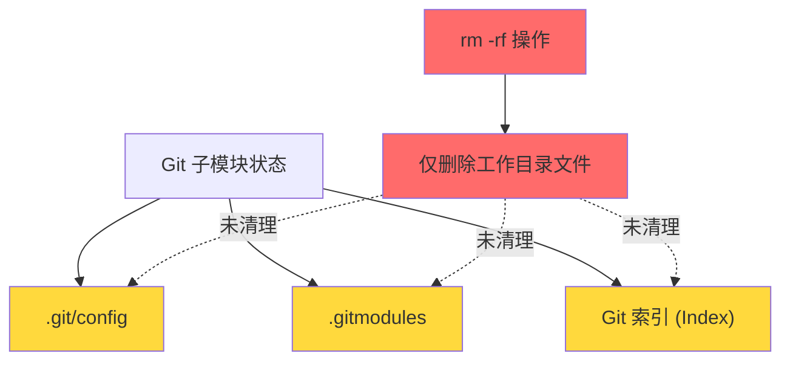
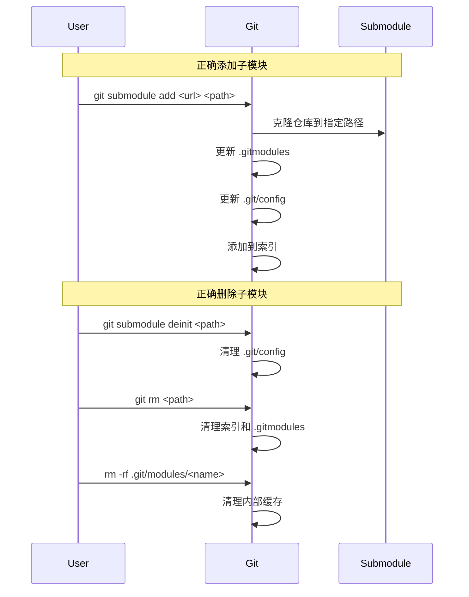

# Git 子模块路径修复指南

## 问题背景

在尝试将第三方库 `SentGraph-RAG` 从项目根目录迁移到 `src/third-party/` 目录时,采用了直接删除 + 重新 clone 的方式,导致 Git 记录混乱。

### 错误操作序列

```bash
# 1. 初次在根目录添加子模块
git submodule add git@github.com:jidechao/SentGraph-RAG.git

# 2. 直接删除子模块目录(错误操作)
rm -rf SentGraph-RAG

# 3. 导致 Git 状态不一致
```

### 问题表现

执行 `git status` 后出现以下状态:

```bash
Changes to be committed:
  modified:   .gitmodules
  new file:   SentGraph-RAG

Changes not staged for commit:
  deleted:    SentGraph-RAG
  modified:   src/third-party/LightRAG (modified content)

Untracked files:
  rag_storage_pg/
  src/third-party/LightRAG.bak/
```

## 根本原因

直接使用 `rm -rf` 删除已添加的 Git 子模块会导致三处配置不一致:



## 完整修复方案

### 第一步: 彻底清理错误的子模块状态

#### 1. 清除暂存区记录

```bash
git rm --cached SentGraph-RAG
```

**作用**: 从 Git 索引中移除子模块引用,但不删除工作目录文件。

#### 2. 清理 `.gitmodules` 配置

手动编辑 `.gitmodules` 文件,删除类似以下内容:

```ini
[submodule "SentGraph-RAG"]
    path = SentGraph-RAG
    url = git@github.com:jidechao/SentGraph-RAG.git
```

#### 3. 清理 `.git/config` 配置

```bash
git submodule deinit -f SentGraph-RAG
```

**作用**: 从 `.git/config` 中移除子模块配置,并清理工作目录。

#### 4. 清理内部模块缓存

```bash
rm -rf .git/modules/SentGraph-RAG
```

**作用**: 删除 Git 内部存储的子模块仓库缓存。

### 第二步: 以正确路径重新添加子模块

```bash
git submodule add git@github.com:jidechao/SentGraph-RAG.git src/third-party/SentGraph-RAG
```

**关键点**: 直接在 `git submodule add` 命令中指定目标路径,避免先添加后移动。

### 第三步: 验证并提交

#### 验证状态

```bash
git status
```

预期输出:

```
Changes to be committed:
  modified:   .gitmodules
  new file:   src/third-party/SentGraph-RAG
```

#### 提交更改

```bash
git commit -m "Add SentGraph-RAG as submodule in src/third-party"
```

## 附加问题处理

### 处理 LightRAG 的 modified content

如果 `src/third-party/LightRAG` 显示 `modified content`,可能原因:

1. 子模块内有未提交的修改
2. HEAD 指针漂移

**解决方案**:

```bash
cd src/third-party/LightRAG
git checkout .  # 丢弃本地修改
cd ../../..
```

### 清理备份目录

```bash
# 如果不需要 LightRAG.bak,可以删除
rm -rf src/third-party/LightRAG.bak
```

## 正确的子模块操作流程



## 最佳实践

### ✅ 推荐做法

1. **添加子模块时直接指定目标路径**
   ```bash
   git submodule add <url> <target/path>
   ```

2. **删除子模块使用完整流程**
   ```bash
   git submodule deinit -f <path>
   git rm <path>
   rm -rf .git/modules/<name>
   ```

3. **移动子模块使用 Git 命令**
   ```bash
   git mv <old-path> <new-path>
   # 然后手动更新 .gitmodules 中的 path
   ```

### ❌ 避免的操作

1. 直接 `rm -rf` 删除子模块目录
2. 手动编辑 `.git/config` 而不使用 `git submodule deinit`
3. 添加后再手动移动子模块目录

## 参考命令速查

| 操作 | 命令 | 说明 |
|------|------|------|
| 添加子模块 | `git submodule add <url> <path>` | 指定路径添加 |
| 初始化子模块 | `git submodule init` | 克隆后初始化 |
| 更新子模块 | `git submodule update` | 拉取最新提交 |
| 卸载子模块 | `git submodule deinit <path>` | 清理配置 |
| 删除子模块 | `git rm <path>` | 从索引删除 |
| 查看子模块状态 | `git submodule status` | 查看所有子模块 |
| 递归克隆 | `git clone --recursive <url>` | 包含子模块克隆 |

## 相关资源

- [Git Submodules 官方文档](https://git-scm.com/book/en/v2/Git-Tools-Submodules)
- 项目路径: `/Users/tsinglungtseng/scaffold/mylightrag`
- 子模块目标目录: `src/third-party/`

## 总结

Git 子模块的管理需要同步维护三处配置:
1. `.gitmodules` - 子模块元数据
2. `.git/config` - 本地配置
3. Git 索引 - 提交记录

任何手动操作都应确保这三处保持一致,否则会导致状态混乱。使用 Git 提供的 `git submodule` 系列命令是最安全的做法。
