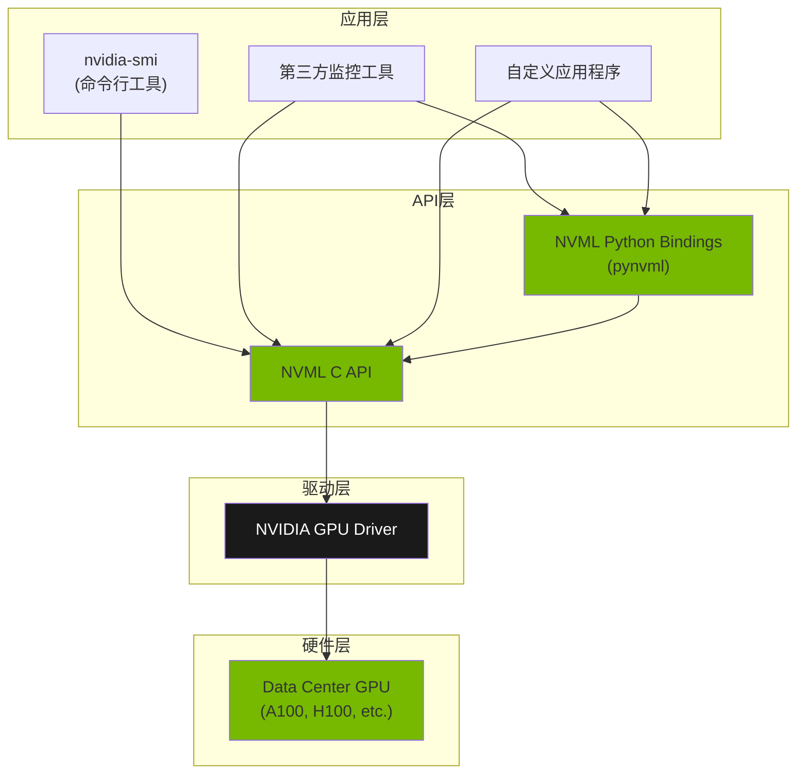
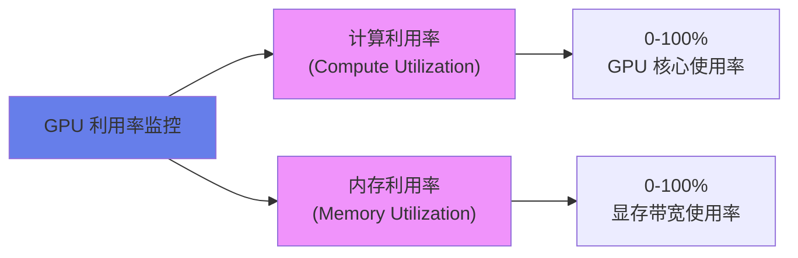
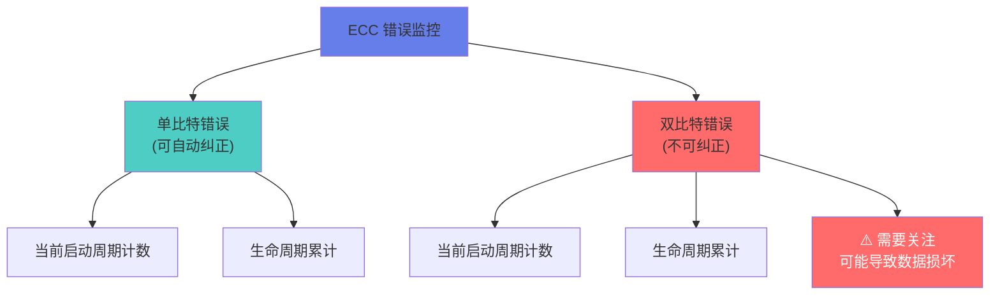
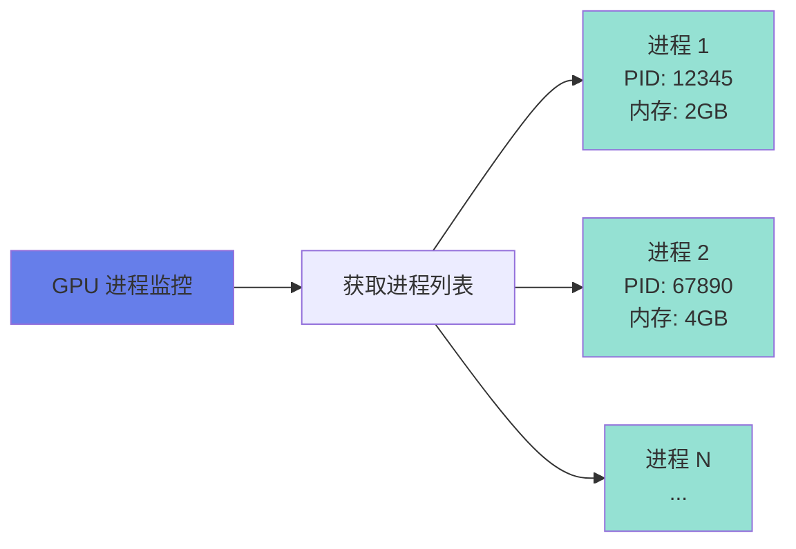
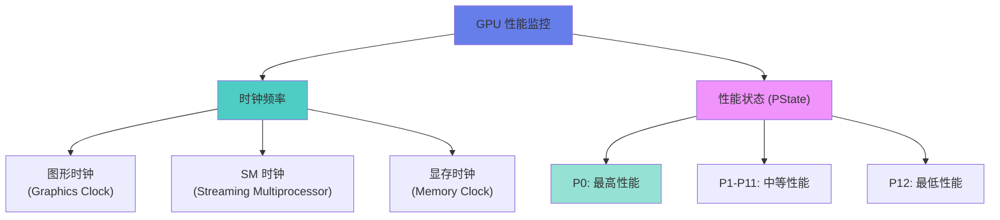
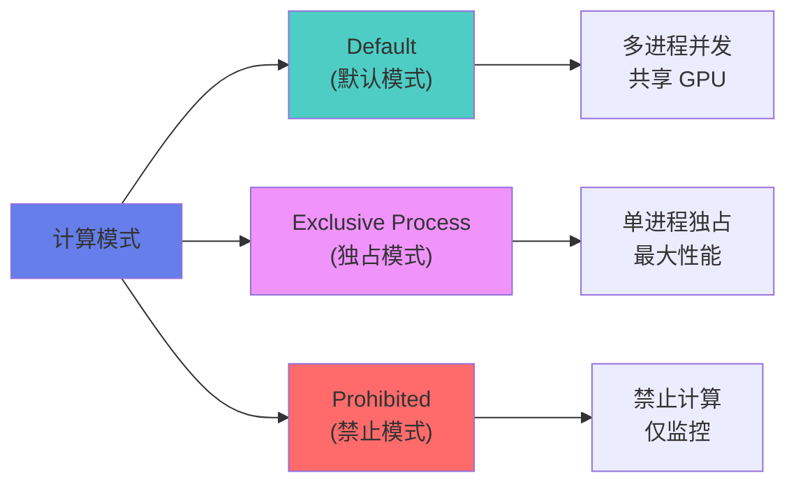
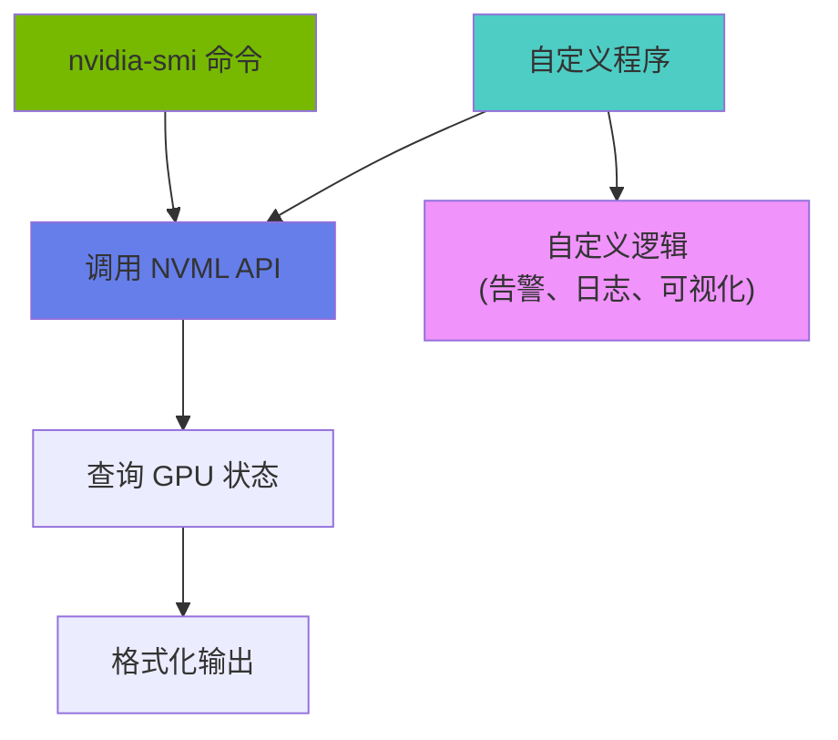
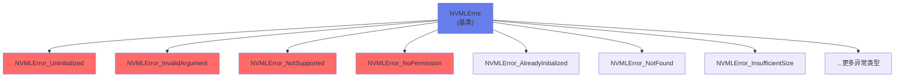
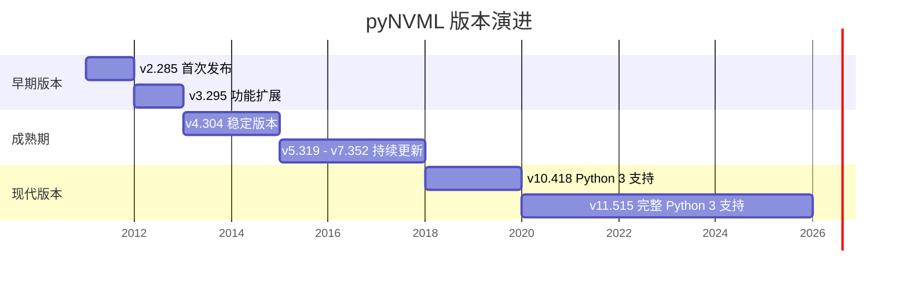

---
alias:
- NVML
- NVIDIA Management Library
- 英伟达管理库
- GPU监控库
- nvidia-smi底层库
auto_summary: NVIDIA Management Library (NVML) 是一个基于 C 语言的编程接口，用于监控和管理数据中心 GPU，是 nvidia-smi
  工具的底层库，支持多线程、跨平台（Linux/Windows），提供全方位 GPU 状态监控和可编程配置。其架构从硬件层（A100、H100 等 GPU）经驱动层、API
  层（NVML C API 及 Python 绑定 pynvml）到应用层（nvidia-smi、第三方工具）。NVML 可查询的状态包括设备识别（序列号、PCI
  ID、VBIOS 版本等）、GPU 利用率（核心和显存接口利用率）、ECC 错误计数（单比特可纠正、双比特可检测，分当前启动周期和生命周期）、温度与风扇转速、功耗管理（当前功耗、功耗限制及可配置范围）、活动计算进程（PID
  和显存占用）、时钟频率与性能状态（P0 最高性能到 P12）。可修改状态包括 ECC 模式（启用会占用约 10% 显存，需重启生效）、ECC 重置、计算模式（Default
  多进程并发、Exclusive Process 单进程独占、Prohibited 禁止计算）以及持久化模式（减少首次启动延迟）。pyNVML 基于 ctypes
  实现，自动管理内存和指针，将 C 返回码转为 Python 异常，输出参数直接作为返回值，结构体转为类属性访问，字符串缓冲区自动分配。异常处理涵盖 NVMLError
  基类及多种子类（未初始化、无效参数、不支持等），支持精确捕获。常用常量包括温度传感器、时钟类型、计算模式、ECC 模式、性能状态（P0-P15）。版本历史从 v2.285
  到 v11.515 逐步演进，支持 Python 2.5+ 至 3.x。应用场景涵盖集群资源管理、深度学习训练监控（利用率保持 80%+）、故障预测（监控 ECC
  增长、双比特立即告警）、性能优化（分析时钟、功耗限制、热节流）。安装随驱动完成，Python 绑定通过 pip install nvidia-ml-py3 安装。最佳实践包括始终错误处理、修改
  GPU 状态需 root/管理员权限、避免过于频繁查询（建议 ≥100ms）、批量查询更高效、使用持久化模式。完整监控脚本可每秒输出利用率、显存、温度、功耗、时钟和进程数。参考资源包括
  NVML API Reference、pynvml PyPI 页、nvidia-smi 文档和数据中心 GPU 文档。
auto_summary_indexed_at: '2026-06-09'
created: 2026-01-21
related-notes:
- '[[DevOps_bignode-H20-NVLink互联拓扑_NVSwitch-Fabric]]'
source: NVIDIA Documentation
tags:
- FRAMEWORK_Linux
- FRAMEWORK_NVML
- FRAMEWORK_Python
- FRAMEWORK_Windows
- FRAMEWORK_pynvml
- ORG_NVIDIA
- TOOL_nvidia-smi
type: note
---

# Tool_NVML英伟达管理库_NVIDIA-Management-Library

## 概述

**NVIDIA Management Library (NVML)** 是一个基于 C 语言的编程接口，用于监控和管理数据中心 GPU 的各种状态。它是构建第三方应用程序的平台，也是 NVIDIA 官方支持的 `nvidia-smi` 工具的底层库。

### 核心特性

- **线程安全**: 支持多线程同时调用 NVML 接口
- **跨平台**: 支持 Linux 和 Windows 系统
- **全面监控**: 提供 GPU 硬件、性能、错误等全方位状态信息
- **可编程管理**: 允许程序化修改 GPU 配置

## 架构关系



## 可查询状态 (Query-able States)

### 1. 设备识别 (Identification)

**提供信息**:
- 板卡序列号 (Board Serial Number)
- PCI 设备 ID (PCI Device ID)
- VBIOS/Inforom 版本号
- 产品名称 (Product Name)

**应用场景**: 资产管理、设备清单、故障追踪

```python
import pynvml

pynvml.nvmlInit()
handle = pynvml.nvmlDeviceGetHandleByIndex(0)

# 获取设备名称
name = pynvml.nvmlDeviceGetName(handle)
# 获取序列号
serial = pynvml.nvmlDeviceGetSerial(handle)
# 获取 UUID
uuid = pynvml.nvmlDeviceGetUUID(handle)

print(f"GPU: {name}, Serial: {serial}, UUID: {uuid}")
```

### 2. GPU 利用率 (GPU Utilization)

**监控指标**:
- **计算资源利用率**: GPU 核心使用百分比
- **内存接口利用率**: 显存带宽使用情况



**代码示例**:
```python
# 获取 GPU 利用率
utilization = pynvml.nvmlDeviceGetUtilizationRates(handle)
print(f"GPU 利用率: {utilization.gpu}%")
print(f"内存利用率: {utilization.memory}%")
```

### 3. ECC 错误计数 (ECC Error Counts)

**错误类型**:
- **单比特可纠正错误** (Single Bit Correctable Errors)
- **双比特可检测错误** (Double Bit Detectable Errors)

**统计维度**:
- 当前启动周期 (Current Boot Cycle)
- GPU 生命周期累计 (Lifetime)



**应用价值**: 预测硬件故障、评估 GPU 健康状况

### 4. 温度与风扇速度 (Temperature & Fan Speed)

**监控项**:
- GPU 核心温度 (Core Temperature)
- 风扇转速 (Fan Speed) - 仅适用于主动散热产品

**代码示例**:
```python
# 获取温度
temp = pynvml.nvmlDeviceGetTemperature(handle, pynvml.NVML_TEMPERATURE_GPU)
print(f"GPU 温度: {temp}°C")

# 获取风扇转速
try:
    fan_speed = pynvml.nvmlDeviceGetFanSpeed(handle)
    print(f"风扇转速: {fan_speed}%")
except pynvml.NVMLError:
    print("该 GPU 无风扇或为被动散热")
```

### 5. 功耗管理 (Power Management)

**监控指标**:
- 当前功耗 (Current Power Draw)
- 功耗限制 (Power Limit)
- 默认功耗限制 (Default Power Limit)
- 可配置功耗范围 (Enforceable Power Limit Range)

```python
# 获取功耗信息
power = pynvml.nvmlDeviceGetPowerUsage(handle) / 1000.0  # 转换为瓦特
power_limit = pynvml.nvmlDeviceGetPowerManagementLimit(handle) / 1000.0

print(f"当前功耗: {power:.2f}W")
print(f"功耗限制: {power_limit:.2f}W")
print(f"功耗占比: {(power/power_limit)*100:.1f}%")
```

### 6. 活动计算进程 (Active Compute Processes)

**提供信息**:
- 进程 ID (Process ID)
- 进程名称 (Process Name)
- 已分配 GPU 内存 (Allocated GPU Memory)



**代码示例**:
```python
# 获取运行在 GPU 上的进程
processes = pynvml.nvmlDeviceGetComputeRunningProcesses(handle)

for proc in processes:
    print(f"PID: {proc.pid}")
    print(f"使用显存: {proc.usedGpuMemory / 1024**2:.2f} MB")
```

### 7. 时钟频率与性能状态 (Clocks & PState)

**监控项**:
- **时钟域** (Clock Domains):
  - Graphics Clock (图形时钟)
  - SM Clock (流多处理器时钟)
  - Memory Clock (显存时钟)
- **性能状态** (Performance State): P0 (最高性能) ~ P12 (最低性能)



**代码示例**:
```python
# 获取时钟频率
graphics_clock = pynvml.nvmlDeviceGetClockInfo(handle, pynvml.NVML_CLOCK_GRAPHICS)
memory_clock = pynvml.nvmlDeviceGetClockInfo(handle, pynvml.NVML_CLOCK_MEM)

# 获取性能状态
pstate = pynvml.nvmlDeviceGetPerformanceState(handle)

print(f"图形时钟: {graphics_clock} MHz")
print(f"显存时钟: {memory_clock} MHz")
print(f"性能状态: P{pstate}")
```

## 可修改状态 (Modifiable States)

### 1. ECC 模式 (ECC Mode)

**功能**: 启用或禁用错误纠正码 (Error Correcting Code)

**注意事项**:
- 启用 ECC 会占用部分显存 (~10%)
- 修改后需要重启 GPU 才能生效

```python
# 启用 ECC
pynvml.nvmlDeviceSetEccMode(handle, pynvml.NVML_FEATURE_ENABLED)

# 禁用 ECC
pynvml.nvmlDeviceSetEccMode(handle, pynvml.NVML_FEATURE_DISABLED)
```

### 2. ECC 重置 (ECC Reset)

**功能**: 清除单比特和双比特 ECC 错误计数

```python
# 清除 ECC 错误计数
pynvml.nvmlDeviceClearEccErrorCounts(handle, pynvml.NVML_VOLATILE_ECC)
```

### 3. 计算模式 (Compute Mode)

**模式类型**:

| 模式 | 说明 | 应用场景 |
|------|------|----------|
| **Default** | 多个进程可并发运行 | 开发、测试环境 |
| **Exclusive Process** | 仅允许一个进程独占 GPU | 高性能计算、深度学习训练 |
| **Prohibited** | 禁止计算进程运行 | 维护、故障排查 |



**代码示例**:
```python
# 设置为独占模式
pynvml.nvmlDeviceSetComputeMode(handle, pynvml.NVML_COMPUTEMODE_EXCLUSIVE_PROCESS)

# 设置为默认模式
pynvml.nvmlDeviceSetComputeMode(handle, pynvml.NVML_COMPUTEMODE_DEFAULT)
```

### 4. 持久化模式 (Persistence Mode)

**功能**: 控制当没有活动客户端连接到 GPU 时，NVIDIA 驱动是否保持加载状态

**优势**:
- 减少首次启动延迟
- 保持 GPU 初始化状态
- 适合频繁启动/停止任务的场景

```python
# 启用持久化模式
pynvml.nvmlDeviceSetPersistenceMode(handle, pynvml.NVML_FEATURE_ENABLED)

# 禁用持久化模式
pynvml.nvmlDeviceSetPersistenceMode(handle, pynvml.NVML_FEATURE_DISABLED)
```

## 完整监控示例

### Python 实现 GPU 监控脚本

```python
#!/usr/bin/env python3
import pynvml
import time

def monitor_gpu(device_index=0, interval=1):
    """
    持续监控 GPU 状态
    
    Args:
        device_index: GPU 索引 (默认 0)
        interval: 监控间隔秒数 (默认 1 秒)
    """
    pynvml.nvmlInit()
    
    try:
        handle = pynvml.nvmlDeviceGetHandleByIndex(device_index)
        name = pynvml.nvmlDeviceGetName(handle)
        
        print(f"监控 GPU: {name}")
        print("-" * 80)
        
        while True:
            # 利用率
            util = pynvml.nvmlDeviceGetUtilizationRates(handle)
            
            # 内存
            mem_info = pynvml.nvmlDeviceGetMemoryInfo(handle)
            mem_used_gb = mem_info.used / 1024**3
            mem_total_gb = mem_info.total / 1024**3
            
            # 温度
            temp = pynvml.nvmlDeviceGetTemperature(handle, pynvml.NVML_TEMPERATURE_GPU)
            
            # 功耗
            power = pynvml.nvmlDeviceGetPowerUsage(handle) / 1000.0
            
            # 时钟
            graphics_clock = pynvml.nvmlDeviceGetClockInfo(handle, pynvml.NVML_CLOCK_GRAPHICS)
            
            # 进程数量
            processes = pynvml.nvmlDeviceGetComputeRunningProcesses(handle)
            
            print(f"GPU 利用率: {util.gpu:3d}% | "
                  f"显存: {mem_used_gb:.1f}/{mem_total_gb:.1f}GB | "
                  f"温度: {temp}°C | "
                  f"功耗: {power:.1f}W | "
                  f"时钟: {graphics_clock}MHz | "
                  f"进程数: {len(processes)}")
            
            time.sleep(interval)
            
    except KeyboardInterrupt:
        print("\n监控已停止")
    finally:
        pynvml.nvmlShutdown()

if __name__ == "__main__":
    monitor_gpu()
```

## 与 nvidia-smi 的关系



**nvidia-smi 常用命令与 NVML 对应**:

| nvidia-smi 命令      | NVML API                                 | 功能         |
| ------------------ | ---------------------------------------- | ---------- |
| `nvidia-smi`       | `nvmlDeviceGetUtilizationRates()`        | 查看 GPU 利用率 |
| `nvidia-smi -q`    | 多个 NVML 查询函数                             | 详细查询所有信息   |
| `nvidia-smi -l 1`  | 循环调用 NVML API                            | 持续监控       |
| `nvidia-smi pmon`  | `nvmlDeviceGetComputeRunningProcesses()` | 进程监控       |
| `nvidia-smi -pm 1` | `nvmlDeviceSetPersistenceMode()`         | 启用持久化模式    |

## 应用场景

### 1. 集群资源管理

**场景**: 数据中心 GPU 集群的资源调度和监控

**实现**:
- 实时监控所有 GPU 的利用率和内存使用
- 自动分配空闲 GPU 给新任务
- 检测异常状态并告警

### 2. 深度学习训练监控

**场景**: 监控训练任务的 GPU 使用情况

**监控指标**:
- GPU 利用率 (应保持在 80%+ 以充分利用硬件)
- 显存使用 (避免 OOM 错误)
- 温度和功耗 (确保在安全范围内)

### 3. 故障预测与诊断

**场景**: 通过 ECC 错误计数预测硬件故障

**策略**:
- 监控 ECC 错误增长趋势
- 双比特错误出现时立即告警
- 定期生成健康报告

### 4. 性能优化

**场景**: 分析 GPU 性能瓶颈

**分析维度**:
- 时钟频率是否达到最大值
- 功耗限制是否导致降频
- 温度是否触发热节流 (Thermal Throttling)

## 安装与使用

### 安装 NVML

NVML 随 NVIDIA GPU 驱动一起安装，无需单独安装。

**验证安装**:
```bash
# Linux
ldconfig -p | grep libnvidia-ml

# Windows
dir "C:\Program Files\NVIDIA Corporation\NVSMI\nvml.dll"
```

### Python Bindings 安装

```bash
pip install nvidia-ml-py3
```

### 基础使用模板

```python
import pynvml

# 1. 初始化
pynvml.nvmlInit()

try:
    # 2. 获取设备句柄
    device_count = pynvml.nvmlDeviceGetCount()
    print(f"检测到 {device_count} 个 GPU")
    
    for i in range(device_count):
        handle = pynvml.nvmlDeviceGetHandleByIndex(i)
        
        # 3. 查询信息
        name = pynvml.nvmlDeviceGetName(handle)
        print(f"GPU {i}: {name}")
        
        # 4. 执行其他操作...
        
finally:
    # 5. 清理
    pynvml.nvmlShutdown()
```

## pyNVML 详解

### Python Bindings 概述

**pyNVML** 是 NVML C 库的 Python 封装，提供了 Pythonic 的接口来访问 GPU 管理功能。它是基于 `ctypes` 实现的，自动处理内存分配、指针传递和类型转换。

**核心特性**:
- 自动内存管理，无需手动分配结构体
- 将 C 返回码转换为 Python 异常
- 支持 Python 2.5+ 和 Python 3.x
- 自动处理字符串编码转换

### C 到 Python 的转换规则

#### 1. 返回码转换为异常

**C 风格**:
```c
nvmlReturn_t result = nvmlDeviceGetCount(&deviceCount);
if (result != NVML_SUCCESS) {
    // 错误处理
}
```

**Python 风格**:
```python
try:
    device_count = nvmlDeviceGetCount()
except NVMLError as error:
    print(f"错误: {error}")
```


#### 2. 输出参数转换为返回值

**C 风格** (输出参数通过指针传递):
```c
nvmlReturn_t nvmlDeviceGetEccMode(nvmlDevice_t device,
                                  nvmlEnableState_t *current,
                                  nvmlEnableState_t *pending);

// 使用
nvmlEnableState_t current, pending;
nvmlDeviceGetEccMode(handle, &current, &pending);
```

**Python 风格** (输出参数作为返回值):
```python
# Python 自动处理指针，直接返回多个值
(current, pending) = nvmlDeviceGetEccMode(handle)
```

**转换规则**: C 函数的输出参数按从左到右的顺序作为 Python 函数的返回值

#### 3. 结构体转换为类

**C 结构体定义**:
```c
typedef struct nvmlMemory_st {
    unsigned long long total;
    unsigned long long free;
    unsigned long long used;
} nvmlMemory_t;

nvmlReturn_t nvmlDeviceGetMemoryInfo(nvmlDevice_t device,
                                     nvmlMemory_t *memory);
```

**Python 类访问**:
```python
# 返回 ctypes 结构体对象
info = nvmlDeviceGetMemoryInfo(handle)

# 通过属性访问成员
print(f"总显存: {info.total} bytes")
print(f"空闲显存: {info.free} bytes")
print(f"已用显存: {info.used} bytes")

# 计算使用率
usage_percent = (info.used / info.total) * 100
print(f"显存使用率: {usage_percent:.1f}%")
```

#### 4. 字符串缓冲区自动管理

**C 风格** (需要手动分配缓冲区):
```c
char version[NVML_SYSTEM_DRIVER_VERSION_BUFFER_SIZE];
nvmlSystemGetDriverVersion(version, NVML_SYSTEM_DRIVER_VERSION_BUFFER_SIZE);
```

**Python 风格** (自动处理):
```python
# Python 自动分配缓冲区并返回字符串
version = nvmlSystemGetDriverVersion()
print(f"驱动版本: {version}")
```

### 异常处理机制

#### 异常层次结构



#### 异常命名规则

C 错误码到 Python 异常的转换规则:

| C 错误码 | Python 异常 | 说明 |
|---------|------------|------|
| `NVML_ERROR_UNINITIALIZED` | `NVMLError_Uninitialized` | NVML 未初始化 |
| `NVML_ERROR_INVALID_ARGUMENT` | `NVMLError_InvalidArgument` | 无效参数 |
| `NVML_ERROR_NOT_SUPPORTED` | `NVMLError_NotSupported` | 功能不支持 |
| `NVML_ERROR_NO_PERMISSION` | `NVMLError_NoPermission` | 权限不足 |
| `NVML_ERROR_ALREADY_INITIALIZED` | `NVMLError_AlreadyInitialized` | 已初始化 |
| `NVML_ERROR_NOT_FOUND` | `NVMLError_NotFound` | 未找到 |
| `NVML_ERROR_INSUFFICIENT_SIZE` | `NVMLError_InsufficientSize` | 缓冲区不足 |
| `NVML_ERROR_LIBRARY_NOT_FOUND` | `NVMLError_LibraryNotFound` | 库文件未找到 |

#### 异常处理示例

**通用异常捕获**:
```python
try:
    device_count = nvmlDeviceGetCount()
except NVMLError as error:
    print(f"NVML 错误: {error}")
```

**精确异常捕获**:
```python
try:
    nvmlInit()
    device_count = nvmlDeviceGetCount()
except NVMLError_Uninitialized:
    print("错误: NVML 未初始化")
except NVMLError_LibraryNotFound:
    print("错误: 未找到 NVML 库，请安装 NVIDIA 驱动")
except NVMLError_NoPermission:
    print("错误: 权限不足，请使用 sudo 运行")
except NVMLError as error:
    print(f"其他 NVML 错误: {error}")
```

**多层异常处理**:
```python
def safe_get_gpu_info(device_index):
    """安全获取 GPU 信息，包含完整异常处理"""
    try:
        nvmlInit()
    except NVMLError_AlreadyInitialized:
        pass  # 已初始化，继续执行
    except NVMLError_LibraryNotFound:
        return None, "NVIDIA 驱动未安装"
    
    try:
        handle = nvmlDeviceGetHandleByIndex(device_index)
        name = nvmlDeviceGetName(handle)
        return name, None
    except NVMLError_InvalidArgument:
        return None, f"无效的设备索引: {device_index}"
    except NVMLError_NotFound:
        return None, "未找到 GPU 设备"
    except NVMLError as error:
        return None, str(error)
    finally:
        try:
            nvmlShutdown()
        except:
            pass
```

### 常量和枚举

#### 常用常量

pyNVML 暴露了所有 NVML 常量和枚举值:

```python
# 温度传感器类型
pynvml.NVML_TEMPERATURE_GPU          # GPU 核心温度
pynvml.NVML_TEMPERATURE_COUNT        # 温度传感器数量

# 时钟类型
pynvml.NVML_CLOCK_GRAPHICS           # 图形时钟
pynvml.NVML_CLOCK_SM                 # SM 时钟
pynvml.NVML_CLOCK_MEM                # 显存时钟
pynvml.NVML_CLOCK_VIDEO              # 视频编码时钟

# 计算模式
pynvml.NVML_COMPUTEMODE_DEFAULT                # 默认模式
pynvml.NVML_COMPUTEMODE_EXCLUSIVE_PROCESS      # 独占进程模式
pynvml.NVML_COMPUTEMODE_PROHIBITED             # 禁止模式

# ECC 模式
pynvml.NVML_FEATURE_DISABLED         # 禁用
pynvml.NVML_FEATURE_ENABLED          # 启用

# 性能状态
pynvml.NVML_PSTATE_0                 # P0 (最高性能)
pynvml.NVML_PSTATE_15                # P15 (最低性能)
```

#### NVML_VALUE_NOT_AVAILABLE 处理

在 C 库中，`NVML_VALUE_NOT_AVAILABLE` 常量用于表示值不可用。在 Python 中，这被映射为 `None`:

```python
# C 风格
if (value == NVML_VALUE_NOT_AVAILABLE) {
    // 处理不可用情况
}

# Python 风格
value = nvmlDeviceGetSomeValue(handle)
if value is None:
    print("该值不可用")
```

### 版本历史



**主要版本里程碑**:

| 版本 | 发布时间 | 主要更新 |
|------|---------|---------|
| **2.285.0** | 早期 | 首次发布，支持 Python 2.0 和 3.0 |
| **3.295.0** | - | 更新 nvidia_smi.py 工具，增强错误处理 |
| **4.304.0** | - | 新增 NVML 4.304 函数 |
| **4.304.3** | - | 修复 `nvmlUnitGetDeviceCount` bug |
| **5.319.0** | - | 新增 NVML 5.319 函数 |
| **6.340.0** | - | 新增 NVML 6.340 函数 |
| **7.346.0** | - | 新增 NVML 7.346 函数 |
| **7.352.0** | - | 新增 NVML 7.352 函数 |
| **10.418** | ~2018 | 修复 Python 3.x 兼容性问题<br>用 example.py 替换 nvidia_smi.py |
| **11.515.48** | ~2020 | **完整 Python 3 支持**<br>更新 API 与 NVML 同步<br>自动字节/字符串转换 |

### 完整功能示例

#### 示例 1: 获取驱动版本和设备信息

```python
from pynvml import *

# 初始化
nvmlInit()

# 获取驱动版本
driver_version = nvmlSystemGetDriverVersion()
print(f"Driver Version: {driver_version}")

# 获取设备数量
device_count = nvmlDeviceGetCount()
print(f"发现 {device_count} 个 GPU 设备")

# 遍历所有设备
for i in range(device_count):
    handle = nvmlDeviceGetHandleByIndex(i)
    name = nvmlDeviceGetName(handle)
    print(f"Device {i}: {name}")

# 清理
nvmlShutdown()
```

**输出示例**:
```
Driver Version: 11.515.48
发现 2 个 GPU 设备
Device 0: Tesla K40c
Device 1: Tesla V100-SXM2-16GB
```

#### 示例 2: 获取显存信息

```python
from pynvml import *

nvmlInit()
handle = nvmlDeviceGetHandleByIndex(0)

# 获取显存信息 (返回结构体对象)
info = nvmlDeviceGetMemoryInfo(handle)

print(f"总显存: {info.total / 1024**3:.2f} GB")
print(f"空闲显存: {info.free / 1024**3:.2f} GB")
print(f"已用显存: {info.used / 1024**3:.2f} GB")
print(f"使用率: {(info.used / info.total) * 100:.1f}%")

nvmlShutdown()
```

#### 示例 3: ECC 模式查询

```python
from pynvml import *

nvmlInit()
handle = nvmlDeviceGetHandleByIndex(0)

# 获取 ECC 模式 (返回两个值)
(current, pending) = nvmlDeviceGetEccMode(handle)

print(f"当前 ECC 模式: {'启用' if current else '禁用'}")
print(f"待生效 ECC 模式: {'启用' if pending else '禁用'}")

nvmlShutdown()
```

## 最佳实践

### 1. 错误处理

```python
try:
    pynvml.nvmlInit()
    handle = pynvml.nvmlDeviceGetHandleByIndex(0)
    # 执行操作...
except pynvml.NVMLError as error:
    print(f"NVML 错误: {error}")
finally:
    pynvml.nvmlShutdown()
```

### 2. 权限管理

**注意**: 修改 GPU 状态 (如计算模式、ECC 模式) 需要 root/管理员权限

```bash
# Linux
sudo python gpu_config.py

# Windows (以管理员身份运行)
```

### 3. 性能考虑

- 避免过于频繁的查询 (建议间隔 ≥ 100ms)
- 批量查询多个指标比单独查询更高效
- 使用持久化模式减少驱动加载开销

## 参考资源

- 📚 [NVML API Reference](https://docs.nvidia.com/deploy/nvml-api/index.html)
- 🐍 [NVML Python Bindings (pynvml)](https://pypi.org/project/nvidia-ml-py/)
- 🔧 [nvidia-smi 文档](https://developer.nvidia.com/nvidia-system-management-interface)
- 📖 [NVIDIA Data Center GPU 文档](https://docs.nvidia.com/datacenter/tesla/)

---

**关键要点**: NVML 是 GPU 监控和管理的核心库，提供了全面的查询和配置能力。通过 Python Bindings，可以轻松构建自定义监控、调度和优化工具，是数据中心 GPU 管理的必备技术。