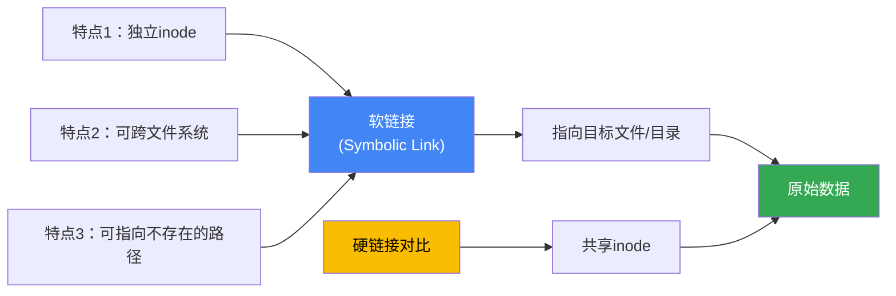
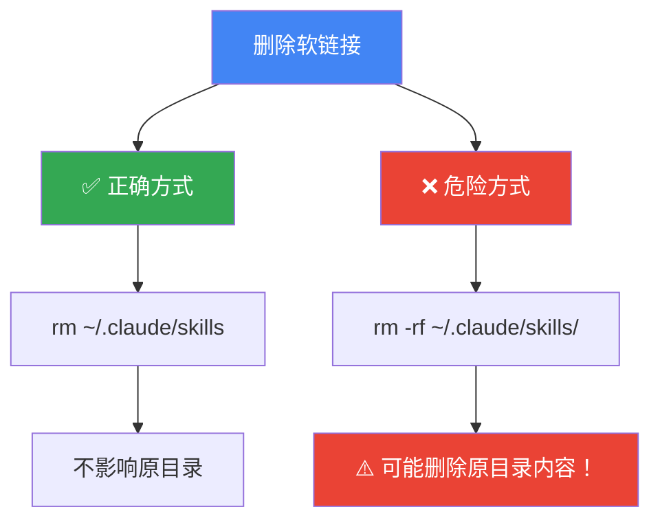

---
alias:
- 软链接
- Symbolic Link
- ln命令
- symlink操作
- 符号链接
created: 2026-01-23
platform:
- Linux
- macOS
- Unix
related-notes:
- '[[Dev_AB测试脚本切换_Symlink-PM2-GitBranch]]'
tags:
- CONCEPT_Dead_Link
- CONCEPT_inode
- CONCEPT_断链
- METHOD_Hard_Link
- METHOD_Symlink
- METHOD_硬链接
- METHOD_软链接
- PRODUCT_Windows
- PRODUCT_macOS
- TOOL_find
- TOOL_ln
- TOOL_ls
- TOOL_readlink
- TOOL_rm
- TOOL_tree
- TOOL_unlink
type: technical-guide
---

# 软链接操作大全 (Symbolic Link Guide)

> **软链接 (Symbolic Link, Symlink)** 是 Unix/Linux 文件系统中的一种特殊文件类型，类似 Windows 的"快捷方式"。它创建一个指向另一个文件或目录的引用，删除软链接**不会影响原文件**。本笔记涵盖创建、删除、查找、调试软链接的所有常用操作。

## 核心概念

### 什么是软链接？



### 软链接 vs 硬链接

| 特性 | 软链接 (Symlink) | 硬链接 (Hard Link) |
|------|------------------|-------------------|
| **inode** | 独立 inode | 共享 inode |
| **跨文件系统** | ✅ 可以 | ❌ 不可以 |
| **指向目录** | ✅ 可以 | ❌ 不可以（大部分系统） |
| **原文件删除后** | ⚠️ 变成断链 (Dead Link) | ✅ 仍可访问 |
| **占用空间** | 极小（路径字符串） | 与原文件相同 |
| **显示方式** | `l` 开头，带 `->` | 权限列正常 |

### 权限列解读

```bash
lrwxrwxrwx 1 user staff 31 Jan 22 05:45 skills -> /home/user/.gemini/antigravity/skills
```

**解读**：
- `l`：文件类型为 link（软链接）
- `rwxrwxrwx`：软链接本身的权限（实际访问权限由目标文件决定）
- `31`：路径字符串长度
- `skills -> ...`：链接名 → 目标路径

## 一、创建软链接

### 基本语法

```bash
ln -s <目标路径> <链接路径>
```

**参数说明**：
- `-s`：创建软链接（symbolic）
- `<目标路径>`：原始文件/目录的**绝对路径或相对路径**
- `<链接路径>`：新建链接的路径

### 常见场景

#### 场景1：链接配置目录

```bash
# 将 ~/.gemini/antigravity/skills 链接到 ~/.claude/skills
ln -s ~/.gemini/antigravity/skills ~/.claude/skills
```

**用途**：
- 统一管理配置文件
- 在多个工具间共享同一目录
- 避免重复存储

#### 场景2：版本切换

```bash
# 链接特定版本的软件
ln -s /usr/local/python3.11 /usr/local/python

# 切换版本时只需重建链接
rm /usr/local/python
ln -s /usr/local/python3.12 /usr/local/python
```

**用途**：
- 快速切换软件版本
- 保持路径不变，只改变指向
- 简化脚本中的路径管理

#### 场景3：跨盘符映射

```bash
# 将大型数据目录链接到主目录
ln -s /mnt/data/datasets ~/datasets
```

**用途**：
- 访问其他分区/挂载点的数据
- 节省主分区空间
- 保持路径简洁

### 创建时的注意事项

#### ⚠️ 使用绝对路径 vs 相对路径

```bash
# ✅ 推荐：使用绝对路径（避免移动后失效）
ln -s /home/user/original/file ~/link

# ⚠️ 相对路径：仅在当前目录结构不变时可用
ln -s ../original/file ~/link
```

**原则**：
- 跨目录链接：**优先使用绝对路径**
- 同目录内链接：可使用相对路径
- 需要移植配置：考虑相对路径（如 dotfiles）

#### ⚠️ 目标不存在时的行为

```bash
# 即使目标不存在，软链接也能创建（但会是断链）
ln -s /path/does/not/exist ~/broken-link
```

**验证方法**：
```bash
ls -l ~/broken-link
# 输出会显示红色或带 "?" 标记
```

## 二、删除软链接

### 基本命令

```bash
rm <链接路径>
```

### ⚠️ 极其重要的注意事项



### 正确删除方式

#### ✅ 方法1：直接 rm（推荐）

```bash
# 删除软链接本身
rm ~/.claude/skills
```

**特点**：
- 只删除链接
- 原目录 `~/.gemini/antigravity/skills` 完全不受影响
- **最安全的方式**

#### ✅ 方法2：unlink 命令

```bash
# unlink 专门用于删除链接
unlink ~/.claude/skills
```

**特点**：
- 语义更明确
- 不支持通配符（更安全）
- 适合脚本中使用

### 错误示例与后果

#### ❌ 错误1：路径末尾加斜杠

```bash
# 危险！可能删除原目录内容
rm -rf ~/.claude/skills/
```

**后果**：
- 某些系统会"穿透"链接，删除目标目录内容
- `~/.gemini/antigravity/skills` 目录可能被清空
- **数据丢失风险极高**

#### ❌ 错误2：误用 rm -rf

```bash
# 即使没有斜杠，rm -rf 也有风险
rm -rf ~/.claude/skills
```

**风险**：
- `-rf` 强制递归删除
- 如果配置错误，可能意外删除原目录
- 建议先用 `ls -l` 确认是软链接

### 验证删除成功

```bash
# 检查链接是否还存在
ls -l ~/.claude/skills
# 如果输出 "No such file or directory"，说明删除成功

# 验证原目录完好
ls -l ~/.gemini/antigravity/skills
# 应该能正常列出文件
```

## 三、查找软链接

### 工具对比表

| 命令 | 用途 | 递归 | 显示详情 | 速度 |
|------|------|------|----------|------|
| `ls -l` | 查看已知目录 | ❌ | ✅ | 快 |
| `find -type l` | 搜索所有链接 | ✅ | ✅ (配合 -ls) | 中 |
| `tree -l` | 可视化目录树 | ✅ | ✅ | 慢 |
| `readlink -f` | 查看最终路径 | N/A | ✅ | 快 |

### 方法1：查看特定目录

```bash
# 查看 ~/.claude 下的所有软链接
ls -l ~/.claude
```

**输出示例**：
```bash
lrwxrwxrwx 1 user staff 31 Jan 22 05:45 skills -> /home/user/.gemini/antigravity/skills
-rw-r--r-- 1 user staff 150 Jan 20 10:30 config.json
```

**识别要点**：
- 第一个字符为 `l`（link）
- 包含 `->` 指向目标路径

### 方法2：递归查找所有软链接

#### 当前目录（不含子目录）

```bash
find . -maxdepth 1 -type l
```

**参数说明**：
- `.`：当前目录
- `-maxdepth 1`：只搜索当前层级，不进入子目录
- `-type l`：只查找 link 类型

#### 递归查找（含子目录）

```bash
# 查找当前目录及所有子目录
find . -type l -ls
```

**输出格式**：
```bash
12345678    0 lrwxrwxrwx   1 user  staff   31 Jan 22 05:45 ./skills -> /home/user/.gemini/antigravity/skills
```

**优点**：
- `-ls` 参数提供详细信息（inode、权限、指向）
- 可以快速定位所有链接

### 方法3：查找断链（Dead Links）

```bash
# 找出指向不存在目标的软链接
find . -type l ! -exec test -e {} \; -print
```

**工作原理**：


**使用场景**：
- 清理失效链接
- 验证迁移后的配置
- 定期维护文件系统

**一键清理断链**：
```bash
# ⚠️ 危险操作！建议先预览
find . -type l ! -exec test -e {} \; -print

# 确认无误后再删除
find . -type l ! -exec test -e {} \; -delete
```

### 方法4：查看链接的最终指向

```bash
# 查看软链接指向的绝对路径
readlink -f ~/.claude/skills
```

**输出示例**：
```bash
/home/user/.gemini/antigravity/skills
```

**参数说明**：
- `-f`：follow，递归解析所有软链接，返回最终路径
- 如果链接指向另一个链接，会一直追溯到真实文件

**应用场景**：
```bash
# 场景：多层链接
ln -s /usr/local/python3.11 /usr/local/python
ln -s /usr/local/python ~/bin/python

# 查看最终指向
readlink -f ~/bin/python
# 输出：/usr/local/python3.11
```

### 方法5：tree 可视化（需安装）

```bash
# 安装 tree（macOS）
brew install tree

# 显示目录树及软链接
tree -l ~/.claude
```

**输出示例**：
```
/Users/user/.claude
├── config.json
├── skills -> /home/user/.gemini/antigravity/skills
└── logs/
    └── debug.log
```

**优点**：
- 直观展示目录结构
- 清楚标识软链接（`->`）
- 适合文档和演示

## 四、高级操作

### 批量创建软链接

```bash
# 将某目录下所有 .sh 文件链接到 ~/bin
for file in /path/to/scripts/*.sh; do
  ln -s "$file" ~/bin/$(basename "$file")
done
```

### 批量删除软链接

```bash
# 删除某目录下所有软链接
find ~/bin -maxdepth 1 -type l -delete
```

### 更新软链接指向

```bash
# 方法1：先删除再创建
rm ~/.claude/skills
ln -s /new/path/to/skills ~/.claude/skills

# 方法2：使用 ln -sf 强制覆盖
ln -sf /new/path/to/skills ~/.claude/skills
```

**参数说明**：
- `-f`：force，如果目标已存在则覆盖
- 注意：依然要小心路径末尾的斜杠

### 检查软链接有效性

```bash
# 单个文件
if [ -L ~/.claude/skills ] && [ -e ~/.claude/skills ]; then
  echo "软链接有效"
else
  echo "软链接断开或不存在"
fi
```

### 自动清理断链脚本

```bash
#!/bin/bash
# 文件名: cleanup-broken-links.sh

TARGET_DIR="${1:-.}"  # 默认当前目录

echo "正在扫描 $TARGET_DIR 下的断链..."

# 查找断链
BROKEN_LINKS=$(find "$TARGET_DIR" -type l ! -exec test -e {} \; -print)

if [ -z "$BROKEN_LINKS" ]; then
  echo "✅ 未发现断链"
  exit 0
fi

echo "发现以下断链："
echo "$BROKEN_LINKS"
echo ""

read -p "是否删除这些断链？(y/N) " -n 1 -r
echo
if [[ $REPLY =~ ^[Yy]$ ]]; then
  find "$TARGET_DIR" -type l ! -exec test -e {} \; -delete
  echo "✅ 已清理断链"
else
  echo "❌ 取消操作"
fi
```

**使用方法**：
```bash
# 给脚本添加执行权限
chmod +x cleanup-broken-links.sh

# 扫描当前目录
./cleanup-broken-links.sh

# 扫描指定目录
./cleanup-broken-links.sh ~/.config
```

## 五、常见问题与调试

### 问题1：软链接显示红色或带 "?"

**原因**：
- 目标文件/目录不存在（断链）
- 权限不足无法访问目标

**排查步骤**：
```bash
# 1. 查看链接本身
ls -l ~/.claude/skills

# 2. 检查目标是否存在
ls -ld /home/user/.gemini/antigravity/skills

# 3. 检查目标权限
stat /home/user/.gemini/antigravity/skills
```

### 问题2：创建软链接时提示 "File exists"

**原因**：
- 目标路径已存在同名文件/目录

**解决方法**：
```bash
# 方法1：先删除旧的
rm ~/.claude/skills
ln -s /new/path ~/.claude/skills

# 方法2：使用 -f 强制覆盖
ln -sf /new/path ~/.claude/skills

# 方法3：换个链接名
ln -s /new/path ~/.claude/skills-new
```

### 问题3：权限问题

**现象**：
```bash
ln: ~/.claude/skills: Permission denied
```

**可能原因**：
1. 目标目录 `~/.claude` 不可写
2. 需要 sudo 权限（系统目录）

**解决方法**：
```bash
# 检查目录权限
ls -ld ~/.claude

# 如果是权限问题
chmod u+w ~/.claude

# 系统目录需要 sudo
sudo ln -s /path/to/target /usr/local/bin/link
```

### 问题4：移动软链接后失效

**原因**：
- 使用了相对路径创建的软链接

**示例**：
```bash
# 在 /home/user 目录下
ln -s original/file link  # 相对路径

# 移动链接到其他目录后
mv link /tmp/
ls -l /tmp/link
# 输出：link -> original/file (但 /tmp/original/file 不存在)
```

**解决方法**：
- 重建链接时使用绝对路径
- 或调整相对路径

### 问题5：循环软链接

**现象**：
```bash
ln -s ~/.claude/a ~/.claude/b
ln -s ~/.claude/b ~/.claude/a
ls -l ~/.claude/a
# 输出：Too many levels of symbolic links
```

**排查**：
```bash
# 检查链接链
readlink -f ~/.claude/a
# 会报错或无限循环
```

**解决**：
- 删除其中一个链接
- 检查配置文件是否误设置循环引用

## 六、最佳实践

### 1. 命名规范

```bash
# ✅ 推荐：清晰表明是链接
ln -s /usr/local/python3.11 /usr/local/python
ln -s ~/Dropbox/config ~/.config-sync

# ❌ 避免：链接名与原文件完全相同（易混淆）
ln -s /mnt/data/important /home/user/important
```

### 2. 文档化

```bash
# 在 README 或脚本中注释软链接的用途
# ~/.claude/skills -> ~/.gemini/antigravity/skills
# 用途：统一管理 Claude 和 Gemini 的 skill 配置
```

### 3. 版本控制

```bash
# 在 .gitignore 中排除软链接（通常是本地配置）
echo "config-local" >> .gitignore

# 或者 commit 软链接本身（不 follow）
git add -A
git config core.symlinks true
```

### 4. 定期维护

```bash
# 每月检查一次断链
find ~ -type l ! -exec test -e {} \; -print > ~/broken-links.txt

# 检查系统级链接
sudo find /usr/local -type l ! -exec test -e {} \; -print
```

### 5. 使用绝对路径

```bash
# ✅ 推荐：绝对路径（可移植性差但稳定）
ln -s /home/user/config ~/.config

# ⚠️ 谨慎：相对路径（仅当目录结构固定时使用）
ln -s ../config ~/.config
```

## 七、速查表

### 创建与删除

| 操作 | 命令 | 说明 |
|------|------|------|
| 创建软链接 | `ln -s <原路径> <链接路径>` | `-s` 表示 symbolic |
| 强制覆盖创建 | `ln -sf <原路径> <链接路径>` | `-f` 强制覆盖 |
| 删除软链接 | `rm <链接路径>` | ⚠️ 不要加 `/` |
| 删除软链接 | `unlink <链接路径>` | 语义更明确 |

### 查找与检查

| 操作 | 命令 | 说明 |
|------|------|------|
| 查看目录中的链接 | `ls -l <目录>` | 以 `l` 开头 |
| 递归查找链接 | `find . -type l -ls` | 详细信息 |
| 查找断链 | `find . -type l ! -exec test -e {} \; -print` | 目标不存在 |
| 查看最终路径 | `readlink -f <链接>` | 递归解析 |
| 可视化目录树 | `tree -l <目录>` | 需安装 tree |

### 验证与调试

| 操作 | 命令 | 说明 |
|------|------|------|
| 检查是否为链接 | `[ -L <路径> ] && echo "是链接"` | Shell 条件判断 |
| 检查链接有效性 | `[ -e <链接> ] && echo "有效"` | 目标存在 |
| 查看 inode | `ls -i <文件>` | 软链接有独立 inode |
| 查看目标权限 | `stat <链接>` | 显示目标文件信息 |

## 八、实战案例

### 案例1：统一配置管理

**场景**：多个工具共享同一配置目录

```bash
# 1. 创建中央配置目录
mkdir -p ~/.config/shared-skills

# 2. 将各工具的 skills 目录链接到中央目录
ln -s ~/.config/shared-skills ~/.claude/skills
ln -s ~/.config/shared-skills ~/.gemini/antigravity/skills
ln -s ~/.config/shared-skills ~/.cursor/skills

# 3. 验证
ls -l ~/.claude/skills
ls -l ~/.gemini/antigravity/skills
```

### 案例2：多版本软件切换

**场景**：在 Python 3.11 和 3.12 之间切换

```bash
# 1. 安装两个版本
brew install python@3.11 python@3.12

# 2. 创建版本链接
sudo ln -s /usr/local/opt/python@3.11/bin/python3.11 /usr/local/bin/python3
sudo ln -s /usr/local/opt/python@3.11/bin/pip3.11 /usr/local/bin/pip3

# 3. 切换到 3.12
sudo rm /usr/local/bin/python3 /usr/local/bin/pip3
sudo ln -s /usr/local/opt/python@3.12/bin/python3.12 /usr/local/bin/python3
sudo ln -s /usr/local/opt/python@3.12/bin/pip3.12 /usr/local/bin/pip3

# 4. 验证
python3 --version
```

### 案例3：跨盘数据访问

**场景**：外接硬盘数据快速访问

```bash
# 1. 挂载外接硬盘
# (假设自动挂载到 /Volumes/ExternalDrive)

# 2. 创建快捷访问链接
ln -s /Volumes/ExternalDrive/Projects ~/Projects
ln -s /Volumes/ExternalDrive/Media ~/Media

# 3. 验证
ls -l ~/Projects
```

### 案例4：Dotfiles 管理

**场景**：使用 Git 管理配置文件

```bash
# 1. 创建 dotfiles 仓库
mkdir ~/dotfiles
cd ~/dotfiles
git init

# 2. 移动配置文件到仓库
mv ~/.zshrc ~/dotfiles/zshrc
mv ~/.vimrc ~/dotfiles/vimrc

# 3. 创建软链接
ln -s ~/dotfiles/zshrc ~/.zshrc
ln -s ~/dotfiles/vimrc ~/.vimrc

# 4. 提交到 Git
git add .
git commit -m "Initial dotfiles"

# 5. 在新机器上恢复
git clone <repo> ~/dotfiles
ln -s ~/dotfiles/zshrc ~/.zshrc
ln -s ~/dotfiles/vimrc ~/.vimrc
```

## 九、相关概念

### 硬链接操作

```bash
# 创建硬链接（不加 -s）
ln /path/to/original /path/to/hardlink

# 查看硬链接数
ls -li /path/to/file
# 第二列数字即为硬链接计数

# 查找同一文件的所有硬链接
find . -samefile /path/to/file
```

### macOS 特有：别名 (Alias)

**与软链接的区别**：
- macOS Finder 创建的"替身"是 Alias
- Alias 包含更多元数据（图标、位置等）
- 终端中通常无法识别 Alias
- 建议在终端使用软链接，Finder 使用 Alias

## 延伸阅读

### 相关命令
- `cp -P`：复制时保留软链接
- `rsync -l`：同步时保留软链接
- `tar -h`：归档时 follow 软链接
- `find -L`：follow 软链接进行搜索

### 文件系统概念
- [[inode详解]] - 理解软链接的底层实现
- [[文件权限系统]] - 软链接权限与目标权限
- [[文件系统层次结构]] - Unix 目录标准

### 实践建议
- [[Dotfiles管理最佳实践]] - 使用软链接管理配置
- [[多环境配置切换]] - 开发/测试/生产环境
- [[macOS系统维护]] - 定期清理断链

---

## 总结

**核心原则**：
1. ✅ 删除软链接时**绝不加斜杠**：`rm ~/.claude/skills`
2. ✅ 优先使用**绝对路径**创建链接
3. ✅ 定期检查并清理**断链**
4. ✅ 重要操作前先用 `ls -l` **验证**
5. ✅ 在脚本中使用 `readlink -f` 获取**真实路径**

**记忆口诀**：
> **链接轻如毛，删时莫加斜。**
> **绝对路径稳，断链定期查。**

软链接是 Unix 系统中强大而灵活的工具，掌握其正确用法可以大幅提升文件管理效率和系统配置的可维护性。