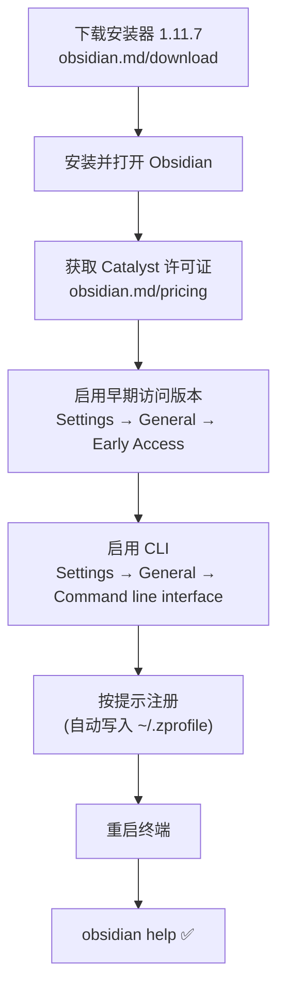

# Obsidian CLI 配置指南

Obsidian 官方内置命令行界面 (CLI)，允许从终端控制 Obsidian，支持脚本自动化与外部工具集成。

> [!warning] 早期访问功能
> Obsidian CLI 需要 **Obsidian 1.12+**（目前为早期访问版本），并需要 [[Catalyst 许可证]]。命令和语法在早期访问阶段可能变化。

---

## 前置要求

| 项目 | 要求 | 当前状态 |
|------|------|---------|
| Obsidian 安装器 | 1.11.7 | 1.7.7（需更新） |
| App 包版本 | 1.12.x | 1.11.7（需早期访问） |
| Catalyst 许可证 | 必需 | - |
| CLI 已启用 | Settings → General | - |

---

## macOS 安装步骤



### 手动配置 PATH（已完成）

已将以下内容添加到 `~/.zprofile`：

```bash
export PATH="$PATH:/Applications/Obsidian.app/Contents/MacOS"
```

> [!tip] Obsidian 注册时会自动写入此行，已提前配置好，注册后直接生效。

---

## 基本用法

### 运行单条命令

```bash
obsidian help
obsidian version
obsidian daily
```

### 交互式 TUI 模式

```bash
obsidian        # 进入 TUI
help            # TUI 内运行命令（无需前缀）
Ctrl+R          # 搜索历史命令
Ctrl+C          # 退出
```

### 指定 Vault

```bash
# 当前目录是 vault 时自动识别
obsidian daily

# 指定 vault 名称
obsidian vault=RPG search query="笔记"
```

---

## 常用命令速查

### 日记 (Daily Notes)

```bash
obsidian daily                                      # 打开今日日记
obsidian daily:read                                 # 读取今日日记
obsidian daily:append content="- [ ] 买菜"          # 追加任务
obsidian daily:prepend content="## 今日计划"        # 前置内容
```

### 文件操作

```bash
obsidian read                                       # 读取当前活动文件
obsidian read file=笔记名                           # 读取指定文件
obsidian create name="新笔记" content="内容" open   # 创建并打开
obsidian create name="Trip" template=Travel         # 从模板创建
obsidian append file=笔记名 content="追加内容"      # 追加内容
obsidian rename name="新名字"                       # 重命名
obsidian move to="目标文件夹/"                      # 移动文件
obsidian delete                                     # 删除（送入回收站）
```

### 搜索

```bash
obsidian search query="关键词"                      # 搜索 vault
obsidian search:context query="TODO"               # 带上下文搜索
obsidian files folder=工具                         # 列出文件夹内文件
obsidian tags counts                               # 列出所有标签（含计数）
```

### 任务管理

```bash
obsidian tasks todo                                # 列出未完成任务
obsidian tasks daily                              # 今日日记的任务
obsidian task ref="Recipe.md:8" toggle            # 切换任务状态
obsidian task daily line=3 done                   # 标记日记任务完成
```

### 属性 (Properties)

```bash
obsidian properties active                        # 查看当前文件属性
obsidian property:set name=status value=done      # 设置属性
obsidian property:read name=tags                  # 读取属性
```

### 链接与图谱

```bash
obsidian backlinks file=笔记名                    # 反向链接
obsidian links                                    # 出链
obsidian orphans                                  # 孤立文件（无入链）
obsidian unresolved                               # 未解析链接
```

### 开发者命令

```bash
obsidian eval code="app.vault.getFiles().length"  # 执行 JS
obsidian plugin:reload id=my-plugin               # 热重载插件
obsidian dev:screenshot path=screenshot.png       # 截图
obsidian devtools                                 # 切换开发者工具
```

---

## 参数说明

| 类型 | 语法 | 示例 |
|------|------|------|
| 参数 (parameter) | `key=value` | `name=Note` |
| 带空格的值 | `key="value"` | `name="My Note"` |
| 标志 (flag) | 直接写标志名 | `open`, `overwrite` |
| 换行 | `\n` | `content="第一行\n第二行"` |

```bash
# 完整示例：创建笔记并打开，内容含多行
obsidian create name="会议记录" content="# 标题\n\n正文内容" open overwrite
```

---

## 输出控制

```bash
obsidian search query="test" --copy              # 复制输出到剪贴板
obsidian tags format=json                        # JSON 格式输出
obsidian backlinks format=csv                    # CSV 格式输出
obsidian files total                             # 仅返回数量
```

---

## TUI 快捷键

| 操作 | 快捷键 |
|------|--------|
| 自动补全 | `Tab` |
| 搜索历史 | `Ctrl+R` |
| 上一条命令 | `↑` / `Ctrl+P` |
| 清屏 | `Ctrl+L` |
| 退出 | `Ctrl+C` / `Ctrl+D` |
| 跳到行首 | `Ctrl+A` |
| 跳到行尾 | `Ctrl+E` |

---

## 故障排查

> [!tip] 常见问题
> - **`obsidian` 命令找不到**: 重启终端后重试，检查 `~/.zprofile` 是否有 PATH 配置
> - **CLI 不响应**: 确保 Obsidian 应用已在运行（CLI 需要连接运行中的 Obsidian 实例）
> - **版本不支持**: 确认使用的是 1.12+ 早期访问版本

---

## 相关链接

- [官方文档](https://help.obsidian.md/cli)
- [Catalyst 许可证](https://obsidian.md/pricing)
- [早期访问版本说明](https://obsidian.md/insider)

## 🔗 相关笔记

- [[Tool_ObsidianCLI_命令行界面完全指南]]
